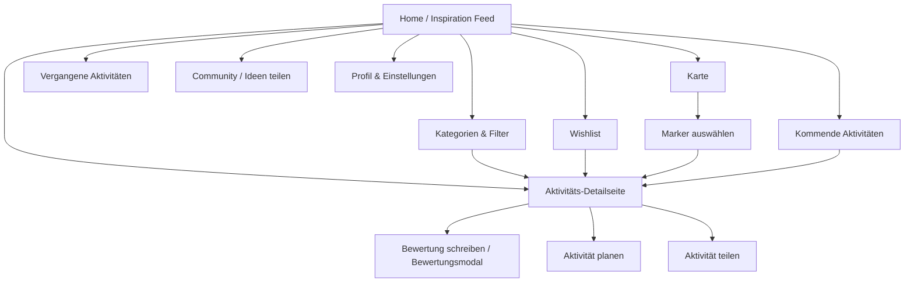
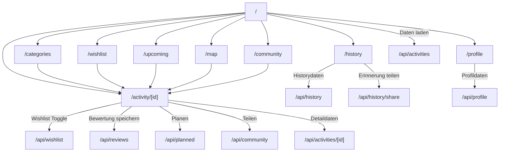

# Projektdokumentation - VibeMatch

## Inhaltsverzeichnis

1. [Ausgangslage](#1-ausgangslage)
2. [Lösungsidee](#2-lösungsidee)
3. [Vorgehen & Artefakte](#3-vorgehen--artefakte)
    1. [Understand & Define](#31-understand--define)
    2. [Sketch](#32-sketch)
    3. [Decide](#33-decide)
    4. [Prototype](#34-prototype)
    5. [Validate](#35-validate)
4. [Erweiterungen [Optional]](#4-erweiterungen-optional)
5. [Projektorganisation [Optional]](#5-projektorganisation-optional)
6. [KI-Deklaration](#6-ki-deklaration)
7. [Anhang [Optional]](#7-anhang-optional)

> **Hinweis:** Massgeblich sind die im **Unterricht** und auf **Moodle** kommunizierten Anforderungen.

<!-- WICHTIG: DIE KAPITELSTRUKTUR DARF NICHT VERÄNDERT WERDEN! -->

<!-- Diese Vorlage ist für eine README.md im Repository gedacht. Abschnitte mit [Optional] können weggelassen werden, wenn in den Übungen nichts anderes verlangt wird. -->

## 1. Ausgangslage
VibeMatch adressiert das alltägliche Problem, dass gemeinsame Aktivitäten oft länger diskutiert als entschieden werden. Besonders bei Paaren, Freundinnen und Freunden oder kleinen Gruppen ist die Ausgangsfrage häufig ähnlich: Was passt heute zu unserer Stimmung, unserem Budget, unserer Zeit und unserem Ort?

- **Problem:** Viele Nutzerinnen und Nutzer möchten spontan etwas unternehmen, verlieren aber Zeit durch zu viele Optionen, unklare Präferenzen oder fehlende lokale Übersicht. Dadurch entsteht Entscheidungsmüdigkeit. VibeMatch soll passende Aktivitätsideen sichtbar machen und den Weg von Inspiration zu Planung vereinfachen.
- **Ziele:** Ziel des Projekts ist ein klickbarer Web-App-Prototyp, der gemeinsame Aktivitäten übersichtlich vorschlägt, filterbar macht, Detailinformationen zeigt und zentrale Folgehandlungen wie Speichern, Planen, Bewerten, Teilen und Kartenansicht unterstützt.
- **Primäre Zielgruppe:** Paare, Freundesgruppen und kleine Gruppen, die gemeinsame Freizeitaktivitäten in der Schweiz schneller entdecken und planen möchten.
- **Weitere Stakeholder [Optional]:** Sekundär profitieren Personen mit wenig Zeit, Singles oder First-Date-Situationen sowie mögliche lokale Anbieter von Aktivitäten. Im aktuellen Prototyp werden lokale Anbieter jedoch nicht als eigene Nutzerrolle umgesetzt.

## 2. Lösungsidee
VibeMatch ist eine Web-App für Inspiration, Auswahl und Planung gemeinsamer Aktivitäten. Die App fokussiert nicht auf Dating-Matching zwischen Personen, sondern auf passende Aktivitätsideen für Paare, Freundinnen und Freunde sowie Gruppen.

- **Kernfunktionalität:** Die Web-App bietet einen Home-/Inspiration-Feed, Aktivitätsdetailseiten, Kategorien und Filter, Wishlist, kommende Aktivitäten, vergangene Aktivitäten/Erinnerungen, eine Kartenansicht mit OpenStreetMap-/Leaflet-Markern, Community-Beiträge, Profil/Einstellungen sowie Modals zum Planen, Teilen und Bewerten.
- **Annahmen [Optional]:** Nutzerinnen und Nutzer entscheiden schneller, wenn Aktivitäten nach Stimmung, Ort, Budget, Dauer, Personenanzahl und Bewertung filterbar sind. Es wird angenommen, dass ein visueller Feed, Kartenmarker und gespeicherte Ideen die Entscheidungsmüdigkeit reduzieren. Eine weitere Hypothese ist, dass Bewertungen und Erinnerungen helfen, zukünftige Entscheidungen besser einzuordnen.
- **Abgrenzung [Optional]:** Der Prototyp enthält kein echtes Login-System, keine echte Authentifizierung, kein Zahlungs- oder Buchungssystem und keine produktive Anbieterintegration. Die Kartenlösung nutzt OpenStreetMap/Leaflet statt einer kostenpflichtigen Google-Maps-API. Daten werden im Prototyp über Demo-/Seed-Daten und MongoDB verwaltet; produktive Datenschutz-, Rollen- und Rechtekonzepte sind TODO.

## 3. Vorgehen & Artefakte
Die Durchführung erfolgt phasenbasiert; dokumentieren Sie die wichtigsten Ergebnisse je Phase.

Das Projekt orientiert sich am nutzerzentrierten Vorgehen aus dem Unterricht: `Understand & Define`, `Sketch`, `Decide`, `Prototype` und `Validate`. Zusätzlich wurden Begriffe und Methoden aus Design Sprint und Human-Centered Design berücksichtigt, insbesondere Proto-Personas, User Journey, Crazy 8, schnelle Prototypen und Validierung anhand konkreter Szenarien.

### 3.1 Understand & Define
- **Zielgruppenverständnis:** Ausgangspunkt war die Beobachtung, dass gemeinsame Aktivitätswahl im Alltag oft unklar, langwierig oder frustrierend ist. Als primäre Proto-Personas wurden Paare und kleine Gruppen angenommen, die schnell passende Ideen in ihrer Nähe suchen. Ergänzend wurden Personen mit wenig Zeit und First-Date-Situationen als sekundäre Zielgruppen betrachtet.
- **Wesentliche Erkenntnisse:** Entscheidungsmüdigkeit ist ein zentrales Problem. Lokale Vorschläge, einfache Filter, visuelle Cards, Bewertungen und eine Wishlist können helfen, Optionen schneller einzugrenzen. Aus der Reflexion des Entscheidungsprozesses ging hervor, dass die Idee wegen Alltagsrelevanz, visueller Umsetzbarkeit und Nutzen für mehrere Zielgruppen gewählt wurde. TODO: Proto-Personas und User Journey mit finalen Screenshots oder separaten Artefakten ergänzen.

### 3.2 Sketch
- **Variantenüberblick:** In der Sketch-Phase wurden mehrere Ansätze geprüft, darunter Detailansicht, Planen, Bewertungen, Kartenansicht, History/Erinnerungen, Upcoming Events und Community-/Teilen-Funktionen.
- **Skizzen:** Die Crazy-8-Skizzen dienten dazu, unterschiedliche Screens und Interaktionen schnell zu vergleichen. Besonders relevant waren Varianten für den Einstieg über eine Hauptseite, den Wechsel zur Detailseite, Planungsaktionen, Bewertungsmodal, Karte und Verlauf. TODO: Fotos oder Screenshots der Skizzen im Anhang verlinken.

### 3.3 Decide
- **Gewählte Variante & Begründung:** Gewählt wurde eine Dashboard-artige Web-App mit Sidebar-Navigation, Aktivitätscards, Detailseiten und klaren Folgeaktionen. Diese Variante unterstützt den zentralen Use Case am besten: Inspiration finden, Aktivität prüfen, speichern, planen, bewerten oder teilen.
- **End-to-End-Ablauf:** Der bisherige Figma-/Mockup-Workflow startet auf der Hauptseite, zeigt kommende oder vorgeschlagene Aktivitäten, führt über einen `Details`-Klick zur Aktivitätsdetailseite und erlaubt dort das Teilen einer Aktivität. Im aktuellen Prototyp wurde dieser Ablauf erweitert: Home → Detailseite → Wishlist/Planen/Teilen/Bewerten sowie Home → Filter/Karte/Wishlist/Upcoming/History/Community/Profile.
- **Mockup:** Figma-Link aus Übung 10: https://www.figma.com/design/E7gsRcP1iqdcxWtTci8CYT/Prototyping_Mockups-f%C3%BCr-Projekt?node-id=0-1&t=3vTtEWy7cSfTMhxj-1. TODO: Finale Figma-Screenshots und kurze Beschreibungen in die Dokumentation oder den Anhang aufnehmen.

### 3.4 Prototype

#### 3.4.1. Entwurf (Design)
Beschreibt die Gestaltung und Interaktion.
> **Hinweis:** Hier wird der **Prototyp** beschrieben, nicht das **Mockup**.
- **Informationsarchitektur:** Die App ist um acht Hauptbereiche aufgebaut: Home/Inspiration, Kategorien & Filter, Karte, Wishlist, Kommende Aktivitäten, Vergangene Aktivitäten, Community und Profil. Detailseiten sind über Aktivitätscards, Listen, Marker und weitere Teaser erreichbar.
- **User Interface Design:** Der Prototyp nutzt ein modernes, helles Dashboard-Design mit Desktop-Sidebar, mobiler Navigation, Such- und Filterelementen, Aktivitätscards, Detail-Hero, Bewertungsanzeige, Map-Panel und Modals. Zentrale Screens sind Home/Inspiration Feed, Aktivitätsdetailseite, Kategorien & Filter, Wishlist, Upcoming, History, Map, Community und Profil.
- **Designentscheidungen:** Die Hauptfarbe ist Violett/Lila, ergänzt durch helle Pastelltöne und weisse Flächen. Cards strukturieren Aktivitätsvorschläge, Badges zeigen Kategorien und Meta-Informationen, und Modals halten Aktionen wie Planen, Teilen und Bewerten im Kontext der Detailseite. Die Sidebar macht die Navigation auf Desktop schnell erreichbar; auf kleineren Viewports wird eine Mobile-Navigation verwendet.

Architekturdiagramm:

TODO: Pfad des Architekturdiagramms abgleichen. Im Repository existiert aktuell `docs/architecture.drawio.svg`; gefordert ist der Markdown-Verweis auf `doc/architecture.drawio.svg`.

Navigation der Webseite:

#### 3.4.2. Umsetzung (Technik)
Fasst die technische Realisierung zusammen.
- **Technologie-Stack:** Der Prototyp ist mit SvelteKit, Svelte 5, Vite und JavaScript umgesetzt. Als Datenbank wird MongoDB verwendet. Für die Kartenansicht wird Leaflet mit OpenStreetMap-Tiles eingesetzt.
- **Tooling:** Entwicklung mit Node/npm, SvelteKit, Vite und einem Seed-Skript (`npm run seed`) für MongoDB-Demodaten. Die App kann lokal mit `npm run dev` gestartet und mit `npm run build` gebaut werden. Der Einsatz von KI wird im Kapitel **KI-Deklaration** beschrieben.
- **Struktur & Komponenten:** Die technischen Pages liegen unter `src/routes`. Wiederverwendbare UI-Elemente liegen unter `src/lib/components`, unter anderem Layout-Komponenten (`AppShell`, `Sidebar`, `Topbar`, `MobileNav`), Activity-Komponenten (`ActivityCard`, `ActivityGrid`, `ActivityListItem`, `ActivityMeta`), Filter-Komponenten, Map-Komponente (`LeafletActivityMap`), Community-Karte, Profil-Statistik und Modals (`PlanActivityModal`, `ShareModal`, `ReviewModal`). Das globale Toast-State-Handling liegt in `src/lib/state/appState.svelte.js`.
- **Daten & Schnittstellen:** Seed- und Mockdaten liegen unter `src/lib/data`, u. a. Aktivitäten, Rezensionen, geplante Aktivitäten, History, Community Posts und Profil. Serverseitige Datenzugriffe sind in `src/lib/server/repositories.js` gebündelt. MongoDB wird über `src/lib/server/db.js` angebunden. API-Endpunkte existieren für Aktivitäten, Wishlist, Reviews, Planned Activities, History, Community und Profile.
- **Deployment:** TODO: Deployment-URL ergänzen, sobald eine getestete Version separat veröffentlicht wurde.
- **Besondere Entscheidungen:** Im Gegensatz zur ursprünglichen React-Idee wurde die Umsetzung mit SvelteKit realisiert. Die App arbeitet mit einem Demo-User (`demo-user`) und verzichtet bewusst auf Authentifizierung. Leaflet/OpenStreetMap wurde gewählt, um eine kostenlose Kartenlösung für den Prototyp zu nutzen.

Technische Routing-Struktur der Pages:

### 3.5 Validate
- **URL der getesteten Version** (separat deployt): TODO: Deployment- oder Test-URL ergänzen.
- **Ziele der Prüfung:** Validiert werden soll, ob Nutzerinnen und Nutzer schnell eine passende Aktivität finden, Filter verstehen, eine Aktivität speichern oder planen können und ob Detailseite, Karte und Bewertungsmodal nachvollziehbar sind.
- **Vorgehen:** TODO: Moderierten oder unmoderierten Test festlegen. Sinnvoll wäre ein kurzer Test mit konkreten Aufgaben und anschliessender Befragung.
- **Stichprobe:** TODO: Testpersonen dokumentieren, z. B. 3-5 Personen aus Zielgruppe Paare/Freunde/Gruppen.
- **Aufgaben/Szenarien:** Beispielhafte Aufgaben: passende Aktivität für Zürich finden, Filter nach Stimmung/Budget nutzen, Detailseite öffnen, Aktivität zur Wishlist hinzufügen, Aktivität planen, Marker auf Karte auswählen, Bewertung schreiben.
- **Kennzahlen & Beobachtungen:** TODO: Erfolgsquote, benötigte Zeit, Verständnisprobleme und qualitative Beobachtungen nach dem Test ergänzen.
- **Zusammenfassung der Resultate:** TODO: Nach der Validierung in 2-4 Sätzen zusammenfassen.
- **Abgeleitete Verbesserungen:** TODO: Verbesserungen priorisieren, z. B. Navigation, Filterlabels, mobile Bedienung, Kartenpanel oder Modal-Texte.

## 4. Erweiterungen [Optional]
Dokumentiert Erweiterungen über den Mindestumfang hinaus.
> **Hinweis:** Jede Erweiterung ist separat nach dem folgenden Schema zu beschreiben.

### _[4.x Kurzbeschreibung / Titel]_
- **Beschreibung & Nutzen:** TODO: Falls Erweiterungen über den Mindestumfang hinaus abgegeben werden, hier beschreiben.
- **Wo umgesetzt:** TODO: Frontend, Backend/Datenbank oder Datenmodell nennen.
- **Referenz:** TODO: Screenshot, Kapitel oder Datei ergänzen.
- **Aus Evaluation abgeleitet?:** TODO: Nach Validate beantworten.

> Das folgende **Beispiel** wurde bewusst kurz gehalten. Erweiterungen dürfen auch ausführlicher beschrieben werden.

### 4.1 Tabelle nach Kategorien filtern
- **Beschreibung & Nutzen:** Im VibeMatch-Prototyp gibt es keine klassische Tabelle, sondern eine Aktivitätsliste mit Kategorien- und Filterlogik. Der relevante Projektbezug ist die Filterseite, auf der Aktivitäten nach Kategorie, Preis, Dauer, Ort, Stimmung, Personenanzahl, Bewertung und bester Zeit eingegrenzt werden können.
- **Wo umgesetzt:**
  - **Frontend:** Filterseite und Filter-UI unter `src/routes/categories` sowie `src/lib/components/filters`.
  - **Backend:** Filterparameter werden serverseitig in `src/lib/server/repositories.js` in MongoDB-Queries übersetzt.
  - **Datenbank:** Aktivitäten werden in der MongoDB-Collection `activities` gespeichert und über Attribute wie `categories`, `priceLevel`, `durationGroup`, `city`, `mood`, `people`, `rating` und `bestTime` gefiltert.
- **Referenz:** Siehe Kap. 3.4.1 und 3.4.2.
- **Aus Evaluation abgeleitet?:** Nein, bisher aus der Lösungsidee und dem Prototyping-Konzept abgeleitet. TODO: Nach Evaluation prüfen.

## 5. Projektorganisation [Optional]
Beispiele:
- **Repository & Struktur:** Dieses Repository enthält den SvelteKit-Prototyp für VibeMatch. Wichtige Bereiche sind `src/routes` für Pages und API-Routen, `src/lib/components` für UI-Komponenten, `src/lib/data` für Demo-/Seed-Daten, `src/lib/server` für MongoDB-Zugriffe und `docs` für Dokumentationsartefakte.
- **Issue-Management:** TODO: Vorgehen für Issues, Aufgaben oder Kanban-Board dokumentieren, falls verwendet.
- **Commit-Praxis:** TODO: Commit-Praxis beschreiben, z. B. sprechende Commits nach Feature oder Dokumentationsschritt.

## 6. KI-Deklaration
Die folgende Deklaration ist verpflichtend und beschreibt den Einsatz von KI im Projekt.

### 6.1 KI-Tools
- **Eingesetzte Tools**: ChatGPT und Codex wurden bzw. können im Projekt unterstützend eingesetzt werden. TODO: Weitere tatsächlich genutzte KI-Tools ergänzen, falls vorhanden.
- **Zweck & Umfang**: KI wurde bzw. kann eingesetzt werden für Ideenstrukturierung, Formulierung von Prompts, Dokumentationsentwürfe, Codevorschläge, technische Analyse des bestehenden Projekts, mögliche Verbesserungen und Textüberarbeitung. Diese README wurde mit KI-Unterstützung begonnen und muss fachlich geprüft werden.
- **Eigene Leistung (Abgrenzung):** Projektidee, Entscheidungen, Bewertung der Vorschläge, Auswahl der finalen Inhalte, Validierung, Tests, Designentscheidungen und Abgabeprüfung bleiben Eigenleistung. KI-Ausgaben werden nicht ungeprüft übernommen.

### 6.2 Prompt-Vorgehen
Beim Prompting wurden Kontext, Ziel, gewünschte Kapitelstruktur, Projektfunktionen und Qualitätsanforderungen möglichst konkret angegeben. Wichtig war die Vorgabe, keine Inhalte zu erfinden und unsichere Punkte als TODO zu markieren. Für technische Dokumentation wurde der vorhandene Code analysiert und nicht nur eine allgemeine Beschreibung generiert.

### 6.3 Reflexion
KI ist nützlich, um Gedanken zu strukturieren, Formulierungen vorzuschlagen und technische Zusammenhänge aus dem Repository schneller zusammenzufassen. Grenzen bestehen bei fachlicher Korrektheit, Aktualität und Interpretation von noch nicht abgeschlossenen Projektteilen. Qualitätssicherung erfolgt durch manuelle Prüfung, Abgleich mit Code und Unterlagen, Tests des Prototyps sowie kritische Überarbeitung der Texte. Risiken sind falsche Annahmen, zu allgemeine Aussagen oder unklare Quellenlage; deshalb werden TODOs gesetzt, wo Informationen fehlen.

## 7. Anhang [Optional]
Beispiele:
- **Quellen:** Unterrichtsunterlagen zu Prototyping-Methodik/Woche 9, Übung 10 zum Prototyping-Workflow, Reflexion des Entscheidungsprozesses, Figma-Mockup, Repository-Dateien und verwendete Demo-/Bildquellen. TODO: Bildlizenzen und externe Assets vollständig prüfen und ergänzen.
- **Testskript & Materialien:** TODO: Testskript für Validate ergänzen.
- **Rohdaten/Auswertung:** TODO: Ergebnisse der Nutzertests nach Durchführung ablegen und verlinken.
