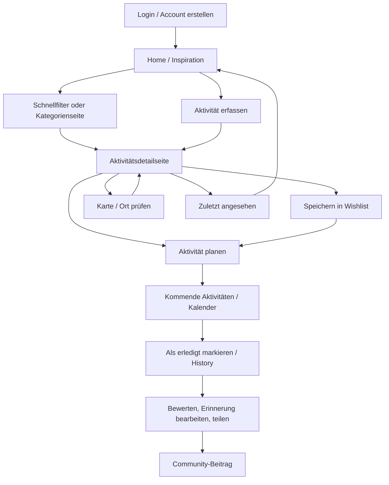
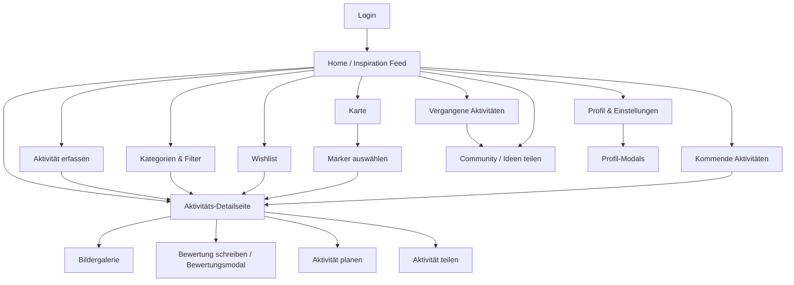

# Projektdokumentation - VibeMatch

## Inhaltsverzeichnis

1. [Ausgangslage](#1-ausgangslage)
2. [Lösungsidee](#2-lösungsidee)
3. [Vorgehen & Artefakte](#3-vorgehen--artefakte)
    1. [Understand & Define](#31-understand--define)
    2. [Sketch](#32-sketch)
    3. [Decide](#33-decide)
    4. [Prototype](#34-prototype)
    5. [Validate](#35-validate)
4. [Erweiterungen [Optional]](#4-erweiterungen-optional)
5. [Projektorganisation [Optional]](#5-projektorganisation-optional)
6. [KI-Deklaration](#6-ki-deklaration)
7. [Anhang [Optional]](#7-anhang-optional)

> **Hinweis:** Massgeblich sind die im **Unterricht** und auf **Moodle** kommunizierten Anforderungen.

<!-- WICHTIG: DIE KAPITELSTRUKTUR DARF NICHT VERÄNDERT WERDEN! -->

<!-- Diese Vorlage ist für eine README.md im Repository gedacht. Abschnitte mit [Optional] können weggelassen werden, wenn in den Übungen nichts anderes verlangt wird. -->

## 1. Ausgangslage
VibeMatch adressiert das alltägliche Problem, dass gemeinsame Aktivitäten oft länger diskutiert als entschieden werden. Besonders bei Paaren, Freundinnen und Freunden oder kleinen Gruppen ist die Ausgangsfrage häufig ähnlich: Was passt heute zu unserer Stimmung, unserem Budget, unserer Zeit und unserem Ort?

- **Problem:** Viele Nutzerinnen und Nutzer möchten spontan etwas unternehmen, verlieren aber Zeit durch zu viele Optionen, unklare Präferenzen oder fehlende lokale Übersicht. Dadurch entsteht Entscheidungsmüdigkeit. VibeMatch soll passende Aktivitätsideen sichtbar machen und den Weg von Inspiration zu Planung vereinfachen.
- **Relevanz:** Freizeitentscheidungen sind im Alltag häufig emotional und sozial geprägt. Eine klare, visuelle und filterbare Übersicht hilft dabei, Vorschläge schneller zu vergleichen und eine gemeinsame Entscheidung zu treffen.
- **Ziele:** Ziel des Projekts ist ein klickbarer Web-App-Prototyp, der gemeinsame Aktivitäten übersichtlich vorschlägt, filterbar macht, Detailinformationen zeigt und zentrale Folgehandlungen wie Speichern, Planen, Bewerten, Teilen, Kartenansicht und eigene Aktivitätserfassung unterstützt.
- **Primäre Zielgruppe:** Paare, Freundesgruppen und kleine Gruppen, die gemeinsame Freizeitaktivitäten in der Schweiz schneller entdecken und planen möchten.
- **Weitere Stakeholder [Optional]:** Sekundär profitieren Personen mit wenig Zeit, Singles oder First-Date-Situationen sowie mögliche lokale Anbieter von Aktivitäten. Im aktuellen Prototyp werden lokale Anbieter jedoch nicht als eigene Nutzerrolle umgesetzt.

**Konkurrenzanalyse vor Projektstart:** Vor der Umsetzung wurden ähnliche Produktkategorien betrachtet, um wiederkehrende Muster und sinnvolle Abgrenzungen für VibeMatch abzuleiten. Die konkrete Liste der tatsächlich analysierten Webseiten muss für die Abgabe noch manuell mit Quellen ergänzt werden; die folgende Tabelle dokumentiert die fachliche Einordnung und die daraus übernommenen Produktentscheidungen.

| Referenz / Produktkategorie | Beobachtete Funktionen | Erkenntnis für VibeMatch | Bewusste Abgrenzung |
|---|---|---|---|
| Event- und Freizeitplattformen, z. B. Eventbrite oder lokale Eventkalender | Suche, Kategorien, Datum, Ort, Ticket-/Event-Fokus | Aktivitäten müssen schnell scannbar, filterbar und lokal verständlich sein | VibeMatch verkauft keine Tickets und bildet keine Anbieterprozesse ab |
| Karten- und Ausflugsplattformen, z. B. Google Maps, Outdoor- oder Tourismusportale | Kartenmarker, Ortsbezug, Bewertungen, Öffnungszeiten | Karte und Detailvorschau helfen bei der Entscheidung vor Ort | Keine Routenplanung, kein Live-Standort und kein produktives Geocoding |
| Inspirations- und Social-Plattformen, z. B. Pinterest, Instagram oder lokale Blogs | Visuelle Karten, gespeicherte Ideen, Community-Impulse | Bilder, Wishlist und geteilte Erinnerungen machen Aktivitäten emotional greifbarer | Kein vollwertiges Social Network und keine Follower-/Kommentarlogik als MVP |
| Dating- und Matching-Apps, z. B. Bumble Date Ideas oder Tinder-ähnliche Swipe-Muster | schnelle Entscheidung, spielerischer Vergleich, niedrige Einstiegshürde | Eine spätere Swipe-/Matching-Idee kann Entscheidungsmüdigkeit reduzieren | Fokus liegt auf Aktivitäten, nicht auf Personenmatching |
| Planungs- und Kalender-Tools | Terminübersicht, Status, Erinnerungen | Aus Inspiration muss ein geplanter Termin werden | Kein Kalenderexport und kein Reminder-System im aktuellen Prototyp |

## 2. Lösungsidee
VibeMatch ist eine Web-App für Inspiration, Auswahl und Planung gemeinsamer Aktivitäten. Die App fokussiert nicht auf Dating-Matching zwischen Personen, sondern auf passende Aktivitätsideen für Paare, Freundinnen und Freunde sowie Gruppen.

- **Kernfunktionalität:** Die Web-App bietet einen Home-/Inspiration-Feed, Aktivitätsdetailseiten, Kategorien und Filter, Wishlist, kommende Aktivitäten, vergangene Aktivitäten/Erinnerungen, eine Kartenansicht mit OpenStreetMap-/Leaflet-Markern, Community-Beiträge, Profil/Einstellungen, eine Page zum Erfassen neuer Aktivitäten sowie Modals zum Planen, Teilen und Bewerten.
- **Aktueller Funktionsumfang:** Zusätzlich zum ursprünglichen Klick-Prototyp sind inzwischen ein einfaches Login-/User-System, eine interaktive Profilseite, eine Aktivität-erfassen-Page, eine Hero-Bildergalerie auf Detailseiten, Home-Schnellfilter, zuletzt angesehene Aktivitäten, aktive Filterchips, Sortierung, userbezogene Daten, bearbeitbare Erinnerungen, eine interaktivere Community und eine verbesserte Map-Page umgesetzt.
- **Annahmen [Optional]:** Nutzerinnen und Nutzer entscheiden schneller, wenn Aktivitäten nach Stimmung, Ort, Budget, Dauer, Personenanzahl und Bewertung filterbar sind. Es wird angenommen, dass ein visueller Feed, Kartenmarker und gespeicherte Ideen die Entscheidungsmüdigkeit reduzieren. Eine weitere Hypothese ist, dass Bewertungen, Erinnerungen und eigene Ideen helfen, zukünftige Entscheidungen besser einzuordnen.
- **Abgrenzung [Optional]:** Der Prototyp enthält ein einfaches Login-, Account-Erstellungs- und User-System, aber kein produktionsreifes Rollen-, Rechte- oder Account-Management. Es gibt kein Zahlungs- oder Buchungssystem, keine produktive Anbieterintegration, kein OAuth, keinen Passwort-Reset, keine E-Mail-Verifikation und kein Cloud-Storage. Die Kartenlösung nutzt OpenStreetMap/Leaflet statt einer kostenpflichtigen Google-Maps-API. Bilduploads für neue Aktivitäten werden prototypisch als kleine Data-URLs in MongoDB gespeichert. Produktive Datenschutz-, Rollen- und Rechtekonzepte sind TODO.

## 3. Vorgehen & Artefakte
Die Durchführung erfolgt phasenbasiert; dokumentieren Sie die wichtigsten Ergebnisse je Phase.

Das Projekt orientiert sich am nutzerzentrierten Vorgehen aus dem Unterricht: `Understand & Define`, `Sketch`, `Decide`, `Prototype` und `Validate`. Zusätzlich wurden Begriffe und Methoden aus Design Sprint und Human-Centered Design berücksichtigt, insbesondere Proto-Personas, User Journey, Crazy 8, schnelle Prototypen und Validierung anhand konkreter Szenarien.

### 3.1 Understand & Define
- **Zielgruppenverständnis:** Ausgangspunkt war die Beobachtung, dass gemeinsame Aktivitätswahl im Alltag oft unklar, langwierig oder frustrierend ist. Als primäre Proto-Personas wurden Paare und kleine Gruppen angenommen, die schnell passende Ideen in ihrer Nähe suchen. Ergänzend wurden Personen mit wenig Zeit und First-Date-Situationen als sekundäre Zielgruppen betrachtet.
- **Wesentliche Erkenntnisse:** Entscheidungsmüdigkeit ist ein zentrales Problem. Lokale Vorschläge, einfache Filter, visuelle Cards, Bewertungen und eine Wishlist können helfen, Optionen schneller einzugrenzen. Aus der Reflexion des Entscheidungsprozesses ging hervor, dass die Idee wegen Alltagsrelevanz, visueller Umsetzbarkeit und Nutzen für mehrere Zielgruppen gewählt wurde.
- **Artefakte:** Reflexion des Entscheidungsprozesses, Übung 10 zum Prototyping-Workflow, Methodik-Unterlagen Woche 9, Proto-Personas, User Stories und User Journey Flows. Die folgenden Personas und Journeys sind direkt auf den aktuellen Prototyp rückführbar und dienen als Grundlage für Requirements Engineering, Validierung und spätere Erweiterungen.

#### Proto-Personas

| Persona | Profil | Technisches Verständnis | Ziele | Motivation | Frustrationen | Typisches Verhalten | Erwartung an VibeMatch | Relevante Features |
|---|---|---|---|---|---|---|---|---|
| **Lea Meier** | 29, Marketing Managerin, lebt in Zürich, seit mehreren Jahren in einer Beziehung | Hoch im Alltag, nutzt viele Apps, erwartet schnelle Bedienung | Wieder mehr gemeinsame Quality Time planen, ohne lange Diskussion | Abwechslung, gemeinsame Erinnerungen, einfache Inspiration nach Stimmung | Routine, zu viele Optionen, unterschiedliche Budgets und Zeitfenster | Öffnet Apps spontan abends oder am Wochenende, vergleicht visuelle Vorschläge, speichert Ideen für später | Schnelle Inspiration, Filter nach Stimmung/Budget/Dauer, Wishlist, Kalender und History | Home, Schnellfilter, Kategorien, Detailseite, Wishlist, Planen, Upcoming, History, Bewertungen |
| **Nico Keller** | 26, Softwareentwickler, Single, plant ein erstes Date in St. Gallen | Sehr hoch, achtet auf klare Informationen und Bewertungen | Eine lockere, sichere Date-Idee finden, die Gesprächspausen reduziert | Ein guter erster Eindruck, entspannte Atmosphäre, öffentlicher Ort | Unsicherheit beim passenden Vibe, Angst vor langweiligen Standarddates | Prüft Bewertungen, Bilder, Ort und Dauer genau, bevorzugt sichere öffentliche Orte | Verlässliche Detailinfos, Review-Zusammenfassung, Karte, Preis-/Dauerfilter und Planung | Filter, Map, Detailseite, Galerie, Reviews, Planungsmodal, Wishlist |
| **Sara Baumann** | 34, Projektleiterin, organisiert Freizeitaktivitäten mit Freundesgruppe und Kolleginnen/Kollegen | Mittel bis hoch, nutzt Kalender und Gruppen-Chats | Gruppenaktivitäten schneller koordinieren und Ideen sammeln | Weniger Organisationsaufwand, faire Budgetauswahl, gemeinsame Entscheidung | Terminfindung, unterschiedliche Interessen, Logistik und Kosten | Sammelt mehrere Optionen, teilt Ideen, achtet auf Personenanzahl, Ort und Dauer | Gruppenfreundliche Suche, Teilen, Wishlist, Kalender und Community-Impulse | Kategorien, Preis/Dauer/Ort, Wishlist, Teilen, Upcoming/Kalender, Community, Aktivität erfassen |
| **Mia Huber** | 41, Pflegefachfrau, lebt in Winterthur, wenig freie Zeit und unregelmässige Arbeitszeiten | Mittel, nutzt Apps pragmatisch, möchte wenig konfigurieren | In wenigen Minuten eine passende Aktivität finden und direkt planen | Zeit sparen, klare Vorschläge, wenig mentale Belastung nach der Arbeit | Zu viele Filter, lange Texte, unsichere Öffnungszeiten oder unklare Dauer | Nutzt schnelle Einstiege, entscheidet visuell, kehrt zu zuletzt angesehenen Ideen zurück | Sehr schnelle Suche, wenige Klicks, klare Metadaten und direkte Planung | Home, Schnellfilter, zuletzt angesehen, Detailseite, Planen, Upcoming |
| **Jonas Frei** | 31, Vereinsmitglied und Freizeitorganisator aus St. Gallen, erstellt regelmässig Ideen für Gruppen | Hoch, ist bereit Formulare zu pflegen, erwartet aber klare Validierung | Eigene Aktivitätsideen erfassen, sichtbar machen und später verbessern | Lokale Ideen teilen, Gruppe inspirieren, neue Vorschläge in VibeMatch bringen | Wenn eigene Inhalte nicht auffindbar sind oder nachträglich nicht bearbeitet werden können | Füllt strukturierte Formulare aus, lädt Bilder hoch, prüft danach Detailseite und Filterbarkeit | Activity-Creation, Bild/Galerie, Sichtbarkeit in Listen, später Creator-Verwaltung | `/activities/new`, Bilder/Galerie, Detailseite, Kategorien, Profil, zukünftiges Bearbeiten/Löschen |

#### Persona-zu-Journey-Zuordnung

| Persona | Hauptjourney | In der App abgebildet? | Begründung |
|---|---|---|---|
| Lea Meier | Paar-Flow: Quality Time planen | Vollständig | Inspiration, Detailseite, Wishlist, Planen, Upcoming, History und Bewertung sind vorhanden |
| Nico Keller | First-Date-Flow: sichere Idee finden | Weitgehend | Filter, Karte, Detailseite, Galerie, Reviews und Planung sind vorhanden; echte Sicherheits-/Verifizierungslogik fehlt bewusst |
| Sara Baumann | Gruppen-Flow: gemeinsame Aktivität organisieren | Teilweise | Gruppentaugliche Filter, Teilen, Wishlist und Planung sind vorhanden; echte Gruppenabstimmung ist offen |
| Mia Huber | Time-Saver-Flow: schnelle Entscheidung | Weitgehend | Schnellfilter, zuletzt angesehen und direkte Planung sind vorhanden; personalisierte Startvorschläge sind offen |
| Jonas Frei | Creator-Flow: eigene Aktivität sichtbar machen | Teilweise | Aktivitätserfassung, Bilder und Sichtbarkeit in Listen sind vorhanden; Bearbeiten/Löschen eigener Aktivitäten fehlt |

#### User Stories Nach Persona

| Persona | User Story | Priorität | Betroffene Seiten/Funktionen | Bereits implementiert? |
|---|---|---:|---|---|
| Lea | Als Lea möchte ich schnell passende Vorschläge nach Stimmung und Budget sehen, damit wir nicht lange diskutieren müssen. | Must | Home, Schnellfilter, Kategorien | Ja |
| Lea | Als Lea möchte ich Aktivitäten speichern, damit ich sie später mit meinem Partner vergleichen kann. | Must | Activity Cards, Detailseite, Wishlist | Ja |
| Lea | Als Lea möchte ich eine gespeicherte Idee direkt planen, damit aus Inspiration ein konkreter Termin wird. | Must | Wishlist, PlanActivityModal, Upcoming | Ja |
| Lea | Als Lea möchte ich vergangene Aktivitäten bewerten und kommentieren, damit wir gute Erlebnisse wiederfinden. | Should | History, Reviews, Community | Ja |
| Nico | Als Nico möchte ich sichere und lockere Date-Ideen nach Ort, Preis und Dauer filtern, damit das erste Treffen entspannt bleibt. | Must | Kategorien, Filter, Map | Ja |
| Nico | Als Nico möchte ich Bewertungen und Review-Verteilung prüfen, damit ich eine glaubwürdige Entscheidung treffen kann. | Should | Detailseite, ReviewSummary, RatingStars | Ja |
| Nico | Als Nico möchte ich Aktivitäten auf einer Karte sehen, damit ich einen gut erreichbaren Treffpunkt wählen kann. | Should | Map, Leaflet, Detailvorschau | Ja |
| Nico | Als Nico möchte ich eine Date-Idee erst speichern und später planen, damit ich nicht sofort entscheiden muss. | Should | Wishlist, Planen, Upcoming | Ja |
| Sara | Als Sara möchte ich Aktivitäten nach Gruppentauglichkeit, Dauer und Budget filtern, damit die Idee für mehrere Personen passt. | Must | Kategorien, erweiterte Filter | Ja |
| Sara | Als Sara möchte ich eine Aktivität teilen, damit andere die Idee sehen und darauf reagieren können. | Should | ShareModal, Community | Teilweise |
| Sara | Als Sara möchte ich geplante Aktivitäten im Kalender verschieben, damit die Organisation flexibel bleibt. | Should | Upcoming, Kalender, PlannedActivityModal | Ja |
| Sara | Als Sara möchte ich eigene Aktivitätsideen erfassen, damit die Gruppe nicht nur aus Seed-Vorschlägen auswählt. | Could | `/activities/new`, Activity-Creation | Ja |
| Sara | Als Sara möchte ich Gruppenabstimmungen durchführen, damit mehrere Personen gemeinsam entscheiden können. | Could | Voting/Matching-Idee | Nein |
| Mia | Als Mia möchte ich mit wenigen Klicks passende Vorschläge sehen, damit ich nach der Arbeit keine lange Suche starten muss. | Must | Home, Schnellfilter, Kategorien | Ja |
| Mia | Als Mia möchte ich zuletzt angesehene Aktivitäten wiederfinden, damit ich eine gute Idee später schnell erneut öffnen kann. | Should | Home, Detailseite, localStorage | Ja |
| Mia | Als Mia möchte ich eine Aktivität direkt planen, damit ich aus einer schnellen Entscheidung sofort einen Termin machen kann. | Must | Detailseite, PlanActivityModal, Upcoming | Ja |
| Mia | Als Mia möchte ich personalisierte Empfehlungen sehen, damit ich noch weniger filtern muss. | Could | Empfehlungen, Profilpräferenzen | Nein |
| Jonas | Als Jonas möchte ich eine eigene Aktivität mit Bildern erfassen, damit meine Gruppe neue lokale Ideen in VibeMatch sieht. | Must | `/activities/new`, Upload, `POST /api/activities` | Ja |
| Jonas | Als Jonas möchte ich prüfen, ob meine Aktivität in Listen und auf der Detailseite sichtbar ist, damit ich weiss, dass sie nutzbar ist. | Should | Home, Kategorien, Detailseite | Ja |
| Jonas | Als Jonas möchte ich eigene Aktivitäten später bearbeiten oder löschen, damit fehlerhafte Angaben korrigiert werden können. | Should | Creator-Verwaltung, Activity-API | Nein |
| Jonas | Als Jonas möchte ich sehen, welche Aktivitäten von ihm erstellt wurden, damit er seine Ideen im Profil verwalten kann. | Could | Profil, eigene Aktivitäten | Nein |

### 3.2 Sketch
- **Variantenüberblick:** In der Sketch-Phase wurden mehrere Ansätze geprüft, darunter Detailansicht, Planen, Bewertungen, Kartenansicht, History/Erinnerungen, Upcoming Events und Community-/Teilen-Funktionen.
- **Skizzen:** Die Crazy-8-Skizzen dienten dazu, unterschiedliche Screens und Interaktionen schnell zu vergleichen. Besonders relevant waren Varianten für den Einstieg über eine Hauptseite, den Wechsel zur Detailseite, Planungsaktionen, Bewertungsmodal, Karte und Verlauf.
- **Crazy-8-Artefakt:** Die folgende Skizze dokumentiert den frühen Ideenraum und zeigt, welche Screens und Interaktionen vor der Umsetzung geprüft wurden.

- **Übertrag in den Prototyp:** Mehrere Skizzenideen sind inzwischen umgesetzt, unter anderem Detailseite, Hero-Galerie, Planen-/Teilen-/Bewerten-Modals, Map-Page, Upcoming, History, Wishlist und Community.

### 3.3 Decide
- **Gewählte Variante & Begründung:** Gewählt wurde eine Dashboard-artige Web-App mit Sidebar-Navigation, Aktivitätscards, Detailseiten und klaren Folgeaktionen. Diese Variante unterstützt den zentralen Use Case am besten: Inspiration finden, Aktivität prüfen, speichern, planen, bewerten oder teilen.
- **End-to-End-Ablauf:** Der bisherige Figma-/Mockup-Workflow startet auf der Hauptseite, zeigt kommende oder vorgeschlagene Aktivitäten, führt über einen `Details`-Klick zur Aktivitätsdetailseite und erlaubt dort das Teilen einer Aktivität. Im aktuellen Prototyp wurde dieser Ablauf erweitert: Login -> Home -> Detailseite -> Wishlist/Planen/Teilen/Bewerten sowie Home -> Wishlist -> direkt planen -> Upcoming -> als erledigt markieren -> History.
- **Mockup:** Figma-Link aus Übung 10: https://www.figma.com/design/E7gsRcP1iqdcxWtTci8CYT/Prototyping_Mockups-f%C3%BCr-Projekt?node-id=0-1&t=3vTtEWy7cSfTMhxj-1. TODO: Finale Figma-Screenshots und kurze Beschreibungen in die Dokumentation oder den Anhang aufnehmen.

#### User Journey Flows Als Entscheidungsgrundlage

Die folgenden Journeys wurden für den Prototyp priorisiert, weil sie die wichtigsten Zielgruppen und Kernfunktionen abdecken.

Zusätzlich sind die einzelnen Journeys als editierbare Draw.io-Workflows im Ordner `docs` dokumentiert. Die Diagramme sind als klassische Prozessdiagramme aufgebaut: Start und Ende sind als Ovale dargestellt, Aktivitätsschritte als Rechtecke, Entscheidungen als Rauten mit beschrifteten `Ja`-/`Nein`-Pfaden und noch offene Gaps als gestrichelte Elemente.

**Paar-Flow: Quality Time planen**  
Lea Meier findet Inspiration, prüft eine Aktivität, plant sie und bewertet das Erlebnis danach.

**First-Date-Flow: sichere Idee finden**  
Nico Keller filtert nach Ort, Preis, Dauer und Bewertung, bevor er eine Date-Idee speichert oder plant.

**Gruppen-Flow: gemeinsame Aktivität organisieren**  
Sara Baumann sammelt und teilt Optionen, bis die Gruppe eine passende Aktivität planen kann.

**Time-Saver-Flow: schnelle Entscheidung**  
Mia Huber nutzt Schnellfilter oder zuletzt angesehene Ideen, um ohne lange Suche direkt zu planen.

**Creator-Flow: eigene Aktivität sichtbar machen**  
Jonas Frei erfasst eine neue Aktivität, fügt Bilder hinzu und prüft danach die Sichtbarkeit in der App.

| Journey | Einstiegspunkt | Such-/Filterprozess | Entscheidung | Folgeaktion | Nachbearbeitung | Mögliche Frustration | Benötigte Features |
|---|---|---|---|---|---|---|---|
| **Paar-Flow: Quality Time planen** | Login -> Home | Schnellfilter nach Stimmung, Budget, Dauer oder Kategorienseite | Vergleich über Bilder, Metadaten, Reviews und Tipps | Wishlist oder direkt planen | Upcoming, Kalender, History, Bewertung | Zu viele Optionen oder unklare Dauer | Home, Filter, Detailseite, Wishlist, Planen, Kalender, History |
| **First-Date-Flow: sichere Idee finden** | Home oder Map | Filter nach Ort, Preis, Dauer, Indoor/Outdoor und Bewertung | Detailseite mit Galerie, Review-Zusammenfassung und Anforderungen | Aktivität planen oder für später speichern | Nach Date bewerten und Erinnerung ergänzen | Unsicherheit, ob Ort und Vibe passen | Kategorien, Map, Detailseite, Reviews, Planungsmodal |
| **Gruppen-Flow: gemeinsame Aktivität organisieren** | Kategorien oder Wishlist | Filter nach Personenanzahl, Budget, Ort, Dauer und Kategorie | Mehrere Optionen speichern oder teilen | Termin im Kalender verwalten | Als erledigt markieren, teilen, Community-Beitrag | Unterschiedliche Interessen, Terminfindung, fehlende Abstimmung | Erweiterte Filter, Wishlist, Teilen, Upcoming, Community |
| **Time-Saver-Flow: schnelle Entscheidung** | Home | Schnellfilter oder zuletzt angesehen, möglichst ohne tiefe Konfiguration | Kurzer Vergleich über Card, Dauer, Preis und Detailseite | Direkt planen | Upcoming prüfen und später erledigen | Zu viele Auswahlmöglichkeiten, zu viele Formularschritte | Home, Schnellfilter, zuletzt angesehen, Detailseite, Planen |
| **Creator-Flow: eigene Aktivität sichtbar machen** | Sidebar `Erfassen` oder Home-Button | Formular mit Kategorien, Ort, Eigenschaften und Bildern | Live-Vorschau und Pflichtfeldvalidierung | Speichern und Redirect zur Detailseite | Sichtbarkeit in Home/Kategorien prüfen | Fehlende Bearbeiten-/Löschen-Funktion nach dem Speichern | `/activities/new`, `POST /api/activities`, Galerie, Detailseite |

| Entscheidungspunkt | Aktuelle Lösung | Status | Nächste mögliche Verbesserung |
|---|---|---|---|
| Welche Aktivität passt zur Situation? | Schnellfilter, Kategorien, Suche, Sortierung | Ja | Personalisierte Empfehlungen auf Basis von Profil/Wishlist |
| Ist die Aktivität glaubwürdig? | Bewertungen, Review-Zusammenfassung, Bildergalerie | Ja | Moderierte oder verifizierte Reviews |
| Wo findet die Aktivität statt? | Map mit Stadt-, Kategorie-, Preis- und Dauerfilter | Ja | Geocoding für neue Aktivitäten ohne Koordinaten |
| Wie wird aus einer Idee ein Termin? | Planungsmodal, Wishlist-Direktplanung, Upcoming/Kalender | Ja | Reminder oder Kalenderexport |
| Wie entscheidet eine Gruppe gemeinsam? | Teilen und Community-Prototyp | Teilweise | Gruppenabstimmung oder Voting-Link |
| Wie werden eigene Ideen gepflegt? | Aktivität erfassen | Teilweise | Eigene Aktivitäten bearbeiten/löschen |
| Wie finden Personen mit wenig Zeit schnell eine Idee? | Home-Schnellfilter, zuletzt angesehen, direkte Planung | Ja | Personalisierte Startvorschläge |
| Wie werden usergenerierte Aktivitäten verwaltet? | Aktivität erfassen und Detailseite | Teilweise | Creator-Bereich im Profil mit Bearbeiten/Löschen |

Journey-Status:

| Journey | Status | Begründung |
|---|---|---|
| Paar-Flow: Quality Time planen | Vollständig | Der gesamte Ablauf von Inspiration über Speichern/Planen bis History und Bewertung ist im Prototyp nutzbar |
| First-Date-Flow: sichere Idee finden | Weitgehend | Filter, Karte, Detailentscheidung und Planung sind vorhanden; Verifizierung oder echte Sicherheitsmerkmale sind nicht Teil des MVP |
| Gruppen-Flow: gemeinsame Aktivität organisieren | Teilweise | Suche, Teilen und Planung funktionieren; eine echte Abstimmung mit mehreren Personen fehlt |
| Time-Saver-Flow: schnelle Entscheidung | Weitgehend | Home-Schnellfilter, zuletzt angesehen und Direktplanung sind vorhanden; personalisierte Vorschläge fehlen |
| Creator-Flow: eigene Aktivität sichtbar machen | Teilweise | Neue Aktivitäten können erfasst und angezeigt werden; eigene Aktivitäten können noch nicht bearbeitet oder gelöscht werden |

### 3.4 Prototype

#### 3.4.1. Entwurf (Design)
Beschreibt die Gestaltung und Interaktion.
> **Hinweis:** Hier wird der **Prototyp** beschrieben, nicht das **Mockup**.

- **Informationsarchitektur:** Die App ist um die Hauptbereiche Home/Inspiration, Kategorien & Filter, Karte, Wishlist, Kommende Aktivitäten mit Kalender, Vergangene Aktivitäten, Community, Aktivität erfassen und Profil aufgebaut. Detailseiten sind über Aktivitätscards, Listen, Marker und weitere Teaser erreichbar. Aus der Wishlist können gespeicherte Ideen direkt geplant werden. Nicht eingeloggte Nutzer werden zuerst zur Login-Seite geführt.
- **User Interface Design:** Der Prototyp nutzt ein modernes, helles Dashboard-Design mit Desktop-Sidebar, mobiler Navigation, Such- und Filterelementen, Aktivitätscards, Detail-Hero, Bewertungsanzeige, Map-Panel und Modals. Die Hauptfarbe ist Violett/Lila, ergänzt durch helle Pastelltöne und weisse Flächen.
- **Login-Seite:** Die Login-Seite ist als fokussierte Einstiegskarte gestaltet. Sie enthält Branding, einen kurzen Nutzenhinweis und zwei Modi: `Einloggen` für vorhandene Accounts sowie `Account erstellen` für neue Accounts. Demo-Zugangsdaten werden nicht mehr prominent angezeigt, damit die Seite sauberer wirkt.
- **Home / Inspiration:** Die Startseite zeigt Inspiration, Aktivitätscards und Schnellfilter für Stimmung, Ort und Budget. Nach dem Öffnen von Detailseiten erscheint zusätzlich der Bereich `Zuletzt angesehen`, damit Nutzer dort fortfahren können, wo sie zuletzt gestöbert haben. Zusätzlich gibt es den Einstieg zur neuen Page `Aktivität erfassen`.
- **Kategorien & Filter:** Die Filterseite wurde kompakter gestaltet. Suche, Kategorie und Stadt sind immer sichtbar; weitere Filter wie Preis, Dauer, Stimmung, Personen, Bewertung, beste Zeit und Sortierung werden über `Erweiterte Filter` eingeblendet. Aktive Filter erscheinen als Chips und können einzeln entfernt werden.
- **Aktivitätsdetailseite:** Die Detailseite nutzt oben eine grosse Hero-Bildergalerie mit Pfeilen, Punkten und Swipe-Unterstützung. Darunter folgen Informationen, Metadaten, Tipps, Anforderungen, ein Bewertungsbereich mit Review-Zusammenfassung und zunächst maximal drei sichtbaren Einzelrezensionen sowie Aktionen zum Speichern, Planen und Teilen.
- **Map:** Die Map-Page kombiniert Leaflet-Karte und Aktivitätenliste. Zusätzlich können Kartenmarker und Ergebnisliste nach Kategorie, Preis und Dauer gefiltert werden. Die Liste bleibt bündig mit der Kartenhöhe und scrollt intern, ohne dass die letzte Aktivität abgeschnitten wird.
- **Kommende Aktivitäten:** Die Page besitzt eine Listenansicht und eine moderne Kalenderansicht. Der Kalender zeigt geplante Aktivitäten in einer Monatsansicht, markiert den heutigen Tag, bietet Monatsnavigation und zeigt Details zum ausgewählten Tag. Termine können über ein Modal bearbeitet oder aus der Planung entfernt werden; auf Desktop ist zusätzlich ein einfaches Drag-&-Drop-Verschieben auf andere Tage vorgesehen.
- **Profil:** Die Profilseite zeigt dynamische Userdaten in einem klareren Header, Statistik-Karten, persönliche Informationen, Vorlieben und Einstellungseinträge. Manuell gewählte Lieblingskategorien werden getrennt von automatisch aus Wishlist/History erkannten Kategorien angezeigt. Die Aktionen öffnen Modals für Profil bearbeiten, Passwort ändern, Benachrichtigungen, Hilfe & Support, Freunde einladen und Logout.
- **Aktivität erfassen:** Die Page `/activities/new` ist als Formular in mehreren Cards aufgebaut. Sie enthält Basisdaten, Ort, Kategorien, Eigenschaften, Bilder/Galerie, Tipps, Anforderungen und eine Live-Vorschau im Stil der bestehenden Activity Cards.

Screen-to-Journey-Mapping:

| Screen / Bereich | Unterstützte Journey-Schritte | Zielgruppenbezug | Status |
|---|---|---|---|
| Login | Einstieg, Account-Erstellung, Multi-User-Trennung | Alle Personas | Ja |
| Home / Inspiration | Erste Inspiration, Schnellfilter, zuletzt angesehen | Lea, Nico, Sara | Ja |
| Kategorien & Filter | Gezieltes Eingrenzen nach Ort, Preis, Dauer, Stimmung, Personen und Bewertung | Alle Personas | Ja |
| Aktivitätsdetailseite | Entscheidung über Bilder, Metadaten, Tipps, Anforderungen und Reviews | Lea, Nico | Ja |
| Wishlist | Ideen sammeln, vergleichen und direkt planen | Lea, Sara | Ja |
| Upcoming / Kalender | Termine verwalten, verschieben, entfernen und abschliessen | Lea, Sara | Ja |
| History | Erlebnisse nachbearbeiten, bewerten, favorisieren und teilen | Lea, Sara | Ja |
| Map | Lokale Entscheidung und Treffpunktprüfung | Nico, Sara | Ja |
| Community | Inspiration durch geteilte Erlebnisse, einfache Interaktionen | Sara | Teilweise |
| Profil | persönliche Daten, Vorlieben, Statistiken und Einstellungen | Alle Personas | Ja |
| Aktivität erfassen | eigene Ideen in den Feed bringen | Sara, Jonas | Ja |
| Zuletzt angesehen | schnelle Rückkehr zu bereits geprüften Ideen | Mia | Ja |
| Eigene Aktivitäten verwalten | usergenerierte Inhalte nachträglich pflegen | Jonas | Nein |
| Swipe / Matching | spielerische gemeinsame Entscheidung | Paare, Gruppen | Nein |
| Gruppenabstimmung | gemeinsame Auswahl über mehrere Personen | Sara | Nein |

Routenübersicht der Pages:

| Route | Zweck der Seite | Wichtigste UI-Elemente | Verwendete Daten | Journey-Bezug |
|---|---|---|---|---|
| `/login` | Einstieg, Login und Account-Erstellung | Login-Formular, Account-erstellen-Modus, Fehlermeldungen | `users`, `sessions` | Startpunkt aller geschützten Journeys |
| `/` | Inspiration und schnelle Aktivitätswahl | Hero, Schnellfilter, Activity Cards, zuletzt angesehen, CTA zum Erfassen | `activities`, `wishlistItems`, `localStorage` | Paar-, Time-Saver- und Creator-Flow |
| `/categories` | gezielte Suche und Filterung | Suche, Basisfilter, erweiterte Filter, Chips, Sortierung, Ergebnisliste | `activities`, Kategorien aus Activity-Daten | Paar-, First-Date- und Gruppen-Flow |
| `/activity/[id]` | Detailentscheidung zu einer Aktivität | Hero-Galerie, Metadaten, Tipps, Reviews, Planen/Teilen/Wishlist | `activities`, `reviews`, `wishlistItems` | zentrale Entscheidung in fast allen Journeys |
| `/wishlist` | gespeicherte Ideen vergleichen und planen | Wishlist-Cards, Sortierung, Planen-Button, Empty State | `wishlistItems`, `activities` | Paar- und Gruppen-Flow |
| `/upcoming` | geplante Aktivitäten verwalten | Liste, Kalender, Bearbeitungsmodal, Abschliessen | `plannedActivities`, `activities` | Planungs- und Kalenderabschnitt |
| `/history` | vergangene Aktivitäten nachbearbeiten | History Cards, Bewertung, Erinnerung, Favorit, Teilen | `historyItems`, `activities` | Nachbearbeitung und Erinnerungen |
| `/community` | geteilte Ideen und Erinnerungen anzeigen | Community Cards, Tabs, Teilen-Interaktionen | `communityPosts`, `activities` | Gruppen- und Community-Flow |
| `/map` | Aktivitäten räumlich entdecken | Leaflet-Karte, Marker, Such-/Filterpanel, Ergebnisliste | `activities` mit Koordinaten | First-Date- und Ortsentscheidung |
| `/profile` | Userdaten, Vorlieben und Einstellungen | Profil-Header, Statistiken, Kategorien, Modals | `users`, `profiles`, userbezogene Zählwerte | Profil- und Multi-User-Validierung |
| `/activities/new` | eigene Aktivität erfassen | Formular-Cards, Bild-Upload, Galerie, Vorschau, Speichern | `activities`, `users.createdBy` | Creator-Flow |

Architekturdiagramm:

Das Architekturdiagramm liegt als Draw.io-SVG im Ordner `docs`. Es dient als technischer Überblick und wird durch die textliche Systembeschreibung in Kapitel 3.4.2 ergänzt.

Navigation der Webseite:

#### 3.4.2. Umsetzung (Technik)
Fasst die technische Realisierung zusammen.

- **Technologie-Stack:** Der Prototyp ist mit SvelteKit, Svelte 5, Vite und JavaScript umgesetzt. Als Datenbank wird MongoDB verwendet. Für die Kartenansicht wird Leaflet mit OpenStreetMap-Tiles eingesetzt.
- **Tooling:** Entwicklung mit Node/npm, SvelteKit, Vite und einem Seed-Skript (`npm run seed`) für MongoDB-Demodaten. Die App kann lokal mit `npm run dev` gestartet und mit `npm run build` gebaut werden. Der Einsatz von KI wird im Kapitel **KI-Deklaration** beschrieben.
- **Projektstruktur:** Die Pages liegen unter `src/routes`. Wiederverwendbare UI-Elemente liegen unter `src/lib/components`, unter anderem Layout-Komponenten (`AppShell`, `Sidebar`, `Topbar`, `MobileNav`), Activity-Komponenten (`ActivityCard`, `ActivityGrid`, `ActivityListItem`, `ActivityMeta`, `ActivityGallery`), Filter-Komponenten, Map-Komponente (`LeafletActivityMap`), Community-Karte, Profil-Komponenten und Modals. Serverseitige Datenzugriffe sind in `src/lib/server/repositories.js` gebündelt. MongoDB wird über `src/lib/server/db.js` angebunden. Das globale Toast-State-Handling liegt in `src/lib/state/appState.svelte.js`.
- **Auth/Login:** Das Login-System nutzt `src/hooks.server.js`, `src/lib/server/auth.js`, MongoDB-Collections `users` und `sessions` sowie das Cookie `vm_session`. Passwörter werden mit Node.js `crypto.scrypt` gehasht. Auf `/login` gibt es zwei Modi: vorhandene Accounts melden sich mit Benutzername oder E-Mail und Passwort an; neue Nutzer erstellen direkt einen Account und werden anschliessend eingeloggt. Der Demo-Login lautet `demo` / `demo123`; der Demo-User ist ein normaler Seed-/Präsentationsaccount und wird nicht mehr zur Laufzeit als Fallback erzeugt. `passwordHash` wird nie ans Frontend gesendet.
- **Userbezogene Daten:** Wishlist, geplante Aktivitäten, History, Reviews, Community-Erstellung und Profilfunktionen verwenden den eingeloggten User über `locals.user.id`. Userbezogene Repository-Funktionen verlangen explizit eine User-ID und fallen nicht mehr automatisch auf `demo-user` zurück. Dadurch bleiben Demo-Daten beim Demo-Account und neue Accounts starten mit eigenen leeren Listen und eigenem Profil. Gespeicherte Wishlist-Aktivitäten können direkt über das bestehende Planungsmodal geplant und in der Wishlist sortiert werden. Geplante Aktivitäten können über `PATCH /api/planned/[id]` aktualisiert, über `DELETE /api/planned/[id]` entfernt und über `POST /api/planned/[id]/complete` als erledigt in die History übernommen werden. History-Einträge können über `PATCH /api/history/[id]` nachträglich bewertet, kommentiert und als Favorit markiert werden.
- **Profiltechnik:** Die Profilseite lädt Daten über `src/routes/profile/+page.server.js`. Profiländerungen laufen über `GET/PUT /api/profile`, Passwortänderungen über `PUT /api/profile/password`, Benachrichtigungseinstellungen über `PUT /api/profile/notifications` und Support-Feedback über `POST /api/support`. Lieblingskategorien stammen direkt aus den gespeicherten User-Präferenzen; zusätzlich werden Nutzungskategorien separat aus Wishlist und History berechnet. Statistikwerte werden userbezogen berechnet, die Durchschnittsbewertung ignoriert unbewertete History-Einträge mit `rating: 0`. Die Modals liegen unter `src/lib/components/profile`.
- **Aktivitäten erfassen:** Die Route `/activities/new` enthält ein Formular mit clientseitiger Validierung und Live-Vorschau. Das Speichern erfolgt über `POST /api/activities`. Die Repository-Funktion `createActivity()` erzeugt eine eindeutige ID, validiert Pflichtfelder und Bilder, setzt Defaults wie `rating: 0`, `reviewCount: 0`, `status: 'active'`, `createdBy`, `createdAt` und `updatedAt` und speichert die Aktivität in MongoDB.
- **Bilder/Galerie:** Bestehende Seed-Aktivitäten besitzen kuratierte, realistische Foto-URLs sowie Galerie-Daten im Format `gallery: [{ src, alt }]`. Neu hochgeladene Bilder werden im Prototyp als Data-URLs gespeichert. Erlaubt sind JPEG, PNG und WebP, maximal fünf Bilder und maximal 500 KB pro Bild. Das erste Bild wird als Hauptbild und erstes Galerie-Element verwendet.
- **Filter und Sortierung:** Die Kategorienseite liest Filter und Sortierung aus URL-Parametern. Dadurch bleiben Links aus Home-Schnellfiltern teilbar und reload-sicher. Die serverseitige Filterlogik liegt in `src/lib/server/repositories.js`; UI-Komponenten liegen unter `src/lib/components/filters`.
- **Zuletzt angesehen:** Die Detailseite speichert die zuletzt geöffneten Aktivitäts-IDs clientseitig in `localStorage` unter `vibematch.recentActivities`. Die Home-Seite liest diese IDs beim Laden im Browser aus, gleicht sie mit den vorhandenen Aktivitätsdaten ab und zeigt maximal vier passende Activity Cards. Dafür ist keine zusätzliche API und keine MongoDB-Collection notwendig.
- **Map:** Die Karte nutzt Leaflet/OpenStreetMap. Aktivitäten mit Koordinaten werden als Marker dargestellt. Kategorie-, Preis- und Dauerfilter nutzen die bestehenden Aktivitätsdaten sowie die Preisgruppierung aus der Filterlogik. Die Listen- und Kartendarstellung sind responsiv abgestimmt.
- **Reviews:** Reviews werden pro Aktivität über `GET /api/reviews` geladen und über `POST /api/reviews` gespeichert. Die Detailseite berechnet daraus Durchschnitt, Anzahl Bewertungen und eine einfache 5-bis-1-Sterne-Verteilung ohne zusätzliche API. Die Demo-/Seed-Daten enthalten pro Aktivität 1-12 realistische und bewusst unterschiedlich gute Reviews; `reviewCount` und `rating` der Aktivitäten sind darauf abgestimmt.
- **Technische Rückführbarkeit der Journeys:** Die Kernjourneys sind auf konkrete Routen, Komponenten und MongoDB-Collections abbildbar. Inspiration und Filter nutzen `activities` sowie Filterkomponenten; Wishlist nutzt `wishlistItems`; Planung nutzt `plannedActivities`; History nutzt `historyItems`; Bewertungen nutzen `reviews`; Community nutzt `communityPosts`; Profil und Auth nutzen `users` und `sessions`.
- **Deployment:** TODO: Deployment-URL ergänzen, sobald eine getestete Version separat veröffentlicht wurde.
- **Besondere Entscheidungen:** Im Gegensatz zur ursprünglichen React-Idee wurde die Umsetzung mit SvelteKit realisiert. Leaflet/OpenStreetMap wurde gewählt, um eine kostenlose Kartenlösung für den Prototyp zu nutzen. Bildupload und Benachrichtigungen sind bewusst prototypisch gehalten; es gibt kein Cloud-Storage und keine echten Push-/E-Mail-Benachrichtigungen.

Journey-to-Technology-Mapping:

| Journey-Schritt | Datenmodelle / Collections | UI-Komponenten / Pages | APIs / Serverlogik | Status |
|---|---|---|---|---|
| Account erstellen / Login | `users`, `sessions` | `/login`, Layout/Auth-Guard | Login-Actions, `/api/auth/login`, `/api/auth/logout`, `auth.js`, `hooks.server.js` | Ja |
| Aktivitäten entdecken | `activities`, `reviews` | `/`, `ActivityCard`, `ActivityGrid` | `getActivities()` | Ja |
| Aktivitäten filtern | `activities` | `/categories`, `FilterPanel`, Filterchips | `getActivities(filters)`, `activityFilters.js` | Ja |
| Detailentscheidung | `activities`, `reviews`, `wishlistItems` | `/activity/[id]`, `ActivityGallery`, `ReviewSummary`, Modals | `requireActivity()`, `getReviews()`, Wishlist-/Review-APIs | Ja |
| Speichern | `wishlistItems` | Herz-Buttons, `/wishlist` | `/api/wishlist`, `addWishlistItem()`, `removeWishlistItem()` | Ja |
| Planen | `plannedActivities` | `PlanActivityModal`, `/upcoming` | `/api/planned`, `addPlannedActivity()` | Ja |
| Kalender verwalten | `plannedActivities` | `UpcomingCalendar`, `PlannedActivityModal` | `PATCH/DELETE /api/planned/[id]`, Complete-Endpoint | Ja |
| History und Bewertung | `historyItems`, `reviews`, `activities` | `/history`, Review-Modal, History-Editor | `PATCH /api/history/[id]`, `/api/reviews` | Ja |
| Teilen und Community | `communityPosts`, `activities`, `historyItems` | `/community`, `CommunityPostCard`, ShareModal | `/api/community`, `/api/history/share` | Teilweise |
| Karte | `activities` mit Koordinaten | `/map`, `LeafletActivityMap` | `getMapActivitiesByPlace()` | Ja |
| Profil und Vorlieben | `users`, `wishlistItems`, `historyItems` | `/profile`, Profil-Modals | `/api/profile`, Profil-Repository-Funktionen | Ja |
| Aktivität erfassen | `activities` | `/activities/new` | `POST /api/activities`, `createActivity()` | Ja |
| Schnelle Rückkehr zu Ideen | Browser-`localStorage`, `activities` | Home-Bereich `Zuletzt angesehen`, Detailseite | keine zusätzliche API, Abgleich mit geladenen Aktivitäten | Ja |
| Eigene Aktivitäten verwalten | zukünftig: `activities.createdBy`, `status` | zukünftiger Profilbereich oder Detailseiten-Aktionen | zukünftig: `PATCH/DELETE /api/activities/[id]` | Nein |
| Swipe / Matching | zukünftig: `activityVotes` oder browserlokaler Prototyp | zukünftige Discovery-Komponente | zukünftige API optional | Nein |
| Gruppenabstimmung | zukünftig: `groupVotes`, `sharedLists` | zukünftiger Voting-Link oder Gruppenansicht | zukünftige Voting-API | Nein |

Technische Routing-Struktur der Pages:

```mermaid
flowchart TD
    Login["/login"]
    Root["/"]
    ActivityNew["/activities/new"]
    Activity["/activity/[id]"]
    Categories["/categories"]
    Wishlist["/wishlist"]
    Upcoming["/upcoming"]
    History["/history"]
    Map["/map"]
    Community["/community"]
    Profile["/profile"]

    ApiLogin["POST /api/auth/login"]
    ApiLogout["POST /api/auth/logout"]
    ApiActivities["GET/POST /api/activities"]
    ApiActivityId["GET /api/activities/[id]"]
    ApiWishlist["/api/wishlist"]
    ApiReviews["/api/reviews"]
    ApiPlanned["/api/planned"]
    ApiPlannedId["PATCH/DELETE /api/planned/[id]"]
    ApiPlannedComplete["POST /api/planned/[id]/complete"]
    ApiHistory["/api/history"]
    ApiHistoryShare["/api/history/share"]
    ApiCommunity["/api/community"]
    ApiProfile["GET/PUT /api/profile"]
    ApiPassword["PUT /api/profile/password"]
    ApiNotifications["PUT /api/profile/notifications"]
    ApiSupport["POST /api/support"]

    Login --> ApiLogin
    Login --> Root
    Root --> Activity
    Root --> ActivityNew
    Root --> Categories
    Root --> Wishlist
    Root --> Upcoming
    Root --> History
    Root --> Map
    Root --> Community
    Root --> Profile

    ActivityNew --> ApiActivities
    ActivityNew --> Activity
    Categories --> Activity
    Wishlist --> Activity
    Upcoming --> Activity
    Map --> Activity
    Community --> Activity

    Root -- "Daten laden" --> ApiActivities
    Activity -- "Detaildaten" --> ApiActivityId
    Activity -- "Wishlist Toggle" --> ApiWishlist
    Activity -- "Bewertung speichern" --> ApiReviews
    Activity -- "Planen" --> ApiPlanned
    Upcoming -- "Als erledigt markieren" --> ApiPlannedComplete
    Upcoming -- "Termin bearbeiten/entfernen" --> ApiPlannedId
    Activity -- "Teilen" --> ApiCommunity
    History -- "Historydaten" --> ApiHistory
    History -- "Erinnerung teilen" --> ApiHistoryShare
    Profile -- "Profildaten" --> ApiProfile
    Profile -- "Passwort ändern" --> ApiPassword
    Profile -- "Benachrichtigungen" --> ApiNotifications
    Profile -- "Support simulieren" --> ApiSupport
    Profile -- "Logout" --> ApiLogout
```

Routen- und API-Übersicht:

| Route/API | Methode | Zweck | Datenquelle | Auth erforderlich | Journey-Bezug |
|---|---|---|---|---|---|
| `/login` | Page Actions / `POST /api/auth/login` | Login und Account-Erstellung | `users`, `sessions` | Nein | Einstieg |
| `/` | Page Load | Inspiration, Schnellfilter, zuletzt angesehen | `activities`, `wishlistItems`, `localStorage` | Ja | Discover / Time-Saver |
| `/categories` | Page Load | Aktivitäten suchen, filtern und sortieren | `activities` | Ja | Filter- und Gruppen-Flow |
| `/activity/[id]` | Page Load | Detailseite, Galerie, Reviews, Aktionen | `activities`, `reviews`, `wishlistItems` | Ja | Entscheidung |
| `/activities/new` | `POST /api/activities` | Aktivität erfassen und speichern | `activities`, `users` | Ja | Creator-Flow |
| `/wishlist` / `/api/wishlist` | GET/POST/DELETE | Aktivitäten speichern, entfernen und planen | `wishlistItems`, `activities` | Ja | Speichern |
| `/upcoming` / `/api/planned` | GET/POST/PATCH/DELETE | Termine planen, bearbeiten, entfernen, abschliessen | `plannedActivities`, `historyItems` | Ja | Planung/Kalender |
| `/history` / `/api/history` | GET/PATCH | vergangene Aktivitäten bewerten und bearbeiten | `historyItems`, `activities` | Ja | Nachbearbeitung |
| `/community` / `/api/community` | GET/POST | öffentliche Beiträge anzeigen und erstellen | `communityPosts`, `activities` | Ja | Teilen/Community |
| `/map` | Page Load | Aktivitäten auf Karte anzeigen und filtern | `activities` mit Koordinaten | Ja | Ortsentscheidung |
| `/profile` / `/api/profile` | GET/PUT | Profil, Statistiken, Vorlieben bearbeiten | `users`, `profiles`, userbezogene Collections | Ja | Profil/Userdaten |
| `/api/reviews` | GET/POST | Reviews laden und speichern | `reviews`, `activities` | Ja | Bewertung |
| `/api/support` | POST | Support-Feedback simulieren | Request-Daten, eingeloggter User | Ja | Einstellungen |

Komponentenübersicht:

| Komponente | Aufgabe | Eingaben/Props oder Daten | Einsatzort | Unterstützte Journey |
|---|---|---|---|---|
| `ActivityCard`, `ActivityGrid`, `ActivityListItem` | Aktivitäten als Cards oder Listen anzeigen | Activity-Daten, Wishlist-Status | Home, Kategorien, Wishlist, ähnliche Aktivitäten | Discover, Speichern |
| `ActivityGallery`, `ActivityMeta` | Bildergalerie und Metadaten einer Aktivität darstellen | `image`, `gallery`, Dauer, Ort, Preis, Personen | Detailseite | Entscheidung |
| `FilterPanel`, `FilterChip`, `SegmentedControl` | Suche, Filter, aktive Chips und Auswahlzustände | URL-Parameter, Kategorien, Filterwerte | Kategorienseite | Filter-Flow |
| `PlanActivityModal`, `PlannedActivityModal`, `UpcomingCalendar` | Aktivität planen, Termine bearbeiten und Kalender anzeigen | Activity- und Planned-Daten | Detailseite, Wishlist, Upcoming | Planung/Kalender |
| `ReviewModal`, `ReviewSummary`, `RatingStars` | Bewertung erfassen, Durchschnitt und Verteilung anzeigen | Reviews, Rating-Werte | Detailseite, History | Bewertung |
| `ShareModal`, `CommunityPostCard` | Teilen und Community-Beiträge darstellen | Activity-, History- und Post-Daten | Detailseite, History, Community | Community |
| `LeafletActivityMap` | Kartenmarker, Vorschau und Kartennavigation | Aktivitäten mit Koordinaten | Map-Page | Ortsentscheidung |
| Profil-Modals und `StatCard` | Profil bearbeiten, Passwort, Notifications, Support, Logout | User-, Profile- und Statistikdaten | Profilseite | Profil/Userverwaltung |
| `AppShell`, `Sidebar`, `Topbar`, `MobileNav`, `NavIcon` | globale Navigation und App-Rahmen | Layout-Daten, User, Wishlist-Zähler | alle geschützten Pages | Orientierung |
| `Toast`, `EmptyState` | Feedback und leere Zustände anzeigen | UI-State, Meldungen | App-weit | UX-Qualität |

ER-Modell:

| Entität / Collection | Wichtigste Attribute | Beziehung zu Funktionen |
|---|---|---|
| `users` | `id`, `username`, `email`, `passwordHash`, `preferences`, `createdAt` | Login, Profil, Multi-User-Trennung |
| `sessions` | `tokenHash`, `userId`, `expiresAt` | Cookie-Session `vm_session` und Auth-Guard |
| `profiles` | `userId`, Legacy-/Demo-Profildaten | ergänzende Profildaten und Seed-Kompatibilität |
| `activities` | `id`, `title`, `categories`, `location`, `image`, `gallery`, `createdBy`, `status` | Feed, Detailseite, Filter, Map, Activity-Creation |
| `wishlistItems` | `userId`, `activityId`, `createdAt` | Wishlist und direktes Planen aus gespeicherten Ideen |
| `plannedActivities` | `id`, `userId`, `activityId`, `date`, `time`, `status` | Upcoming, Kalender, Abschliessen |
| `historyItems` | `id`, `userId`, `activityId`, `rating`, `memory`, `favorite` | Erinnerungen, Bewertung, Teilen |
| `reviews` | `id`, `activityId`, `userId`, `rating`, `comment`, `visitDate` | Detailseite, Review-Zusammenfassung, Activity-Rating |
| `communityPosts` | `id`, `userId`, `activityId`, `text`, `visibility`, `likes` | Community-Feed und geteilte Erinnerungen |

Systemarchitektur:

- **Frontend:** SvelteKit/Svelte Pages und Komponenten unter `src/routes` und `src/lib/components`; AppShell mit Sidebar/Topbar/MobileNav für geschützte Bereiche.
- **Backend/API:** SvelteKit Server Loads und API-Routen unter `src/routes/api`; zentrale Businesslogik und MongoDB-Zugriffe in `src/lib/server/repositories.js`.
- **Datenbank:** MongoDB mit Collections für User, Sessions, Aktivitäten, Reviews, Wishlist, Planung, History, Community und Profile; Seed-Daten unter `src/lib/data`.
- **Authentifizierung:** Session-Cookie `vm_session`, gehashte Session-Tokens in `sessions`, Passwort-Hashing mit `scrypt`, Route-Schutz über `hooks.server.js`.
- **Externe Dienste:** Leaflet mit OpenStreetMap-Tiles für die Karte; externe kuratierte Bild-URLs für Seed-Aktivitäten.
- **Notification-/E-Mail-Konzept:** Benachrichtigungseinstellungen sind prototypisch gespeichert; es gibt bewusst keinen echten E-Mail-, Push- oder SMTP-Versand.

### 3.5 Validate
- **URL der getesteten Version** (separat deployt): TODO: Deployment- oder Test-URL ergänzen.
- **Ziele der Prüfung:** Validiert werden soll, ob Nutzerinnen und Nutzer schnell eine passende Aktivität finden, Filter verstehen, eine Aktivität speichern oder planen können und ob Detailseite, Karte, Bewertungsmodal, Login, Profil und Aktivitätserfassung nachvollziehbar sind.
- **Vorgehen:** TODO: Moderierten oder unmoderierten Test festlegen. Sinnvoll wäre ein kurzer Test mit konkreten Aufgaben und anschliessender Befragung.
- **Stichprobe:** TODO: Testpersonen dokumentieren, z. B. 3-5 Personen aus Zielgruppe Paare/Freunde/Gruppen.
- **Aufgaben/Szenarien:** Beispielhafte Aufgaben: einloggen, passende Aktivität für Zürich finden, Schnellfilter nutzen, Filter nach Stimmung/Budget setzen, Detailseite öffnen, Aktivität zur Wishlist hinzufügen, Aktivität planen, Marker auf Karte auswählen, Bewertung schreiben, Profil bearbeiten, neue Aktivität mit Bild erfassen.
- **Kennzahlen & Beobachtungen:** TODO: Erfolgsquote, benötigte Zeit, Verständnisprobleme und qualitative Beobachtungen nach dem Test ergänzen.
- **Zusammenfassung der Resultate:** TODO: Nach der Validierung in 2-4 Sätzen zusammenfassen.
- **Abgeleitete Verbesserungen:** TODO: Verbesserungen priorisieren, z. B. Navigation, Filterlabels, mobile Bedienung, Kartenpanel, Modal-Texte oder Formularverständlichkeit.

## 4. Erweiterungen [Optional]
Dokumentiert Erweiterungen über den Mindestumfang hinaus.
> **Hinweis:** Jede Erweiterung ist separat nach dem folgenden Schema zu beschreiben.

### 4.1 Kategorien & Filter
- **Beschreibung & Nutzen:** Die Filterseite ermöglicht es, Aktivitäten gezielt nach Suche, Kategorie, Stadt, Preis, Dauer, Stimmung, Personenanzahl, Bewertung, bester Zeit und Sortierung einzugrenzen. Dadurch wird der Einstieg aus Home-Schnellfiltern nützlicher, weil Nutzer gesetzte Filter sehen und weiter anpassen können.
- **Wo umgesetzt:**
  - **Frontend:** `src/routes/categories`, `src/lib/components/filters/FilterPanel.svelte`, `FilterChip.svelte`.
  - **Backend:** Filterparameter werden in `src/lib/server/repositories.js` in MongoDB-Queries übersetzt.
  - **Datenbank:** Aktivitäten werden in der Collection `activities` über Attribute wie `categories`, `priceLevel`, `durationGroup`, `city`, `mood`, `people`, `rating` und `bestTime` gefiltert.
- **Technische Umsetzung:** Suche, Kategorie und Stadt sind immer sichtbar; erweiterte Filter werden ein- und ausgeklappt. Aktive Filter werden als Chips angezeigt und können einzeln entfernt werden. Sortierung und Filter werden über URL-Parameter gespeichert.
- **Abgrenzung/Prototyp-Charakter:** Es gibt keine KI-Empfehlungslogik und keine personalisierten Filterprofile. Die Filter arbeiten auf den vorhandenen MongoDB-Daten.
- **Testhinweis:** `/categories?mood=Entspannt` öffnen, aktive Chips prüfen, Sortierung ändern, einzelne Filter entfernen und `Alle zurücksetzen` testen.
- **Aus Evaluation abgeleitet?:** Nein, bisher aus der Lösungsidee und dem Prototyping-Konzept abgeleitet. TODO: Nach Evaluation prüfen.

### 4.2 Login- und User-System
- **Beschreibung & Nutzen:** Die App ist nur nach Login nutzbar. Neue Nutzer können direkt auf der Login-Seite einen Account erstellen und danach sofort auf die App zugreifen. Dadurch können Profil, Wishlist, geplante Aktivitäten und weitere nutzerbezogene Aktionen sauber einem User zugeordnet werden.
- **Wo umgesetzt:**
  - **Frontend:** `src/routes/login`.
  - **Server/Auth:** `src/hooks.server.js`, `src/lib/server/auth.js`, `src/routes/login/+page.server.js`, `src/routes/api/auth/login`, `src/routes/api/auth/logout`.
  - **Datenbank:** Collections `users` und `sessions`.
- **Technische Umsetzung:** Nach erfolgreichem Login wird ein zufälliges Session-Token erzeugt, gehasht in MongoDB gespeichert und als `httpOnly` Cookie `vm_session` gesetzt. `hooks.server.js` prüft die Session und schützt App-Routen. Passwörter werden mit `scrypt` gehasht. Neue Accounts werden über eine zweite Form-Action auf `/login` erstellt, direkt in der `users`-Collection gespeichert und anschliessend automatisch eingeloggt.
- **Abgrenzung/Prototyp-Charakter:** Es gibt keinen Passwort-Reset, kein OAuth, kein Rollenmodell und keine produktive Account-Verwaltung.
- **Testhinweis:** Ohne Login `/profile` öffnen -> Redirect nach `/login`. Account-Erstellung direkt auf `/login` durchführen und prüfen, dass der neue User sofort eingeloggt wird. Mit Benutzername oder E-Mail erneut einloggen. Mit `demo` / `demo123` einloggen, App neu laden und Logout testen. Zur Multi-User-Prüfung zwei Accounts verwenden und kontrollieren, dass Wishlist, Planung, History und Profil getrennt bleiben. Nach dem Logout muss die Login-Seite ohne Sidebar, Topbar und Mobile Navigation erscheinen.
- **Aus Evaluation abgeleitet?:** Nein, als technische Erweiterung zur userbezogenen Datentrennung umgesetzt.

### 4.3 Interaktive Profilseite
- **Beschreibung & Nutzen:** Die Profilseite ist nicht mehr rein statisch. Userdaten können bearbeitet werden, Passwort und Benachrichtigungen sind verwaltbar, Lieblingskategorien werden als echte Profilpräferenz sichtbar gemacht, und bisher funktionslose Einstellungspunkte zeigen sinnvolle Modals oder Feedback.
- **Wo umgesetzt:**
  - **Frontend:** `src/routes/profile/+page.svelte`, `src/lib/components/profile`.
  - **Backend:** `src/routes/api/profile`, `src/routes/api/profile/password`, `src/routes/api/profile/notifications`, `src/routes/api/support`.
  - **Datenbank:** Userdaten in `users`, statistische Werte aus Wishlist/Planned/History.
- **Technische Umsetzung:** Profiländerungen werden über `PUT /api/profile` gespeichert. Passwortänderungen prüfen das alte Passwort und speichern einen neuen Hash. Benachrichtigungseinstellungen werden in MongoDB persistiert. Lieblingskategorien werden im Profilformular als auswählbare Chips aus den vorhandenen Aktivitätskategorien gepflegt und direkt im Userprofil gespeichert. Automatisch erkannte Nutzungskategorien aus Wishlist und History werden separat dargestellt, damit sie nicht mit echten Profilangaben verwechselt werden. Die Chips im Profil verlinken auf `/categories?category=...`. Hilfe & Support sowie Freunde einladen sind als Prototyp-Simulation mit Feedback umgesetzt.
- **Abgrenzung/Prototyp-Charakter:** Es werden keine echten Einladungs-E-Mails und keine echten Push-Benachrichtigungen versendet.
- **Testhinweis:** Profil bearbeiten, Lieblingskategorien per Chip-Auswahl ändern, speichern, neu laden und Persistenz prüfen. Kategorie-Chips im Profil anklicken und gesetzten Filter auf `/categories` prüfen. Passwort ändern, Logout ausführen und mit neuem Passwort einloggen.
- **Aus Evaluation abgeleitet?:** Nein, als UX-Erweiterung und Abrundung des Prototyps umgesetzt.

### 4.4 Aktivität erfassen
- **Beschreibung & Nutzen:** Eingeloggte Nutzer können eigene Aktivitätsideen erfassen. Dadurch wirkt VibeMatch nicht nur wie ein statischer Feed, sondern wie eine erweiterbare Inspirationsplattform.
- **Wo umgesetzt:**
  - **Frontend:** `src/routes/activities/new/+page.svelte`.
  - **Backend:** `POST /api/activities`, `createActivity()` in `src/lib/server/repositories.js`.
  - **Navigation:** Sidebar-Eintrag `Erfassen` und Home-Button `Aktivität erfassen`.
- **Technische Umsetzung:** Das Formular speichert Titel, Beschreibung, Kategorien, Preis, eine frei eingegebene Dauer, Ort, Stadt, Adresse, beste Zeit, Personen, Indoor/Outdoor, Stimmung, Tipps, Anforderungen und Bilder. Die technische Dauergruppe für Filter wird automatisch aus der eingegebenen Dauer abgeleitet. Serverseitig werden Pflichtfelder, Bildtypen, Bildgrössen und Anzahl Bilder geprüft. Neue Aktivitäten erhalten `createdBy`, `status`, `createdAt`, `updatedAt`, `rating: 0` und `reviewCount: 0`.
- **Abgrenzung/Prototyp-Charakter:** Es gibt keinen Admin-Freigabeprozess, keine Bearbeiten-/Löschen-Funktion für eigene Aktivitäten und kein Cloud-Storage. Bilder werden prototypisch als Data-URLs gespeichert.
- **Testhinweis:** `/activities/new` öffnen, Pflichtfelder leer absenden, gültige Aktivität mit Bild speichern und Redirect zur Detailseite prüfen.
- **Aus Evaluation abgeleitet?:** Nein, als Funktionsausbau des Prototyps umgesetzt.

### 4.5 Bildergalerie auf Detailseite
- **Beschreibung & Nutzen:** Aktivitäten können mehrere Bilder besitzen. Die Detailseite zeigt diese als grosse Hero-Galerie, wodurch Aktivitäten visueller und hochwertiger wirken.
- **Wo umgesetzt:**
  - **Frontend:** `src/lib/components/activities/ActivityGallery.svelte`, `src/routes/activity/[id]/+page.svelte`.
  - **Daten:** Galerie-Daten in `src/lib/data/activities.js` und neu erfasste Bilder in MongoDB.
- **Technische Umsetzung:** Die Galerie unterstützt Vor/Zurück-Buttons, Punkte-Navigation, Bildzähler und Touch-Swipe. Alt-Texte werden über `gallery: [{ src, alt }]` gepflegt; falls keine Galerie vorhanden ist, wird das Hauptbild als Fallback verwendet. Die Seed-Aktivitäten nutzen thematisch passende externe Foto-URLs; sichtbare Änderungen in MongoDB werden nach einer Anpassung der Seed-Daten über `npm run seed` übernommen.
- **Abgrenzung/Prototyp-Charakter:** Es gibt keine Lightbox und keine produktive Medienverwaltung.
- **Testhinweis:** Mehrere Aktivitäten öffnen, Galeriepfeile und Swipe testen, Mobile-Ansicht prüfen.
- **Aus Evaluation abgeleitet?:** Nein, aus Design- und Detailseiten-Verbesserung abgeleitet.

### 4.6 Map-Page mit OpenStreetMap/Leaflet
- **Beschreibung & Nutzen:** Die Kartenansicht zeigt Aktivitäten räumlich und unterstützt lokale Entscheidungen. Nutzer können eine Stadt wählen, nach Kategorie, Preis und Dauer filtern, Marker anklicken und von der Vorschau zur Detailseite wechseln.
- **Wo umgesetzt:**
  - **Frontend:** `src/routes/map`, `src/lib/components/map/LeafletActivityMap.svelte`.
  - **Backend:** `getMapActivitiesByPlace()` in `src/lib/server/repositories.js`.
  - **Daten:** Koordinatenfelder `latitude` und `longitude` in Aktivitäten.
- **Technische Umsetzung:** Leaflet rendert OpenStreetMap-Kacheln und Marker. Kategorie-, Preis- und Dauerfilter werden clientseitig auf Aktivitäten mit Koordinaten angewendet; für Preisbereiche wird dieselbe `priceGroup()`-Logik wie auf der Kategorienseite verwendet. Die Ergebnisliste ist auf Desktop bündig mit der Karte, scrollt intern und schneidet die letzte Aktivität nicht ab.
- **Abgrenzung/Prototyp-Charakter:** Es gibt keine echte Standortfreigabe, keine Routenplanung und keine Geocoding-API.
- **Testhinweis:** `/map` öffnen, Stadt wählen, Kategorie, Preis und Dauer filtern, Marker anklicken, Empty State prüfen und Detailnavigation testen.
- **Aus Evaluation abgeleitet?:** Teilweise aus UX-Beobachtung im eigenen Test: Die Ergebnisliste durfte die letzte Aktivität nicht abschneiden.

### 4.7 Community, Teilen und Reviews
- **Beschreibung & Nutzen:** Aktivitäten und Erinnerungen können geteilt und bewertet werden. Vergangene Aktivitäten können in der History nachträglich bewertet, kommentiert und als Favorit markiert werden. Dadurch entsteht ein sozialer Prototyp-Charakter, ohne VibeMatch in eine Dating- oder Social-Media-App umzubauen.
- **Wo umgesetzt:**
  - **Frontend:** `src/routes/community`, `src/lib/components/community/CommunityPostCard.svelte`, `ShareModal.svelte`, `ReviewModal.svelte`.
  - **Backend:** `/api/community`, `/api/reviews`, `/api/history/share`.
  - **Datenbank:** Collections `communityPosts`, `reviews`, `historyItems`.
- **Technische Umsetzung:** Bewertungen werden mit Rating, Kommentar, Besuchsdatum und Userbezug gespeichert. Das Bewertungsmodal nutzt eine interaktive Sterneauswahl mit sichtbarem Auswahlstatus. Die Seed-Daten enthalten durchmischte Review-Anzahlen zwischen 1 und 12 pro Aktivität sowie bewusst variierende Durchschnittswerte von mittelmässig bis sehr gut, damit Activity Cards, Listen und Detailseiten konsistente und glaubwürdigere Bewertungszahlen anzeigen. Auf der Detailseite werden Durchschnitt, Anzahl Reviews und eine einfache Bewertungsverteilung als Balken aus den geladenen Review-Daten berechnet. Die Einzelrezensionen werden initial auf drei Einträge begrenzt und können per Button vollständig eingeblendet werden. History-Einträge lassen sich über ein Bearbeiten-Modal aktualisieren. Community-Tabs trennen öffentliche Beiträge, eigene Beiträge und einen Prototyp-Zustand für gefolgte Beiträge. Likes, Kommentare und Speichern reagieren als Prototyp-Interaktionen mit sichtbarem Feedback. Teilen erzeugt Community-Posts oder geteilte Erinnerungen. Erfolgsmeldungen laufen über Toasts.
- **Abgrenzung/Prototyp-Charakter:** Likes, Kommentare, Speichern und Follow-Logik sind prototypisch bzw. begrenzt. Es gibt keine Moderation und kein öffentliches Produktivsystem.
- **Testhinweis:** Detailseite öffnen, Review-Zusammenfassung prüfen, maximal drei sichtbare Einzelrezensionen und Button für weitere Rezensionen testen, Bewertung schreiben, aktualisierte Verteilung prüfen, History-Eintrag bearbeiten, Aktivität teilen, Community-Tabs prüfen und Community-Interaktionen testen.
- **Aus Evaluation abgeleitet?:** Nein, aus dem geplanten Funktionsumfang und den Crazy-8-Ansätzen abgeleitet.

### 4.8 Moderne Kalenderansicht für kommende Aktivitäten
- **Beschreibung & Nutzen:** Die Page `Kommende Aktivitäten` zeigt geplante Aktivitäten nicht nur als Liste, sondern auch als echte Monatskalenderansicht. Dadurch können Nutzerinnen und Nutzer geplante Termine zeitlich besser einordnen, verschieben und verwalten.
- **Wo umgesetzt:**
  - **Frontend:** `src/routes/upcoming/+page.svelte`, Kalender- und Planned-Activity-Komponenten unter `src/lib/components/upcoming`.
  - **Backend:** `PATCH /api/planned/[id]`, `DELETE /api/planned/[id]`, Repository-Funktionen für Aktualisieren und Entfernen geplanter Aktivitäten.
  - **Datenbank:** Collection `plannedActivities` mit `date`, `time`, `location`, `notes`, `status`, `createdAt`, `updatedAt`.
- **Technische Umsetzung:** Die Kalenderansicht bietet Monatsnavigation, Heute-Button, Tageszellen, kompakte Kalendereinträge, Agenda-Details für den ausgewählten Tag und ein Bearbeitungsmodal. Änderungen werden userbezogen in MongoDB gespeichert. Auf Desktop können Termine per einfachem Drag & Drop auf einen anderen Tag verschoben werden; auf Mobile erfolgt die Bearbeitung über das Modal.
- **Abgrenzung/Prototyp-Charakter:** Es gibt keine externe Kalender-Library, keine Synchronisation mit Google/Outlook und kein Reminder-System. Drag & Drop ändert in der ersten Version nur das Datum, nicht die Uhrzeit.
- **Testhinweis:** `/upcoming` öffnen, Kalender-Reiter wählen, Monat wechseln, Termin bearbeiten, Termin verschieben, Termin entfernen und Reload-Persistenz prüfen.
- **Aus Evaluation abgeleitet?:** Nein, als UX-Verbesserung für den bestehenden Reiter `Kalender` umgesetzt.

### 4.9 Zuletzt angesehene Aktivitäten
- **Beschreibung & Nutzen:** Die Home-Seite zeigt zuletzt geöffnete Aktivitätsdetailseiten. Dadurch können Nutzerinnen und Nutzer schneller zu Ideen zurückkehren, die sie bereits geprüft haben.
- **Wo umgesetzt:**
  - **Frontend:** `src/routes/activity/[id]/+page.svelte` speichert die betrachteten IDs; `src/routes/+page.svelte` zeigt den Bereich `Zuletzt angesehen`.
  - **Browser-Speicher:** `localStorage` mit dem Key `vibematch.recentActivities`.
- **Technische Umsetzung:** Beim Öffnen einer Detailseite wird die Aktivitäts-ID in einer Liste gespeichert, Duplikate werden entfernt und die neueste Aktivität steht vorne. Auf der Home-Seite werden die gespeicherten IDs mit den geladenen Aktivitäten abgeglichen und maximal vier Activity Cards angezeigt.
- **Abgrenzung/Prototyp-Charakter:** Die Funktion ist lokal im Browser gespeichert und nicht geräteübergreifend synchronisiert. Es gibt keine neue API und keine zusätzliche MongoDB-Collection.
- **Testhinweis:** Detailseite öffnen, zur Home-Seite zurückkehren und prüfen, ob die Aktivität unter `Zuletzt angesehen` erscheint. Mehrere Aktivitäten öffnen und Reihenfolge sowie Duplikatvermeidung prüfen.
- **Aus Evaluation abgeleitet?:** Nein, als kleines UX-Zusatzfeature nach den Kernflows umgesetzt.

### 4.10 Journey-Gaps und priorisierte Roadmap
- **Beschreibung & Nutzen:** Aus den Personas und Journeys ergeben sich Lücken, die für spätere Iterationen relevant sind. Sie helfen, zwischen MVP-Fokus und Erweiterungen zu unterscheiden.
- **Bereits abbildbar:** Inspiration, Filter, Detailentscheidung, Wishlist, direkte Planung, Kalenderverwaltung, History-Bearbeitung, Reviews, Kartenansicht, Profil, Login/Multi-User und Aktivitätserfassung.
- **Teilweise abbildbar:** Community-Interaktion, Teilen in Gruppen, neue Aktivitäten auf der Karte ohne Koordinaten, Social Discovery und Gruppenentscheidung.
- **Fehlende Features:** Swipe-/Matching-Idee, echte Gruppenabstimmung, Bearbeiten/Löschen eigener Aktivitäten, Follow-System, echte Kommentare, personalisierte Empfehlungen und Kalenderexport.

| Verbesserung | Zugehörige Journey | Mehrwert | Machbarkeit | Priorität |
|---|---|---|---|---|
| Eigene Aktivitäten bearbeiten/löschen | Jonas / Creator-Flow | Korrigiert und pflegt usergenerierte Inhalte | Mittel | Should |
| Gruppenabstimmung für gespeicherte Ideen | Sara / Gruppen-Flow | Unterstützt echte gemeinsame Entscheidung | Mittel bis gross | Should |
| Swipe- oder Matching-Modus | Lea / Paare, Sara / Gruppen | Spielerischer Einstieg und schneller Vergleich | Mittel | Could |
| Map-Integration neuer Aktivitäten ohne Koordinaten | Nico / Map, Sara / Activity-Creation | Neue Ideen werden räumlich besser sichtbar | Mittel | Should |
| Community-Kommentare und Follow-Logik | Sara / Community | Glaubwürdigere soziale Nutzung | Gross | Could |
| Schnellere Startvorschläge | Mia / Time-Saver-Flow | Reduziert Suchaufwand für Nutzer mit wenig Zeit | Mittel | Should |
| Personalisierte Empfehlungen | Alle Personas | Bessere Vorschläge aus Profil, Wishlist und History | Gross | Later |
| Kalenderexport oder Reminder | Lea, Sara / Planung | Bessere Alltagstauglichkeit | Mittel bis gross | Later |

- **MVP-Fokus:** Für die aktuelle Abgabe sind die Kernflows bereits abgedeckt. Am wertvollsten für spätere Entwicklung wären eigene Aktivitäten bearbeiten/löschen für Creator, schnellere Startvorschläge für Nutzer mit wenig Zeit, Gruppenabstimmung und bessere Map-Integration neuer Aktivitäten.
- **Bewusste Abgrenzung:** Kein Payment, kein Buchungssystem, kein Anbieterportal, kein OAuth, kein produktives Social Network und kein vollständiges Rollen-/Rechtesystem.

### 4.11 Funktionen und mögliche Erweiterungen nach Priorität
- **Beschreibung & Nutzen:** Die folgende Tabelle fasst bestehende Funktionen und geplante Erweiterungen fachlich zusammen. Sie verbindet MVP-Relevanz, User Journeys und technische Bereiche, damit spätere Umsetzungsschritte direkt aus der Dokumentation ableitbar sind.

| Funktion | Status | Priorität | Nutzen | Betroffene Journey | Technische Bereiche |
|---|---|---|---|---|---|
| Erinnerungen / History | Umgesetzt | Must | Erlebnisse nachbearbeiten, bewerten und teilen | Paar-, Gruppen- und First-Date-Flow | `historyItems`, `/history`, History-API |
| Community Map / Kartenansicht | Teilweise umgesetzt | Must/Should | lokale Aktivitäten räumlich entdecken und filtern | First-Date- und Gruppen-Flow | `/map`, `LeafletActivityMap`, `activities.latitude/longitude` |
| Matching-/Swipe-Funktion | Offen | Could | spielerischer Vergleich und schnellere Entscheidung | Paar- und Gruppen-Flow | zukünftige Discovery-Komponente, optional `activityVotes` |
| Aktivitäts-Erstellung | Umgesetzt | Must | User können eigene Ideen in die App einbringen | Creator-Flow | `/activities/new`, `POST /api/activities`, `activities.createdBy` |
| Bewertungen und Review-Zusammenfassung | Umgesetzt | Must | Entscheidungen werden glaubwürdiger | Detailentscheidung, First-Date-Flow | `reviews`, `ReviewSummary`, `RatingStars` |
| Wishlist | Umgesetzt | Must | Ideen sammeln, vergleichen und direkt planen | Paar- und Gruppen-Flow | `wishlistItems`, `/wishlist`, Wishlist-API |
| Geplante Aktivitäten / Kalender | Umgesetzt | Must | aus Ideen werden konkrete Termine | Planungs-Flow | `plannedActivities`, `/upcoming`, Planned-API |
| Eigene Aktivitäten bearbeiten/löschen | Offen | Should | Creator können Fehler korrigieren und Inhalte pflegen | Creator-Flow | zukünftiges `PATCH/DELETE /api/activities/[id]` |
| Gruppenabstimmung | Offen | Should | mehrere Personen können gemeinsam entscheiden | Gruppen-Flow | zukünftige Voting- oder Shared-List-Logik |
| Personalisierte Empfehlungen | Offen | Could | weniger Suchaufwand und relevantere Startvorschläge | Time-Saver-Flow | Profilpräferenzen, Wishlist-/History-Auswertung |

## 5. Projektorganisation [Optional]
- **Repository & Struktur:** Dieses Repository enthält den SvelteKit-Prototyp für VibeMatch. Wichtige Bereiche sind `src/routes` für Pages und API-Routen, `src/lib/components` für UI-Komponenten, `src/lib/data` für Demo-/Seed-Daten, `src/lib/server` für MongoDB-Zugriffe und `docs` für Dokumentationsartefakte.
- **Issue-Management:** Anforderungen wurden in einzelne Feature- und Qualitäts-Issues aufgeteilt, z. B. Bildergalerie, Home-Schnellfilter, Filterchips/Sortierung, Login/User-System, interaktive Profilseite und Aktivität erfassen. TODO: GitHub-Issue-Links ergänzen, falls sie für die Abgabe referenziert werden sollen.
- **Commit-Praxis:** Änderungen sollten pro Feature oder Dokumentationsschritt nachvollziehbar committed werden, z. B. `feat: add activity gallery`, `feat: add login system`, `docs: update README for profile features`. TODO: Tatsächliche Commit-Historie prüfen und kurz beschreiben.
- **Dokumentationsregel:** Bei jeder neuen Funktion wird die README im gleichen Arbeitsschritt aktualisiert. Die Kapitelstruktur darf nicht verändert werden. Neue Features werden in Kapitel 4 beschrieben; Designauswirkungen werden in 3.4.1 ergänzt; technische Details, Routen, APIs und Datenmodelländerungen werden in 3.4.2 ergänzt. Unsichere oder noch nicht getestete Punkte werden als TODO markiert.
- **Qualitätssicherung:** Vor Abschluss eines Features wird geprüft, ob Routing, API, UI, Datenmodell, Fehlermeldungen, Mobile-Darstellung, README und manuelle Testhinweise konsistent sind.
- **Rollen & Aufgabenverteilung:** Das Projekt wird in der Dokumentation als studentischer Prototyp geführt. Falls es sich um ein Einzelprojekt handelt, liegen Konzeption, UX, Frontend, Backend, Datenmodell, Testing und Dokumentation bei einer Person; KI wurde unterstützend für Analyse, Planung, Textentwürfe und Codeunterstützung eingesetzt. Falls Teammitglieder beteiligt waren, müssen Namen und Zuständigkeiten hier manuell ergänzt werden.
- **Arbeitsweise:** Die Umsetzung erfolgte iterativ entlang konkreter Issues und Workflows. Typischer Ablauf: fachliches Ziel klären, Codebasis analysieren, Plan erstellen, Funktion umsetzen, Build prüfen, manuell testen und README aktualisieren.
- **Verwendete Tools:** SvelteKit, Svelte 5, JavaScript, MongoDB, Node/npm, Draw.io, Figma, Git/GitHub, VS Code sowie KI-Assistenz für Planung, Analyse und Dokumentationsarbeit.
- **Planung & Testing:** Features werden anhand von User Journeys priorisiert. Für technische Prüfung wird `npm.cmd run build` genutzt; für fachliche Prüfung dienen manuelle Testchecklisten im Anhang.

## 6. KI-Deklaration
Die folgende Deklaration ist verpflichtend und beschreibt den Einsatz von KI im Projekt.

### 6.1 KI-Tools
- **Eingesetzte Tools**: ChatGPT und Codex wurden bzw. können im Projekt unterstützend eingesetzt werden. TODO: Weitere tatsächlich genutzte KI-Tools ergänzen, falls vorhanden.
- **Zweck & Umfang**: KI wurde bzw. kann eingesetzt werden für Ideenstrukturierung, Formulierung von Prompts, Dokumentationsentwürfe, Codevorschläge, technische Analyse des bestehenden Projekts, mögliche Verbesserungen und Textüberarbeitung. Diese README wurde mit KI-Unterstützung überarbeitet und muss fachlich geprüft werden.
- **Eigene Leistung (Abgrenzung):** Projektidee, Entscheidungen, Bewertung der Vorschläge, Auswahl der finalen Inhalte, Validierung, Tests, Designentscheidungen und Abgabeprüfung bleiben Eigenleistung. KI-Ausgaben werden nicht ungeprüft übernommen.

### 6.2 Prompt-Vorgehen
Beim Prompting wurden Kontext, Ziel, gewünschte Kapitelstruktur, Projektfunktionen und Qualitätsanforderungen möglichst konkret angegeben. Wichtig war die Vorgabe, keine Inhalte zu erfinden und unsichere Punkte als TODO zu markieren. Für technische Dokumentation wurde der vorhandene Code analysiert und nicht nur eine allgemeine Beschreibung generiert.

### 6.3 Reflexion
KI ist nützlich, um Gedanken zu strukturieren, Formulierungen vorzuschlagen und technische Zusammenhänge aus dem Repository schneller zusammenzufassen. Grenzen bestehen bei fachlicher Korrektheit, Aktualität und Interpretation von noch nicht abgeschlossenen Projektteilen. Qualitätssicherung erfolgt durch manuelle Prüfung, Abgleich mit Code und Unterlagen, Tests des Prototyps sowie kritische Überarbeitung der Texte. Risiken sind falsche Annahmen, zu allgemeine Aussagen oder unklare Quellenlage; deshalb werden TODOs gesetzt, wo Informationen fehlen.

## 7. Anhang [Optional]
- **Quellen:** Unterrichtsunterlagen zu Prototyping-Methodik/Woche 9, Übung 10 zum Prototyping-Workflow, Reflexion des Entscheidungsprozesses, Figma-Mockup, Repository-Dateien und verwendete Demo-/Bildquellen. TODO: Bildlizenzen und externe Assets vollständig prüfen und ergänzen.
- **Architekturartefakte:** Architekturdiagramm-Verweis siehe Kapitel 3.4.1; verwendeter Pfad: `docs/architecture.drawio.svg`.
- **Testskript & Materialien:** TODO: Testskript für Validate ergänzen.
- **Rohdaten/Auswertung:** TODO: Ergebnisse der Nutzertests nach Durchführung ablegen und verlinken.

**Artefaktübersicht:**

| Artefakt | Dateipfad / Link | Zweck | Bezug zum Projekt | Status |
|---|---|---|---|---|
| Gesamtdokumentation | `README.md` | zentrale fachliche, technische und organisatorische Dokumentation | Abgabe, Nachvollziehbarkeit, Requirements | vorhanden |
| Crazy-8-Skizze | `docs/Crazy 8.jpg` | frühe Ideenskizzen und Variantenfindung | Sketch-Phase | vorhanden |
| Architekturdiagramm | `docs/architecture.drawio.svg` | technischer Überblick über Systembestandteile | Prototype / Technik | vorhanden, fachlich noch prüfbar |
| ER-Modell | `docs/er-model.drawio.svg` | Datenmodell und Collection-Beziehungen | Datenbank, APIs, User Journeys | ergänzt |
| Paar-Flow | `docs/journey-paar-flow.drawio.svg` | Prozessdiagramm für Quality-Time-Journey | Lea / Paar-Flow | vorhanden |
| First-Date-Flow | `docs/journey-first-date-flow.drawio.svg` | Prozessdiagramm für sichere Date-Idee | Nico / First-Date-Flow | vorhanden |
| Gruppen-Flow | `docs/journey-gruppen-flow.drawio.svg` | Prozessdiagramm für Gruppenorganisation | Sara / Gruppen-Flow | vorhanden |
| Time-Saver-Flow | `docs/journey-time-saver-flow.drawio.svg` | Prozessdiagramm für schnelle Entscheidung | Mia / Time-Saver-Flow | vorhanden |
| Creator-Flow | `docs/journey-creator-flow.drawio.svg` | Prozessdiagramm für Aktivitätserfassung | Jonas / Creator-Flow | vorhanden |
| Seed-Daten | `src/lib/data/*.js` | Demo-Aktivitäten, Reviews, History, Community und Profile | Testdaten und Datenmodell | vorhanden |
| SvelteKit-Routen | `src/routes/**` | Pages und API-Endpunkte | App-Implementierung | vorhanden |
| UI-Komponenten | `src/lib/components/**` | wiederverwendbare UI-Bausteine | Designsystem und Journeys | vorhanden |
| Serverlogik | `src/lib/server/**` | Auth, DB und Repository-Funktionen | Backend/API | vorhanden |
| Figma-Mockup | Figma-Link in Kapitel 3.3 | frühe Mockup-Referenz | Decide/Prototype | vorhanden, Screenshots TODO |
| GitHub Issues | TODO: Links ergänzen | Planung und Nachvollziehbarkeit einzelner Features | Projektorganisation | offen |
| Präsentationsunterlagen | TODO: Pfad/Link ergänzen | Abgabepräsentation oder Video-Walkthrough | Abschluss | offen |

**Offene manuelle Ergänzungen:**

| Thema | Warum offen? | Empfohlene Ergänzung |
|---|---|---|
| konkrete Konkurrenzprodukte | muss mit tatsächlich analysierten Quellen abgeglichen werden | Namen, Links und Datum der Analyse ergänzen |
| Teamrollen | hängt von realer Projektorganisation ab | Teammitglieder oder Einzelprojekt explizit eintragen |
| GitHub Issues | Links sind im README noch nicht referenziert | relevante Issue-Nummern und Labels ergänzen |
| Validierung | Nutzertests sind als TODO markiert | Testpersonen, Beobachtungen und Resultate dokumentieren |
| Deployment | Test-/Produktions-URL fehlt | finale URL ergänzen |
| Bild- und Asset-Lizenzen | externe Bildquellen müssen final geprüft werden | Quellen und Lizenzhinweise vervollständigen |

**Dokumentations-Checkliste:**

- Konkurrenzanalyse ist mit Quellen und Abgrenzung dokumentiert.
- Personas, User Stories und User Journeys sind auf bestehende App-Funktionen rückführbar.
- Routen, APIs und Komponenten sind fachlich und technisch beschrieben.
- ER-Modell und Architekturdiagramm sind eingebunden.
- Erweiterungen sind nach Must/Should/Could priorisiert.
- Projektorganisation, Tools und Arbeitsweise sind nachvollziehbar.
- Offene Punkte sind als TODO oder `offen` markiert und nicht als umgesetzt dargestellt.

- **Journey-Testcheckliste für Walkthrough und Validierung:**
  - **Lea / Paar-Flow:** Einloggen, Home öffnen, Schnellfilter nutzen, Detailseite vergleichen, Aktivität speichern, aus Wishlist planen, Termin im Kalender prüfen, als erledigt markieren und in History bewerten.
  - **Nico / First-Date-Flow:** Kategorie-/Preis-/Dauerfilter setzen, sichere öffentliche Aktivität wählen, Reviews und Galerie prüfen, Karte öffnen, Detailseite erneut öffnen und Aktivität planen.
  - **Sara / Gruppen-Flow:** Gruppentaugliche Aktivität nach Personenanzahl, Budget und Dauer suchen, mehrere Ideen speichern, Aktivität teilen, Termin in Upcoming verwalten und Erinnerung in Community teilen.
  - **Mia / Time-Saver-Flow:** Home öffnen, Schnellfilter oder `Zuletzt angesehen` nutzen, Detailseite kurz prüfen, Aktivität direkt planen und in Upcoming kontrollieren.
  - **Jonas / Creator-Flow:** Neue Aktivität erfassen, Bild hinzufügen, speichern, Detailseite öffnen und prüfen, ob die Aktivität in Home/Kategorien erscheint.
  - **Gap-Prüfung:** Swipe/Matching, Gruppenabstimmung, Bearbeiten/Löschen eigener Aktivitäten und echte Follow-/Kommentarlogik bewusst als nicht oder nur teilweise umgesetzt markieren.
- **Manuelle Testcheckliste aktueller Prototyp:**
  - Login ohne gültige Session prüfen: geschützte Route öffnet `/login`.
  - Auf `/login` zwischen `Einloggen` und `Account erstellen` wechseln.
  - Account mit Benutzername, E-Mail und Passwort erstellen.
  - Nach Account-Erstellung prüfen, dass direkt zur App weitergeleitet wird.
  - Logout ausführen und danach Login mit Benutzername oder E-Mail prüfen.
  - Login mit `demo` / `demo123` prüfen.
  - Zwei unterschiedliche Accounts verwenden und prüfen, dass Wishlist, Planung, History und Profil nicht vermischt werden.
  - Logout prüfen: Session wird gelöscht und `/login` ohne App-Navigation erscheint.
  - Profil bearbeiten: Benutzername, E-Mail, Ort, Avatar/Bio speichern und Reload prüfen.
  - Passwort ändern: falsches altes Passwort und korrektes altes Passwort testen.
  - Benachrichtigungseinstellungen ändern und Reload prüfen.
  - Hilfe & Support öffnen und Feedback-Simulation prüfen.
  - Freunde einladen öffnen und Link-Kopieren bzw. Simulation prüfen.
  - Profil-Lieblingskategorien per Chip-Auswahl bearbeiten, speichern, neu laden und aktiven Filter auf `/categories` kontrollieren.
  - Profil prüfen: manuelle Lieblingskategorien und automatisch erkannte Nutzungskategorien sind getrennt dargestellt.
  - Home-Schnellfilter anklicken und URL-/Filterzustand auf `/categories` prüfen.
  - Aktivitätsdetailseite öffnen, zur Home-Seite zurückkehren und `Zuletzt angesehen` prüfen.
  - Erweiterte Filter öffnen, aktive Filterchips entfernen und Sortierung testen.
  - Map öffnen, Kategorie-/Preis-/Dauerfilter setzen, Marker und Ergebnisliste vergleichen.
  - Detailseite öffnen, Galerie mit Pfeilen/Punkten/Swipe testen.
  - Detailseite mit Reviews öffnen und Durchschnitt, Anzahl Reviews sowie Bewertungsverteilung prüfen.
  - Activity Cards und Kategorienliste prüfen: Review-Anzahl liegt zwischen 1 und 12 und stimmt mit der Detailseite überein.
  - Aktivität zur Wishlist hinzufügen, Wishlist-Sortierung ändern und in `/wishlist` prüfen.
  - Aktivität aus der Wishlist direkt planen und in `/upcoming` prüfen.
  - Geplante Aktivität als erledigt markieren, in `/history` prüfen und dort Bewertung/Erinnerung/Favorit bearbeiten.
  - `/upcoming` öffnen, zwischen Liste und Kalender wechseln, Monat wechseln und Heute-Button prüfen.
  - Termin im Kalender anklicken, Datum/Uhrzeit/Ort/Notiz bearbeiten und Reload-Persistenz prüfen.
  - Termin im Kalender per Drag & Drop auf einen anderen Tag verschieben und Erfolgsmeldung prüfen.
  - Geplante Aktivität aus dem Bearbeitungsmodal entfernen.
  - Bewertung schreiben und Erfolgsmeldung prüfen.
  - Nach neuer Bewertung prüfen, ob Review-Zusammenfassung und Balkenverteilung aktualisiert werden.
  - Aktivität oder Erinnerung teilen, Community-Tabs prüfen und Like/Kommentar/Speichern im Prototyp testen.
  - `/activities/new` öffnen, Pflichtfeldfehler prüfen, gültige Aktivität mit Bild speichern und Detailseite öffnen.
  - Ungültige Bilddatei oder zu grosses Bild testen.
  - `/map` öffnen, Stadt wählen, Marker anklicken und Detailseite öffnen.
  - Mobile Darstellung für Login, Filter, Detailseite, Profil-Modals und Aktivitätserfassung prüfen.
