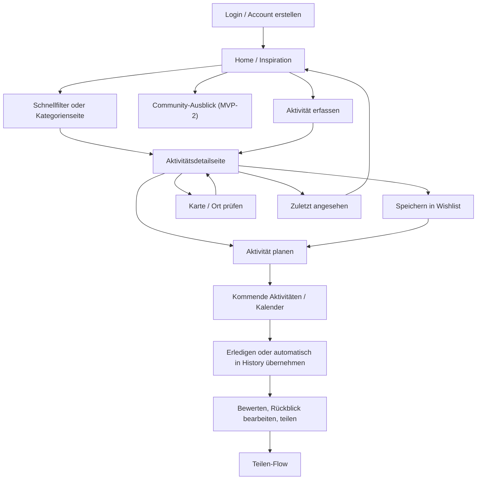
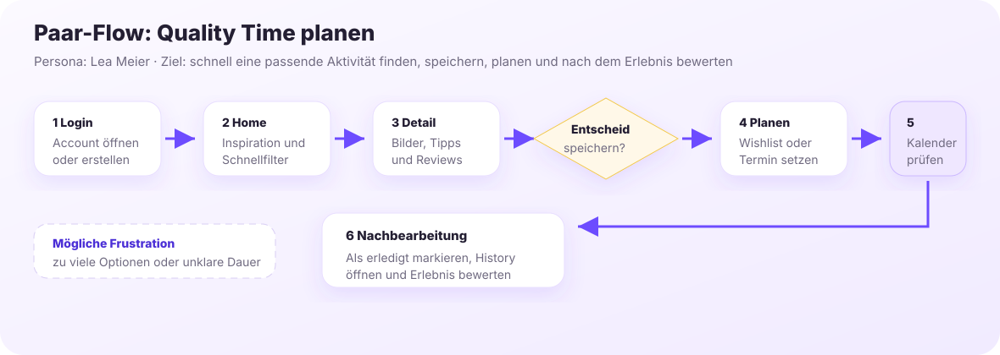
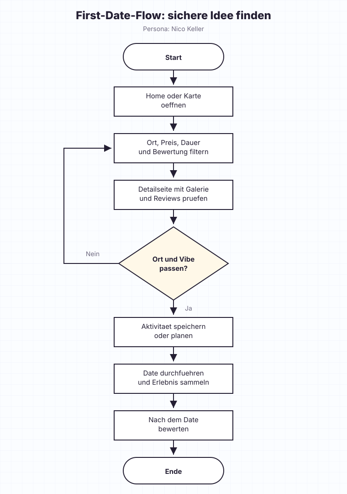
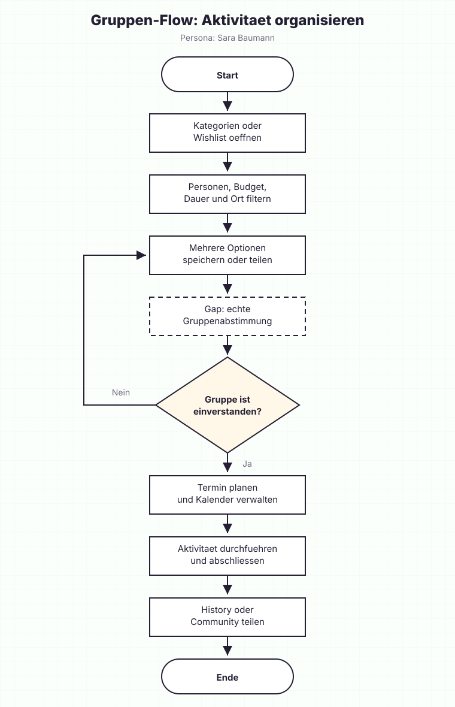
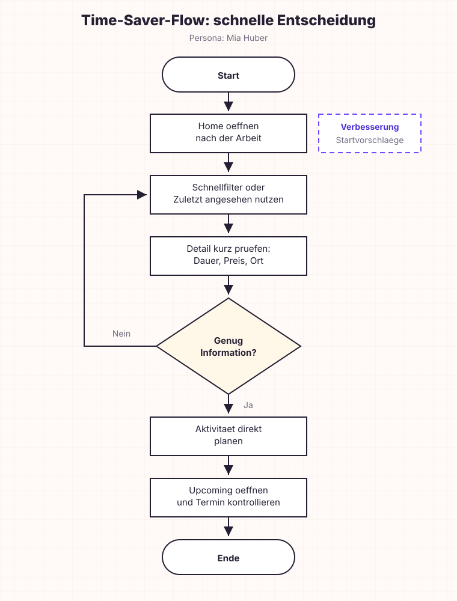
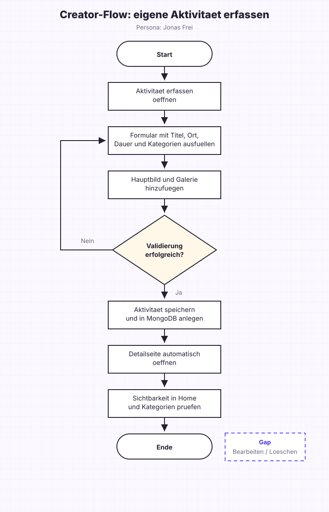
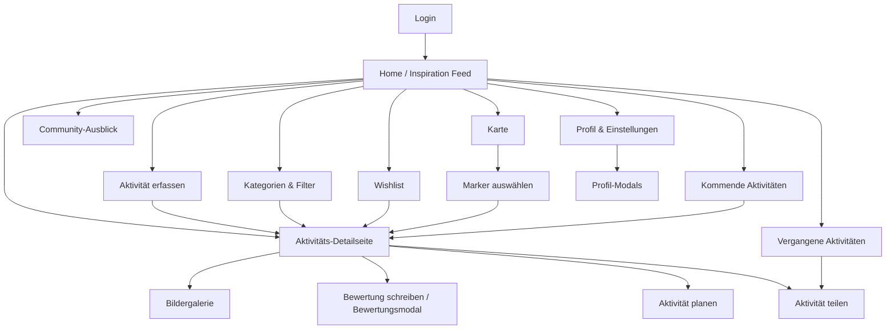
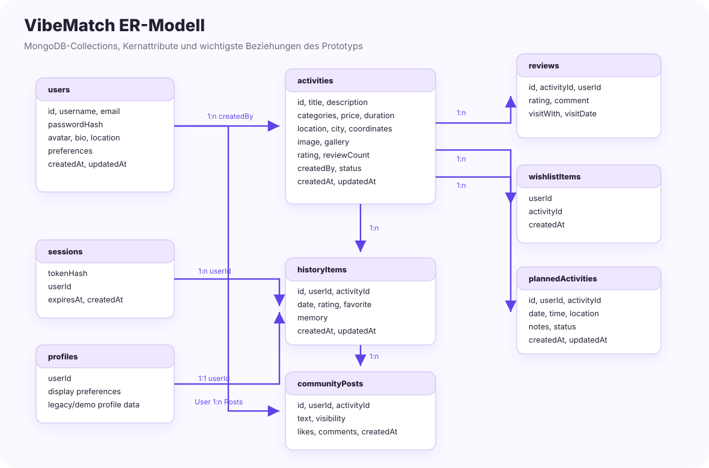
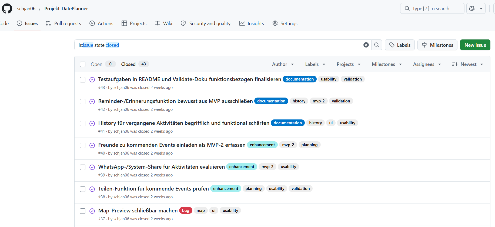

# Projektdokumentation - VibeMatch

## Inhaltsverzeichnis

1. [Ausgangslage](#1-ausgangslage)
2. [Lösungsidee](#2-lösungsidee)
3. [Vorgehen & Artefakte](#3-vorgehen--artefakte)
    1. [Understand & Define](#31-understand--define)
    2. [Sketch](#32-sketch)
    3. [Decide](#33-decide)
    4. [Prototype](#34-prototype)
    5. [Validate](#35-validate)
4. [Erweiterungen](#4-erweiterungen-optional)
5. [Projektorganisation](#5-projektorganisation-optional)
6. [KI-Deklaration](#6-ki-deklaration)
7. [Anhang](#7-anhang-optional)

> **Deployment-Link:** [https://schjandateplanner.netlify.app/](https://schjandateplanner.netlify.app/)
>
> **Hinweis: Für den Test kann folgender Demo-Zugang verwendet werden:**
>
> | Feld | Wert |
> |---|---|
> | Benutzername | `demo` |
> | Passwort | `demo123` |

<!-- WICHTIG: DIE KAPITELSTRUKTUR DARF NICHT VERÄNDERT WERDEN! -->

<!-- Diese Vorlage ist für eine README.md im Repository gedacht. Abschnitte mit [Optional] können weggelassen werden, wenn in den Übungen nichts anderes verlangt wird. -->

## 1. Ausgangslage
VibeMatch adressiert das alltägliche Problem, dass gemeinsame Aktivitäten oft länger diskutiert als entschieden werden. Besonders bei Paaren, Freundinnen und Freunden oder kleinen Gruppen ist die Ausgangsfrage häufig ähnlich: Was passt heute zu unserer Stimmung, unserem Budget, unserer Zeit und unserem Ort?

- **Problem:** Viele Nutzerinnen und Nutzer möchten spontan etwas unternehmen, verlieren aber Zeit durch zu viele Optionen, unklare Präferenzen oder fehlende lokale Übersicht. Dadurch entsteht Entscheidungsmüdigkeit. VibeMatch soll passende Aktivitätsideen sichtbar machen und den Weg von Inspiration zu Planung vereinfachen.
- **Relevanz:** Freizeitentscheidungen sind im Alltag häufig emotional und sozial geprägt. Eine klare, visuelle und filterbare Übersicht hilft dabei, Vorschläge schneller zu vergleichen und eine gemeinsame Entscheidung zu treffen.
- **Ziele:** Ziel des Projekts ist ein klickbarer Web-App-Prototyp, der gemeinsame Aktivitäten übersichtlich vorschlägt, filterbar macht, Detailinformationen zeigt und zentrale Folgehandlungen wie Speichern, Planen, Bewerten, Teilen, Kartenansicht und eigene Aktivitätserfassung unterstützt.
- **Primäre Zielgruppe:** Paare, Freundesgruppen und kleine Gruppen, die gemeinsame Freizeitaktivitäten in der Schweiz schneller entdecken und planen möchten.
- **Weitere Stakeholder [Optional]:** Sekundär profitieren Personen mit wenig Zeit, Singles oder First-Date-Situationen sowie mögliche lokale Anbieter von Aktivitäten. Im aktuellen Prototyp werden lokale Anbieter jedoch nicht als eigene Nutzerrolle umgesetzt.

## 2. Lösungsidee
VibeMatch ist eine Web-App für Inspiration, Auswahl und Planung gemeinsamer Aktivitäten. Die App fokussiert nicht auf Dating-Matching zwischen Personen, sondern auf passende Aktivitätsideen für Paare, Freundinnen und Freunde sowie Gruppen.

- **Kernfunktionalität:** Die Web-App bietet einen Home-/Inspiration-Feed, Aktivitätsdetailseiten, Kategorien und Filter, Wishlist, kommende Aktivitäten, vergangene Aktivitäten mit Rückblicksnotizen, eine Kartenansicht mit OpenStreetMap-/Leaflet-Markern, Profil/Einstellungen, eine Page zum Erfassen neuer Aktivitäten sowie Modals zum Planen, Teilen und Bewerten.
- **Aktueller Funktionsumfang:** Zusätzlich zum ursprünglichen Klick-Prototyp sind inzwischen ein einfaches Login-/User-System, eine interaktive Profilseite, eine Aktivität-erfassen-Page, eine Hero-Bildergalerie auf Detailseiten, Home-Schnellfilter, zuletzt angesehene Aktivitäten, aktive Filterchips, Sortierung, userbezogene Daten, bearbeitbare Rückblicksnotizen in der History, eine Community-Ausblickseite für ein späteres MVP und eine verbesserte Map-Page umgesetzt.
- **Annahmen [Optional]:** Nutzerinnen und Nutzer entscheiden schneller, wenn Aktivitäten nach Stimmung, Ort, Budget, Dauer, Personenanzahl und Bewertung filterbar sind. Es wird angenommen, dass ein visueller Feed, Kartenmarker und gespeicherte Ideen die Entscheidungsmüdigkeit reduzieren. Eine weitere Hypothese ist, dass Bewertungen, Rückblicksnotizen und eigene Ideen helfen, zukünftige Entscheidungen besser einzuordnen.
- **Abgrenzung [Optional]:** Der Prototyp enthält ein einfaches Login-, Account-Erstellungs- und User-System, aber kein produktionsreifes Rollen-, Rechte- oder Account-Management. Es gibt kein Zahlungs- oder Buchungssystem, keine produktive Anbieterintegration, kein OAuth, keinen Passwort-Reset, keine E-Mail-Verifikation und kein Cloud-Storage. Die Kartenlösung nutzt OpenStreetMap/Leaflet statt einer kostenpflichtigen Google-Maps-API. Bilduploads für neue Aktivitäten werden prototypisch als kleine Data-URLs in MongoDB gespeichert. Eine produktive Community mit Feed, Follow-System, Kommentaren, Moderation und Privatsphäre-Konzept ist bewusst MVP-2 und nicht Teil der aktuellen Abgabe.

## 3. Vorgehen & Artefakte
Die Durchführung erfolgt phasenbasiert; dokumentieren Sie die wichtigsten Ergebnisse je Phase.

Das Projekt orientiert sich am nutzerzentrierten Vorgehen aus dem Unterricht: `Understand & Define`, `Sketch`, `Decide`, `Prototype` und `Validate`. Zusätzlich wurden Begriffe und Methoden aus Design Sprint und Human-Centered Design berücksichtigt, insbesondere Proto-Personas, User Journey, Crazy 8, schnelle Prototypen und Validierung anhand konkreter Szenarien.

### 3.1 Understand & Define
- **Zielgruppenverständnis:** Ausgangspunkt war die Beobachtung, dass gemeinsame Aktivitätswahl im Alltag oft unklar, langwierig oder frustrierend ist. Als primäre Proto-Personas wurden Paare und kleine Gruppen angenommen, die schnell passende Ideen in ihrer Nähe suchen. Ergänzend wurden Personen mit wenig Zeit und First-Date-Situationen als sekundäre Zielgruppen betrachtet.
- **Research / Konkurrenzanalyse:** Vor der Umsetzung wurden ähnliche Produktkategorien betrachtet, um wiederkehrende Muster und sinnvolle Abgrenzungen für VibeMatch abzuleiten. Die folgende Tabelle dokumentiert die fachliche Einordnung und die daraus übernommenen Produktentscheidungen.

| Referenz / Produktkategorie | Beobachtete Funktionen | Erkenntnis für VibeMatch | Bewusste Abgrenzung |
|---|---|---|---|
| Event- und Freizeitplattformen, z. B. [Eventbrite](https://www.eventbrite.com/) oder lokale Eventkalender | Suche, Kategorien, Datum, Ort, Ticket-/Event-Fokus | Aktivitäten müssen schnell scannbar, filterbar und lokal verständlich sein | VibeMatch verkauft keine Tickets und bildet keine Anbieterprozesse ab |
| Karten- und Ausflugsplattformen, z. B. [Google Maps](https://maps.google.com/maps/about/?hl=de) oder [Schweiz Tourismus](https://www.myswitzerland.com/de-ch/erlebnisse/) | Kartenmarker, Ortsbezug, Bewertungen, Öffnungszeiten und Erlebnislisten | Karte und Detailvorschau helfen bei der Entscheidung vor Ort | Keine Routenplanung, kein Live-Standort und kein produktives Geocoding |
| Inspirations- und Social-Plattformen, z. B. [Pinterest](https://help.pinterest.com/de/article/save-pins-on-pinterest), Instagram oder lokale Blogs | Visuelle Karten, gespeicherte Ideen, Community-Impulse | Bilder, Wishlist und geteilte Rückblicke machen Aktivitäten emotional greifbarer | Kein vollwertiges Social Network und keine Follower-/Kommentarlogik als MVP |
| Dating- und Matching-Apps, z. B. Bumble Date Ideas oder Tinder-ähnliche Swipe-Muster | schnelle Entscheidung, spielerischer Vergleich, niedrige Einstiegshürde | Eine spätere Swipe-/Matching-Idee kann Entscheidungsmüdigkeit reduzieren | Fokus liegt auf Aktivitäten, nicht auf Personenmatching |
| Planungs- und Kalender-Tools | Terminübersicht, Status, Erinnerungen | Aus Inspiration muss ein geplanter Termin werden | Kein Kalenderexport und kein Reminder-System im aktuellen Prototyp |

- **Wesentliche Erkenntnisse:** Entscheidungsmüdigkeit ist ein zentrales Problem. Lokale Vorschläge, einfache Filter, visuelle Cards, Bewertungen und eine Wishlist können helfen, Optionen schneller einzugrenzen. Aus der Reflexion des Entscheidungsprozesses ging hervor, dass die Idee wegen Alltagsrelevanz, visueller Umsetzbarkeit und Nutzen für mehrere Zielgruppen gewählt wurde.
- **Artefakte:** Reflexion des Entscheidungsprozesses, Übung 10 zum Prototyping-Workflow, Methodik-Unterlagen Woche 9, Proto-Personas, User Stories und User Journey Flows. Die folgenden Personas und Journeys sind direkt auf den aktuellen Prototyp rückführbar und dienen als Grundlage für Requirements Engineering, Validierung und spätere Erweiterungen.

#### Proto-Personas

| Persona | Profil | Technisches Verständnis | Ziele | Motivation | Frustrationen | Typisches Verhalten | Erwartung an VibeMatch | Relevante Features |
|---|---|---|---|---|---|---|---|---|
| **Lea Meier** | 29, Marketing Managerin, lebt in Zürich, seit mehreren Jahren in einer Beziehung | Hoch im Alltag, nutzt viele Apps, erwartet schnelle Bedienung | Wieder mehr gemeinsame Quality Time planen, ohne lange Diskussion | Abwechslung, gemeinsame Erinnerungen, einfache Inspiration nach Stimmung | Routine, zu viele Optionen, unterschiedliche Budgets und Zeitfenster | Öffnet Apps spontan abends oder am Wochenende, vergleicht visuelle Vorschläge, speichert Ideen für später | Schnelle Inspiration, Filter nach Stimmung/Budget/Dauer, Wishlist, Kalender und History | Home, Schnellfilter, Kategorien, Detailseite, Wishlist, Planen, Upcoming, History, Bewertungen |
| **Nico Keller** | 26, Softwareentwickler, Single, plant ein erstes Date in St. Gallen | Sehr hoch, achtet auf klare Informationen und Bewertungen | Eine lockere, sichere Date-Idee finden, die Gesprächspausen reduziert | Ein guter erster Eindruck, entspannte Atmosphäre, öffentlicher Ort | Unsicherheit beim passenden Vibe, Angst vor langweiligen Standarddates | Prüft Bewertungen, Bilder, Ort und Dauer genau, bevorzugt sichere öffentliche Orte | Verlässliche Detailinfos, Review-Zusammenfassung, Karte, Preis-/Dauerfilter und Planung | Filter, Map, Detailseite, Galerie, Reviews, Planungsmodal, Wishlist |
| **Sara Baumann** | 34, Projektleiterin, organisiert Freizeitaktivitäten mit Freundesgruppe und Kolleginnen/Kollegen | Mittel bis hoch, nutzt Kalender und Gruppen-Chats | Gruppenaktivitäten schneller koordinieren und Ideen sammeln | Weniger Organisationsaufwand, faire Budgetauswahl, gemeinsame Entscheidung | Terminfindung, unterschiedliche Interessen, Logistik und Kosten | Sammelt mehrere Optionen, teilt Ideen, achtet auf Personenanzahl, Ort und Dauer | Gruppenfreundliche Suche, Teilen, Wishlist, Kalender und später Community-Impulse | Kategorien, Preis/Dauer/Ort, Wishlist, Teilen, Upcoming/Kalender, Community-Ausblick, Aktivität erfassen |
| **Mia Huber** | 41, Pflegefachfrau, lebt in Winterthur, wenig freie Zeit und unregelmässige Arbeitszeiten | Mittel, nutzt Apps pragmatisch, möchte wenig konfigurieren | In wenigen Minuten eine passende Aktivität finden und direkt planen | Zeit sparen, klare Vorschläge, wenig mentale Belastung nach der Arbeit | Zu viele Filter, lange Texte, unsichere Öffnungszeiten oder unklare Dauer | Nutzt schnelle Einstiege, entscheidet visuell, kehrt zu zuletzt angesehenen Ideen zurück | Sehr schnelle Suche, wenige Klicks, klare Metadaten und direkte Planung | Home, Schnellfilter, zuletzt angesehen, Detailseite, Planen, Upcoming |
| **Jonas Frei** | 31, Vereinsmitglied und Freizeitorganisator aus St. Gallen, erstellt regelmässig Ideen für Gruppen | Hoch, ist bereit Formulare zu pflegen, erwartet aber klare Validierung | Eigene Aktivitätsideen erfassen, sichtbar machen und später verbessern | Lokale Ideen teilen, Gruppe inspirieren, neue Vorschläge in VibeMatch bringen | Wenn eigene Inhalte nicht auffindbar sind oder nachträglich nicht bearbeitet werden können | Füllt strukturierte Formulare aus, lädt Bilder hoch, prüft danach Detailseite und Filterbarkeit | Activity-Creation, Bild/Galerie, Sichtbarkeit in Listen, später Creator-Verwaltung | `/activities/new`, Bilder/Galerie, Detailseite, Kategorien, Profil, zukünftiges Bearbeiten/Löschen |

#### Persona-zu-Journey-Zuordnung

| Persona | Hauptjourney | In der App abgebildet? | Begründung |
|---|---|---|---|
| Lea Meier | Paar-Flow: Quality Time planen | Vollständig | Inspiration, Detailseite, Wishlist, Planen, Upcoming, History und Bewertung sind vorhanden |
| Nico Keller | First-Date-Flow: sichere Idee finden | Weitgehend | Filter, Karte, Detailseite, Galerie, Reviews und Planung sind vorhanden; echte Sicherheits-/Verifizierungslogik fehlt bewusst |
| Sara Baumann | Gruppen-Flow: gemeinsame Aktivität organisieren | Teilweise | Gruppentaugliche Filter, Teilen, Wishlist und Planung sind vorhanden; echte Gruppenabstimmung ist offen |
| Mia Huber | Time-Saver-Flow: schnelle Entscheidung | Weitgehend | Schnellfilter, zuletzt angesehen und direkte Planung sind vorhanden; personalisierte Startvorschläge sind offen |
| Jonas Frei | Creator-Flow: eigene Aktivität sichtbar machen | Teilweise | Aktivitätserfassung, Bilder und Sichtbarkeit in Listen sind vorhanden; Bearbeiten/Löschen eigener Aktivitäten fehlt |

#### User Stories Nach Persona

| Persona | User Story | Priorität | Betroffene Seiten/Funktionen | Bereits implementiert? |
|---|---|---:|---|---|
| Lea | Als Lea möchte ich schnell passende Vorschläge nach Stimmung und Budget sehen, damit wir nicht lange diskutieren müssen. | Must | Home, Schnellfilter, Kategorien | Ja |
| Lea | Als Lea möchte ich Aktivitäten speichern, damit ich sie später mit meinem Partner vergleichen kann. | Must | Activity Cards, Detailseite, Wishlist | Ja |
| Lea | Als Lea möchte ich eine gespeicherte Idee direkt planen, damit aus Inspiration ein konkreter Termin wird. | Must | Wishlist, PlanActivityModal, Upcoming | Ja |
| Lea | Als Lea möchte ich vergangene Aktivitäten bewerten und kommentieren, damit wir gute Erlebnisse wiederfinden. | Should | History, Reviews | Ja |
| Nico | Als Nico möchte ich sichere und lockere Date-Ideen nach Ort, Preis und Dauer filtern, damit das erste Treffen entspannt bleibt. | Must | Kategorien, Filter, Map | Ja |
| Nico | Als Nico möchte ich Bewertungen und Review-Verteilung prüfen, damit ich eine glaubwürdige Entscheidung treffen kann. | Should | Detailseite, ReviewSummary, RatingStars | Ja |
| Nico | Als Nico möchte ich Aktivitäten auf einer Karte sehen, damit ich einen gut erreichbaren Treffpunkt wählen kann. | Should | Map, Leaflet, Detailvorschau | Ja |
| Nico | Als Nico möchte ich eine Date-Idee erst speichern und später planen, damit ich nicht sofort entscheiden muss. | Should | Wishlist, Planen, Upcoming | Ja |
| Sara | Als Sara möchte ich Aktivitäten nach Gruppentauglichkeit, Dauer und Budget filtern, damit die Idee für mehrere Personen passt. | Must | Kategorien, erweiterte Filter | Ja |
| Sara | Als Sara möchte ich eine Aktivität teilen, damit andere die Idee sehen und sie später in einer Community weiterentwickelt werden kann. | Should | ShareModal, Community-Ausblick | Teilweise |
| Sara | Als Sara möchte ich geplante Aktivitäten im Kalender verschieben, damit die Organisation flexibel bleibt. | Should | Upcoming, Kalender, PlannedActivityModal | Ja |
| Sara | Als Sara möchte ich eigene Aktivitätsideen erfassen, damit die Gruppe nicht nur aus Seed-Vorschlägen auswählt. | Could | `/activities/new`, Activity-Creation | Ja |
| Sara | Als Sara möchte ich Gruppenabstimmungen durchführen, damit mehrere Personen gemeinsam entscheiden können. | Could | Voting/Matching-Idee | Nein |
| Mia | Als Mia möchte ich mit wenigen Klicks passende Vorschläge sehen, damit ich nach der Arbeit keine lange Suche starten muss. | Must | Home, Schnellfilter, Kategorien | Ja |
| Mia | Als Mia möchte ich zuletzt angesehene Aktivitäten wiederfinden, damit ich eine gute Idee später schnell erneut öffnen kann. | Should | Home, Detailseite, localStorage | Ja |
| Mia | Als Mia möchte ich eine Aktivität direkt planen, damit ich aus einer schnellen Entscheidung sofort einen Termin machen kann. | Must | Detailseite, PlanActivityModal, Upcoming | Ja |
| Mia | Als Mia möchte ich personalisierte Empfehlungen sehen, damit ich noch weniger filtern muss. | Could | Empfehlungen, Profilpräferenzen | Nein |
| Jonas | Als Jonas möchte ich eine eigene Aktivität mit Bildern erfassen, damit meine Gruppe neue lokale Ideen in VibeMatch sieht. | Must | `/activities/new`, Upload, `POST /api/activities` | Ja |
| Jonas | Als Jonas möchte ich prüfen, ob meine Aktivität in Listen und auf der Detailseite sichtbar ist, damit ich weiss, dass sie nutzbar ist. | Should | Home, Kategorien, Detailseite | Ja |
| Jonas | Als Jonas möchte ich eigene Aktivitäten später bearbeiten oder löschen, damit fehlerhafte Angaben korrigiert werden können. | Should | Creator-Verwaltung, Activity-API | Nein |
| Jonas | Als Jonas möchte ich sehen, welche Aktivitäten von ihm erstellt wurden, damit er seine Ideen im Profil verwalten kann. | Could | Profil, eigene Aktivitäten | Nein |

### 3.2 Sketch
- **Variantenüberblick:** In der Sketch-Phase wurden mehrere Ansätze geprüft, darunter Detailansicht, Planen, Bewertungen, Kartenansicht, History/vergangene Aktivitäten, Upcoming Events und Community-/Teilen-Funktionen.
- **Skizzen:** Die Crazy-8-Skizzen dienten dazu, unterschiedliche Screens und Interaktionen schnell zu vergleichen. Besonders relevant waren Varianten für den Einstieg über eine Hauptseite, den Wechsel zur Detailseite, Planungsaktionen, Bewertungsmodal, Karte und Verlauf.
- **Crazy-8-Artefakt:** Die folgende Skizze dokumentiert den frühen Ideenraum und zeigt, welche Screens und Interaktionen vor der Umsetzung geprüft wurden.


**Feedback zu den Crazy-8-Skizzen:**

Die Crazy-8-Skizzen zeigen bereits eine gute Grundstruktur der Webapplikation. Besonders positiv ist, dass verschiedene zentrale Funktionen berücksichtigt wurden, wie die Detailansicht einer Date-Idee, Filtermöglichkeiten, das Hinzufügen neuer Ideen, geplante Aktivitäten, Bewertungen, eine Kartenansicht sowie eine History. Dadurch wird ersichtlich, dass die wichtigsten User-Flows der Anwendung bereits mitgedacht wurden.

Die Detailansicht ist sinnvoll aufgebaut, da sie eine kurze Beschreibung, Bilder und zusätzliche Informationen wie Preis, Dauer und Region enthält. Auch die Idee, direkt von dort aus eine Bewertung oder weitere Aktionen aufzurufen, passt gut zum Nutzungskontext.

Die Filterfunktion ist ebenfalls ein wichtiger Bestandteil der Anwendung. Die Kombination aus Basisfiltern und erweiterten Filtern wirkt sinnvoll, da Nutzer so schnell passende Date-Ideen finden können. Hier könnte später noch darauf geachtet werden, dass die Filter übersichtlich bleiben und nicht zu viele Optionen auf einmal angezeigt werden.

Der Bereich „Add new Date-Idee“ ist klar verständlich und enthält die wichtigsten Eingabefelder wie Name, Preis, Zeit, Location und Bild. Das ist eine gute Grundlage, um neue Aktivitäten einfach erfassen zu können.

Auch die Upcoming Events/Wishlist und die History sind gute Ergänzungen, weil sie den Nutzern helfen, geplante und bereits erlebte Aktivitäten zu verwalten. Besonders die History mit Links zu vergangenen Dates ist sinnvoll, da man dadurch später nochmals auf Details oder Bewertungen zugreifen kann.

Die Map-Ansicht ist eine sehr passende Idee für diese Webapplikation, da Aktivitäten oft stark vom Standort abhängig sind. Die Marker auf der Karte machen die Suche nach Date-Ideen intuitiver und visueller.

Insgesamt wirken die Skizzen durchdacht und decken die wichtigsten Funktionen der Webapplikation gut ab. Für die nächste Ausarbeitung wäre es sinnvoll, die einzelnen Screens noch etwas klarer voneinander zu trennen und eine einheitliche Navigation zu definieren. So wird für den Nutzer noch verständlicher, wie er sich durch die Anwendung bewegt.

- **Übertrag in den Prototyp:** Mehrere Skizzenideen sind inzwischen umgesetzt, unter anderem Detailseite, Hero-Galerie, Planen-/Teilen-/Bewerten-Modals, Map-Page, Upcoming, History, Wishlist und eine Community-Ausblickseite.

### 3.3 Decide
- **Gewählte Variante & Begründung:** Gewählt wurde eine Dashboard-artige Web-App mit Sidebar-Navigation, Aktivitätscards, Detailseiten und klaren Folgeaktionen. Diese Variante unterstützt den zentralen Use Case am besten: Inspiration finden, Aktivität prüfen, speichern, planen, bewerten oder teilen.
- **End-to-End-Ablauf:** Der bisherige Figma-/Mockup-Workflow startet auf der Hauptseite, zeigt kommende oder vorgeschlagene Aktivitäten, führt über einen `Details`-Klick zur Aktivitätsdetailseite und erlaubt dort das Teilen einer Aktivität. Im aktuellen Prototyp wurde dieser Ablauf erweitert: Login -> Home -> Detailseite -> Wishlist/Planen/Teilen/Bewerten sowie Home -> Wishlist -> direkt planen -> Upcoming -> als erledigt markieren -> History.
- **Mockup:** Figma-Link aus Übung 10: https://www.figma.com/design/E7gsRcP1iqdcxWtTci8CYT/Prototyping_Mockups-f%C3%BCr-Projekt?node-id=0-1&t=3vTtEWy7cSfTMhxj-1. Finale Screenshots, Figma-Bezug und Abgabeartefakte sind in `docs/artifacts-and-screenshots.md` dokumentiert.

#### User Journey Flows Als Entscheidungsgrundlage

Die folgenden Journeys wurden für den Prototyp priorisiert, weil sie die wichtigsten Zielgruppen und Kernfunktionen abdecken.



Zusätzlich sind die einzelnen Journeys als editierbare Draw.io-Workflows im Ordner `docs` dokumentiert. Die Diagramme sind als klassische Prozessdiagramme aufgebaut: Start und Ende sind als Ovale dargestellt, Aktivitätsschritte als Rechtecke, Entscheidungen als Rauten mit beschrifteten `Ja`-/`Nein`-Pfaden und noch offene Gaps als gestrichelte Elemente.

**Paar-Flow: Quality Time planen**  
Lea Meier findet Inspiration, prüft eine Aktivität, plant sie und bewertet das Erlebnis danach.



**First-Date-Flow: sichere Idee finden**  
Nico Keller filtert nach Ort, Preis, Dauer und Bewertung, bevor er eine Date-Idee speichert oder plant.



**Gruppen-Flow: gemeinsame Aktivität organisieren**  
Sara Baumann sammelt und teilt Optionen, bis die Gruppe eine passende Aktivität planen kann.



**Time-Saver-Flow: schnelle Entscheidung**  
Mia Huber nutzt Schnellfilter oder zuletzt angesehene Ideen, um ohne lange Suche direkt zu planen.



**Creator-Flow: eigene Aktivität sichtbar machen**  
Jonas Frei erfasst eine neue Aktivität, fügt Bilder hinzu und prüft danach die Sichtbarkeit in der App.



| Journey | Einstiegspunkt | Such-/Filterprozess | Entscheidung | Folgeaktion | Nachbearbeitung | Mögliche Frustration | Benötigte Features |
|---|---|---|---|---|---|---|---|
| **Paar-Flow: Quality Time planen** | Login -> Home | Schnellfilter nach Stimmung, Budget, Dauer oder Kategorienseite | Vergleich über Bilder, Metadaten, Reviews und Tipps | Wishlist oder direkt planen | Upcoming, Kalender, History, Bewertung | Zu viele Optionen oder unklare Dauer | Home, Filter, Detailseite, Wishlist, Planen, Kalender, History |
| **First-Date-Flow: sichere Idee finden** | Home oder Map | Filter nach Ort, Preis, Dauer, Indoor/Outdoor und Bewertung | Detailseite mit Galerie, Review-Zusammenfassung und Anforderungen | Aktivität planen oder für später speichern | Nach Date bewerten und Rückblicksnotiz ergänzen | Unsicherheit, ob Ort und Vibe passen | Kategorien, Map, Detailseite, Reviews, Planungsmodal |
| **Gruppen-Flow: gemeinsame Aktivität organisieren** | Kategorien oder Wishlist | Filter nach Personenanzahl, Budget, Ort, Dauer und Kategorie | Mehrere Optionen speichern oder teilen | Termin im Kalender verwalten | Als erledigt markieren und teilen | Unterschiedliche Interessen, Terminfindung, fehlende Abstimmung | Erweiterte Filter, Wishlist, Teilen, Upcoming, MVP-2-Ausblick |
| **Time-Saver-Flow: schnelle Entscheidung** | Home | Schnellfilter oder zuletzt angesehen, möglichst ohne tiefe Konfiguration | Kurzer Vergleich über Card, Dauer, Preis und Detailseite | Direkt planen | Upcoming prüfen und später erledigen | Zu viele Auswahlmöglichkeiten, zu viele Formularschritte | Home, Schnellfilter, zuletzt angesehen, Detailseite, Planen |
| **Creator-Flow: eigene Aktivität sichtbar machen** | Sidebar `Erfassen` oder Home-Button | Formular mit Kategorien, Ort, Eigenschaften und Bildern | Live-Vorschau und Pflichtfeldvalidierung | Speichern und Redirect zur Detailseite | Sichtbarkeit in Home/Kategorien prüfen | Fehlende Bearbeiten-/Löschen-Funktion nach dem Speichern | `/activities/new`, `POST /api/activities`, Galerie, Detailseite |

| Entscheidungspunkt | Aktuelle Lösung | Status | Nächste mögliche Verbesserung |
|---|---|---|---|
| Welche Aktivität passt zur Situation? | Schnellfilter, Kategorien, Suche, Sortierung | Ja | Personalisierte Empfehlungen auf Basis von Profil/Wishlist |
| Ist die Aktivität glaubwürdig? | Bewertungen, Review-Zusammenfassung, Bildergalerie | Ja | Moderierte oder verifizierte Reviews |
| Wo findet die Aktivität statt? | Map mit Stadt-, Kategorie-, Preis- und Dauerfilter | Ja | Geocoding für neue Aktivitäten ohne Koordinaten |
| Wie wird aus einer Idee ein Termin? | Planungsmodal, Wishlist-Direktplanung, Upcoming/Kalender, automatische History-Übernahme abgelaufener Termine | Ja | Kalenderexport oder echte Reminder als MVP-2 |
| Wie entscheidet eine Gruppe gemeinsam? | Teilen-Flow und Community-Ausblick | Teilweise | Gruppenabstimmung oder Voting-Link |
| Wie werden eigene Ideen gepflegt? | Aktivität erfassen | Teilweise | Eigene Aktivitäten bearbeiten/löschen |
| Wie finden Personen mit wenig Zeit schnell eine Idee? | Home-Schnellfilter, zuletzt angesehen, direkte Planung | Ja | Personalisierte Startvorschläge |
| Wie werden usergenerierte Aktivitäten verwaltet? | Aktivität erfassen und Detailseite | Teilweise | Creator-Bereich im Profil mit Bearbeiten/Löschen |

Journey-Status:

| Journey | Status | Begründung |
|---|---|---|
| Paar-Flow: Quality Time planen | Vollständig | Der gesamte Ablauf von Inspiration über Speichern/Planen bis History und Bewertung ist im Prototyp nutzbar |
| First-Date-Flow: sichere Idee finden | Weitgehend | Filter, Karte, Detailentscheidung und Planung sind vorhanden; Verifizierung oder echte Sicherheitsmerkmale sind nicht Teil des MVP |
| Gruppen-Flow: gemeinsame Aktivität organisieren | Teilweise | Suche, Teilen und Planung funktionieren; eine echte Abstimmung mit mehreren Personen fehlt |
| Time-Saver-Flow: schnelle Entscheidung | Weitgehend | Home-Schnellfilter, zuletzt angesehen und Direktplanung sind vorhanden; personalisierte Vorschläge fehlen |
| Creator-Flow: eigene Aktivität sichtbar machen | Teilweise | Neue Aktivitäten können erfasst und angezeigt werden; eigene Aktivitäten können noch nicht bearbeitet oder gelöscht werden |

### 3.4 Prototype

#### 3.4.1. Entwurf (Design)
Beschreibt die Gestaltung und Interaktion.
> **Hinweis:** Hier wird der **Prototyp** beschrieben, nicht das **Mockup**.

- **Informationsarchitektur:** Die App ist um die Hauptbereiche Home/Inspiration, Kategorien & Filter, Karte, Wishlist, Kommende Aktivitäten mit Kalender, Vergangene Aktivitäten, Community-Ausblick, Aktivität erfassen und Profil aufgebaut. Detailseiten sind über Aktivitätscards, Listen, Marker und weitere Teaser erreichbar. Aus der Wishlist können gespeicherte Ideen direkt geplant werden. Nicht eingeloggte Nutzer werden zuerst zur Login-Seite geführt.
- **User Interface Design:** Der Prototyp nutzt ein modernes, helles Dashboard-Design mit Desktop-Sidebar, mobiler Navigation, Such- und Filterelementen, Aktivitätscards, Detail-Hero, Bewertungsanzeige, Map-Panel und Modals. Die Hauptfarbe ist Violett/Lila, ergänzt durch helle Pastelltöne und weisse Flächen.
- **Login-Seite:** Die Login-Seite ist als fokussierte Einstiegskarte gestaltet. Sie enthält Branding, einen kurzen Nutzenhinweis und zwei Modi: `Einloggen` für vorhandene Accounts sowie `Account erstellen` für neue Accounts. Demo-Zugangsdaten werden nicht mehr prominent angezeigt, damit die Seite sauberer wirkt.
- **Home / Inspiration:** Die Startseite zeigt Inspiration, Aktivitätscards und Schnellfilter für Stimmung, Ort und Budget. Nach dem Öffnen von Detailseiten erscheint zusätzlich der Bereich `Zuletzt angesehen`, damit Nutzer dort fortfahren können, wo sie zuletzt gestöbert haben. Zusätzlich gibt es den Einstieg zur neuen Page `Aktivität erfassen`.
- **Kategorien & Filter:** Die Filterseite wurde kompakter gestaltet. Suche, Kategorie und Stadt sind immer sichtbar; weitere Filter wie Preis, Dauer, Stimmung, Personen, Bewertung, beste Zeit und Sortierung werden über `Erweiterte Filter` eingeblendet. Aktive Filter erscheinen als Chips und können einzeln entfernt werden.
- **Aktivitätsdetailseite:** Die Detailseite nutzt oben eine grosse Hero-Bildergalerie mit Pfeilen, Punkten und Swipe-Unterstützung. Darunter folgen Informationen, Metadaten, Tipps, Anforderungen, ein Bewertungsbereich mit Review-Zusammenfassung und zunächst maximal drei sichtbaren Einzelrezensionen sowie Aktionen zum Speichern, Planen und Teilen.
- **Map:** Die Map-Page kombiniert Leaflet-Karte und Aktivitätenliste. Zusätzlich können Kartenmarker und Ergebnisliste nach Kategorie, Preis und Dauer gefiltert werden. Die Liste bleibt bündig mit der Kartenhöhe und scrollt intern, ohne dass die letzte Aktivität abgeschnitten wird.
- **Kommende Aktivitäten:** Die Page besitzt eine Listenansicht und eine moderne Kalenderansicht. Der Kalender zeigt geplante Aktivitäten in einer Monatsansicht, markiert den heutigen Tag, bietet Monatsnavigation und zeigt Details zum ausgewählten Tag. Termine können über ein Modal bearbeitet oder aus der Planung entfernt werden; auf Desktop ist zusätzlich ein einfaches Drag-&-Drop-Verschieben auf andere Tage vorgesehen.
- **Profil:** Die Profilseite zeigt dynamische Userdaten in einem klareren Header, Statistik-Karten, persönliche Informationen, Vorlieben und Einstellungseinträge. Manuell gewählte Lieblingskategorien werden getrennt von automatisch aus Wishlist/History erkannten Kategorien angezeigt. Die Aktionen öffnen Modals für Profil bearbeiten, Passwort ändern, Reminder-/Benachrichtigungsabgrenzung, Hilfe & Support, Freunde einladen und Logout.
- **Aktivität erfassen:** Die Page `/activities/new` ist als Formular in mehreren Cards aufgebaut. Sie enthält Basisdaten, Ort, Kategorien, Eigenschaften, Bilder/Galerie, Tipps, Anforderungen und eine Live-Vorschau im Stil der bestehenden Activity Cards.

Screen-to-Journey-Mapping:

| Screen / Bereich | Unterstützte Journey-Schritte | Zielgruppenbezug | Status |
|---|---|---|---|
| Login | Einstieg, Account-Erstellung, Multi-User-Trennung | Alle Personas | Ja |
| Home / Inspiration | Erste Inspiration, Schnellfilter, zuletzt angesehen | Lea, Nico, Sara | Ja |
| Kategorien & Filter | Gezieltes Eingrenzen nach Ort, Preis, Dauer, Stimmung, Personen und Bewertung | Alle Personas | Ja |
| Aktivitätsdetailseite | Entscheidung über Bilder, Metadaten, Tipps, Anforderungen und Reviews | Lea, Nico | Ja |
| Wishlist | Ideen sammeln, vergleichen und direkt planen | Lea, Sara | Ja |
| Upcoming / Kalender | Termine verwalten, verschieben, entfernen und abschliessen | Lea, Sara | Ja |
| History | Vergangene Aktivitäten bewerten, Rückblicksnotiz ergänzen und teilen | Lea, Sara | Ja |
| Map | Lokale Entscheidung und Treffpunktprüfung | Nico, Sara | Ja |
| Community-Ausblick | spätere soziale Inspiration, Follow-/Kommentarlogik und Moderation | Sara | MVP-2 |
| Profil | persönliche Daten, Vorlieben, Statistiken und Einstellungen | Alle Personas | Ja |
| Aktivität erfassen | eigene Ideen in den Feed bringen | Sara, Jonas | Ja |
| Zuletzt angesehen | schnelle Rückkehr zu bereits geprüften Ideen | Mia | Ja |
| Eigene Aktivitäten verwalten | usergenerierte Inhalte nachträglich pflegen | Jonas | Nein |
| Swipe / Matching | spielerische gemeinsame Entscheidung | Paare, Gruppen | Nein |
| Gruppenabstimmung | gemeinsame Auswahl über mehrere Personen | Sara | Nein |

Routenübersicht der Pages:

| Route | Zweck der Seite | Wichtigste UI-Elemente | Verwendete Daten | Journey-Bezug |
|---|---|---|---|---|
| `/login` | Einstieg, Login und Account-Erstellung | Login-Formular, Account-erstellen-Modus, Fehlermeldungen | `users`, `sessions` | Startpunkt aller geschützten Journeys |
| `/` | Inspiration und schnelle Aktivitätswahl | Hero, Schnellfilter, Activity Cards, zuletzt angesehen, CTA zum Erfassen | `activities`, `wishlistItems`, `localStorage` | Paar-, Time-Saver- und Creator-Flow |
| `/categories` | gezielte Suche und Filterung | Suche, Basisfilter, erweiterte Filter, Chips, Sortierung, Ergebnisliste | `activities`, Kategorien aus Activity-Daten | Paar-, First-Date- und Gruppen-Flow |
| `/activity/[id]` | Detailentscheidung zu einer Aktivität | Hero-Galerie, Metadaten, Tipps, Reviews, Planen/Teilen/Wishlist | `activities`, `reviews`, `wishlistItems` | zentrale Entscheidung in fast allen Journeys |
| `/wishlist` | gespeicherte Ideen vergleichen und planen | Wishlist-Cards, Sortierung, Planen-Button, Empty State | `wishlistItems`, `activities` | Paar- und Gruppen-Flow |
| `/upcoming` | geplante Aktivitäten verwalten | Liste, Kalender, Bearbeitungsmodal, Abschliessen | `plannedActivities`, `activities` | Planungs- und Kalenderabschnitt |
| `/history` | vergangene Aktivitäten nachbearbeiten | History Cards, Bewertung, Rückblicksnotiz, Teilen | `historyItems`, `activities` | Nachbearbeitung vergangener Aktivitäten |
| `/community` | MVP-2-Ausblick für Community-Konzept erklären | Roadmap-Karten, Abgrenzung, Link zu Aktivitäten | keine Seitendaten nötig | Produkt-Roadmap und Abgabeabgrenzung |
| `/map` | Aktivitäten räumlich entdecken | Leaflet-Karte, Marker, Such-/Filterpanel, Ergebnisliste | `activities` mit Koordinaten | First-Date- und Ortsentscheidung |
| `/profile` | Userdaten, Vorlieben und Einstellungen | Profil-Header, Statistiken, Kategorien, Modals | `users`, `profiles`, userbezogene Zählwerte | Profil- und Multi-User-Validierung |
| `/activities/new` | eigene Aktivität erfassen | Formular-Cards, Bild-Upload, Galerie, Vorschau, Speichern | `activities`, `users.createdBy` | Creator-Flow |

Navigation der Webseite:



#### Screenshots der fertigen Applikation

Die folgenden Screenshots dokumentieren die umgesetzten VibeMatch-Kernflows und zeigen den Stand der fertigen Applikation.

**Einstieg und Inspiration**

<table>
  <tr>
    <td width="50%"><br><em>Anmeldung und Account-Einstieg</em></td>
    <td width="50%"><br><em>Titelseite mit Inspirationen und Aktivitätskarten</em></td>
  </tr>
  <tr>
    <td width="50%"><br><em>Kategorien mit Basis- und erweiterten Filtern</em></td>
    <td width="50%"><br><em>Detailansicht mit Informationen und Aktionen</em></td>
  </tr>
</table>

**Speichern und Planen**

<table>
  <tr>
    <td width="50%"><br><em>Gespeicherte Aktivitäten in der Wishlist</em></td>
    <td width="50%"><br><em>Kalenderansicht für geplante Aktivitäten</em></td>
  </tr>
</table>

<p align="center">
  <br>
  <em>Listenansicht der kommenden Aktivitäten</em>
</p>

**Entdecken und Erfassen**

<table>
  <tr>
    <td width="50%"><br><em>Dynamische Kartenansicht mit Markern und Vorschau</em></td>
    <td width="50%"><br><em>Neue Aktivität erfassen inklusive Live-Vorschau</em></td>
  </tr>
</table>

**Bewerten und Teilen**

<table>
  <tr>
    <td width="50%"><br><em>Rezensionsübersicht und eigene Bewertung</em></td>
    <td width="50%"><br><em>Aktivitäten über Link, WhatsApp oder Systemfunktion teilen</em></td>
  </tr>
  <tr>
    <td colspan="2" align="center"><br><em>Vergangene Aktivitäten mit Rückblick und Bewertung</em></td>
  </tr>
</table>

**Profil**

<p align="center">
  <br>
  <em>Profilübersicht mit persönlichen Angaben, Vorlieben und Einstellungen</em>
</p>

#### 3.4.2. Umsetzung (Technik)
Fasst die technische Realisierung zusammen.

- **Technologie-Stack:** Der Prototyp ist mit SvelteKit, Svelte 5, Vite und JavaScript umgesetzt. Als Datenbank wird MongoDB verwendet. Für die Kartenansicht wird Leaflet mit OpenStreetMap-Tiles eingesetzt.
- **Tooling:** Entwicklung mit Node/npm, SvelteKit, Vite und einem Seed-Skript (`npm run seed`) für MongoDB-Demodaten. Die App kann lokal mit `npm run dev` gestartet und mit `npm run build` gebaut werden. Der Einsatz von KI wird im Kapitel **KI-Deklaration** beschrieben.
- **Lokales Setup:** `.env.example` nach `.env` kopieren, `DB_URI` mit einer gültigen MongoDB-Verbindung ersetzen und `DB_NAME` auf die gewünschte Datenbank setzen, z. B. `vibematch`. Danach `npm install`, `npm run seed`, `npm run dev` und vor der Abgabe `npm run build` ausführen. Wenn `DB_URI` fehlt oder noch Platzhalter enthält, bricht die App bzw. das Seed-Skript mit einer verständlichen Fehlermeldung ab.
- **Projektstruktur:** Die Pages liegen unter `src/routes`. Wiederverwendbare UI-Elemente liegen unter `src/lib/components`, unter anderem Layout-Komponenten (`AppShell`, `Sidebar`, `Topbar`, `MobileNav`), Activity-Komponenten (`ActivityCard`, `ActivityGrid`, `ActivityListItem`, `ActivityMeta`, `ActivityGallery`), Filter-Komponenten, Map-Komponente (`LeafletActivityMap`), Profil-Komponenten und Modals. Serverseitige Datenzugriffe sind in `src/lib/server/repositories.js` gebündelt. MongoDB wird über `src/lib/server/db.js` angebunden. Das globale Toast-State-Handling liegt in `src/lib/state/appState.svelte.js`.
- **Auth/Login:** Das Login-System nutzt `src/hooks.server.js`, `src/lib/server/auth.js`, MongoDB-Collections `users` und `sessions` sowie das Cookie `vm_session`. Passwörter werden mit Node.js `crypto.scrypt` gehasht. Auf `/login` gibt es zwei Modi: vorhandene Accounts melden sich mit Benutzername oder E-Mail und Passwort an; neue Nutzer erstellen direkt einen Account und werden anschliessend eingeloggt. Der Demo-Login lautet `demo` / `demo123`; der Demo-User ist ein normaler Seed-/Präsentationsaccount und wird nicht mehr zur Laufzeit als Fallback erzeugt. `passwordHash` wird nie ans Frontend gesendet.
- **Userbezogene Daten:** Wishlist, geplante Aktivitäten, History, Reviews, Teilen-Flow und Profilfunktionen verwenden den eingeloggten User über `locals.user.id`. Userbezogene Repository-Funktionen verlangen explizit eine User-ID und fallen nicht mehr automatisch auf `demo-user` zurück. Dadurch bleiben Demo-Daten beim Demo-Account und neue Accounts starten mit eigenen leeren Listen und eigenem Profil. Gespeicherte Wishlist-Aktivitäten können direkt über das bestehende Planungsmodal geplant und in der Wishlist sortiert werden. Geplante Aktivitäten können über `PATCH /api/planned/[id]` aktualisiert, über `DELETE /api/planned/[id]` entfernt und über `POST /api/planned/[id]/complete` als erledigt in die History übernommen werden. Zusätzlich werden geplante Aktivitäten mit Datum vor heute beim Laden der Planung automatisch in die History verschoben. History-Einträge können über `PATCH /api/history/[id]` nachträglich bewertet und mit einer Rückblicksnotiz ergänzt werden.
- **Robustheit und Empty States:** Home, Upcoming, History und Profilstatistiken sind so ausgelegt, dass leere userbezogene Listen oder fehlende Seed-Daten verständlich erklärt werden. `/community` ist bewusst eine Ausblickseite und nicht mehr von Seed-Communitydaten abhängig. API-POST-Routen liefern kontrollierte JSON-Fehler mit `error` und optional `fieldErrors`, statt ungültige Eingaben ungeprüft weiterzugeben.
- **Accessibility:** Globale `:focus-visible`-Styles machen Tastaturnavigation sichtbar. Modals lassen sich per Schliessen-Button, Abbrechen-Aktion und Escape-Taste verlassen; dies wird in der manuellen Flow-Checkliste geprüft.
- **Profiltechnik:** Die Profilseite lädt Daten über `src/routes/profile/+page.server.js`. Profiländerungen laufen über `GET/PUT /api/profile`, Passwortänderungen über `PUT /api/profile/password` und Support-Feedback über `POST /api/support`. Das Reminder-/Benachrichtigungsmodal ist bewusst ein Info-Dialog zur MVP-Abgrenzung und speichert keine aktiven Reminder-Toggles. Lieblingskategorien stammen direkt aus den gespeicherten User-Präferenzen; zusätzlich werden Nutzungskategorien separat aus Wishlist und History berechnet. Statistikwerte werden userbezogen berechnet, die Durchschnittsbewertung ignoriert unbewertete History-Einträge mit `rating: 0`. Die Modals liegen unter `src/lib/components/profile`.
- **Aktivitäten erfassen:** Die Route `/activities/new` enthält ein Formular mit clientseitiger Validierung und Live-Vorschau. Das Speichern erfolgt über `POST /api/activities`. Die Repository-Funktion `createActivity()` erzeugt eine eindeutige ID, validiert Pflichtfelder und Bilder, setzt Defaults wie `rating: 0`, `reviewCount: 0`, `status: 'active'`, `createdBy`, `createdAt` und `updatedAt` und speichert die Aktivität in MongoDB.
- **Bilder/Galerie:** Bestehende Seed-Aktivitäten besitzen kuratierte, realistische Foto-URLs sowie Galerie-Daten im Format `gallery: [{ src, alt }]`. Für neu erfasste Aktivitäten ist mindestens ein Upload-Bild Pflicht; die Bilder werden im Prototyp als Data-URLs gespeichert. Erlaubt sind JPEG, PNG und WebP, maximal fünf Bilder und maximal 500 KB pro Bild. Das erste Bild wird als Hauptbild und erstes Galerie-Element verwendet.
- **Filter und Sortierung:** Die Kategorienseite liest Filter und Sortierung aus URL-Parametern. Dadurch bleiben Links aus Home-Schnellfiltern teilbar und reload-sicher. Die serverseitige Filterlogik liegt in `src/lib/server/repositories.js`; UI-Komponenten liegen unter `src/lib/components/filters`.
- **Zuletzt angesehen:** Die Detailseite speichert die zuletzt geöffneten Aktivitäts-IDs clientseitig in `localStorage` unter `vibematch.recentActivities`. Die Home-Seite liest diese IDs beim Laden im Browser aus, gleicht sie mit den vorhandenen Aktivitätsdaten ab und zeigt maximal vier passende Activity Cards. Dafür ist keine zusätzliche API und keine MongoDB-Collection notwendig.
- **Map:** Die Karte nutzt Leaflet/OpenStreetMap. Aktivitäten mit Koordinaten werden als Marker dargestellt. Kategorie-, Preis- und Dauerfilter nutzen die bestehenden Aktivitätsdaten sowie die Preisgruppierung aus der Filterlogik. Die Listen- und Kartendarstellung sind responsiv abgestimmt.
- **Reviews:** Reviews werden pro Aktivität über `GET /api/reviews` geladen und über `POST /api/reviews` gespeichert. Die Detailseite berechnet daraus Durchschnitt, Anzahl Bewertungen und eine einfache 5-bis-1-Sterne-Verteilung ohne zusätzliche API. Die Demo-/Seed-Daten enthalten pro Aktivität 1-12 realistische und bewusst unterschiedlich gute Reviews; `reviewCount` und `rating` der Aktivitäten sind darauf abgestimmt.
- **Technische Rückführbarkeit der Journeys:** Die Kernjourneys sind auf konkrete Routen, Komponenten und MongoDB-Collections abbildbar. Inspiration und Filter nutzen `activities` sowie Filterkomponenten; Wishlist nutzt `wishlistItems`; Planung nutzt `plannedActivities`; History nutzt `historyItems`; Bewertungen nutzen `reviews`; Teilen nutzt clientseitige Share-Aktionen mit Aktivitätslinks; `communityPosts` bleibt als technische Vorstufe für spätere Community-Funktionen erhalten; `/community` dokumentiert den MVP-2-Ausblick; Profil und Auth nutzen `users` und `sessions`.
- **Deployment:** Das Projekt wird über Netlify bereitgestellt und ist unter [https://schjandateplanner.netlify.app/](https://schjandateplanner.netlify.app/) erreichbar. Die Netlify-Konfiguration liegt in `netlify.toml`; vor der Bereitstellung wird die Anwendung mit `npm run build` geprüft.
- **Besondere Entscheidungen:** Im Gegensatz zur ursprünglichen React-Idee wurde die Umsetzung mit SvelteKit realisiert. Leaflet/OpenStreetMap wurde gewählt, um eine kostenlose Kartenlösung für den Prototyp zu nutzen. Bilduploads werden prototypisch als Data-URLs gespeichert; echte Reminder, Push- und E-Mail-Benachrichtigungen sind bewusst nicht Teil des aktuellen MVP.

Journey-to-Technology-Mapping:

| Journey-Schritt | Datenmodelle / Collections | UI-Komponenten / Pages | APIs / Serverlogik | Status |
|---|---|---|---|---|
| Account erstellen / Login | `users`, `sessions` | `/login`, Layout/Auth-Guard | Login-Actions, `/api/auth/login`, `/api/auth/logout`, `auth.js`, `hooks.server.js` | Ja |
| Aktivitäten entdecken | `activities`, `reviews` | `/`, `ActivityCard`, `ActivityGrid` | `getActivities()` | Ja |
| Aktivitäten filtern | `activities` | `/categories`, `FilterPanel`, Filterchips | `getActivities(filters)`, `activityFilters.js` | Ja |
| Detailentscheidung | `activities`, `reviews`, `wishlistItems` | `/activity/[id]`, `ActivityGallery`, `ReviewSummary`, Modals | `requireActivity()`, `getReviews()`, Wishlist-/Review-APIs | Ja |
| Speichern | `wishlistItems` | Herz-Buttons, `/wishlist` | `/api/wishlist`, `addWishlistItem()`, `removeWishlistItem()` | Ja |
| Planen | `plannedActivities` | `PlanActivityModal`, `/upcoming` | `/api/planned`, `addPlannedActivity()` | Ja |
| Kalender verwalten | `plannedActivities` | `UpcomingCalendar`, `PlannedActivityModal` | `PATCH/DELETE /api/planned/[id]`, Complete-Endpoint | Ja |
| History und Bewertung | `historyItems`, `reviews`, `activities` | `/history`, Review-Modal, History-Editor | `PATCH /api/history/[id]`, `/api/reviews` | Ja |
| Teilen und Community-Ausblick | `activities`, `historyItems`, `communityPosts` als Vorstufe | ShareModal, `/community` als MVP-2-Konzeptseite | clientseitige Share-Aktionen, `/api/community` als Vorstufe, `/api/history/share` | Teilen: Ja, Community: MVP-2 |
| Karte | `activities` mit Koordinaten | `/map`, `LeafletActivityMap` | `getMapActivitiesByPlace()` | Ja |
| Profil und Vorlieben | `users`, `wishlistItems`, `historyItems` | `/profile`, Profil-Modals | `/api/profile`, Profil-Repository-Funktionen | Ja |
| Aktivität erfassen | `activities` | `/activities/new` | `POST /api/activities`, `createActivity()` | Ja |
| Schnelle Rückkehr zu Ideen | Browser-`localStorage`, `activities` | Home-Bereich `Zuletzt angesehen`, Detailseite | keine zusätzliche API, Abgleich mit geladenen Aktivitäten | Ja |
| Eigene Aktivitäten verwalten | zukünftig: `activities.createdBy`, `status` | zukünftiger Profilbereich oder Detailseiten-Aktionen | zukünftig: `PATCH/DELETE /api/activities/[id]` | Nein |
| Swipe / Matching | zukünftig: `activityVotes` oder browserlokaler Prototyp | zukünftige Discovery-Komponente | zukünftige API optional | Nein |
| Gruppenabstimmung | zukünftig: `groupVotes`, `sharedLists` | zukünftiger Voting-Link oder Gruppenansicht | zukünftige Voting-API | Nein |

Technische Routing-Struktur der Pages:

```mermaid
flowchart TD
    Login["/login"]
    Root["/"]
    ActivityNew["/activities/new"]
    Activity["/activity/[id]"]
    Categories["/categories"]
    Wishlist["/wishlist"]
    Upcoming["/upcoming"]
    History["/history"]
    Map["/map"]
    Community["/community"]
    Profile["/profile"]

    ApiLogin["POST /api/auth/login"]
    ApiLogout["POST /api/auth/logout"]
    ApiActivities["GET/POST /api/activities"]
    ApiActivityId["GET /api/activities/[id]"]
    ApiWishlist["/api/wishlist"]
    ApiReviews["/api/reviews"]
    ApiPlanned["/api/planned"]
    ApiPlannedId["PATCH/DELETE /api/planned/[id]"]
    ApiPlannedComplete["POST /api/planned/[id]/complete"]
    ApiHistory["/api/history"]
    ApiHistoryShare["/api/history/share"]
    ApiCommunity["/api/community"]
    ApiProfile["GET/PUT /api/profile"]
    ApiPassword["PUT /api/profile/password"]
    ApiSupport["POST /api/support"]
    NotificationInfo["Info-Modal Reminder/MVP-2"]
    ExternalShare["System-Share / Link / WhatsApp"]

    Login --> ApiLogin
    Login --> Root
    Root --> Activity
    Root --> ActivityNew
    Root --> Categories
    Root --> Wishlist
    Root --> Upcoming
    Root --> History
    Root --> Map
    Root --> Community
    Root --> Profile

    ActivityNew --> ApiActivities
    ActivityNew --> Activity
    Categories --> Activity
    Wishlist --> Activity
    Upcoming --> Activity
    Map --> Activity
    Root -- "Daten laden" --> ApiActivities
    Activity -- "Detaildaten" --> ApiActivityId
    Activity -- "Wishlist Toggle" --> ApiWishlist
    Activity -- "Bewertung speichern" --> ApiReviews
    Activity -- "Planen" --> ApiPlanned
    Upcoming -- "Als erledigt markieren" --> ApiPlannedComplete
    Upcoming -- "Termin bearbeiten/entfernen" --> ApiPlannedId
    Activity -- "Teilen" --> ExternalShare
    History -- "Historydaten" --> ApiHistory
    History -- "Vergangene Aktivität teilen" --> ApiHistoryShare
    Profile -- "Profildaten" --> ApiProfile
    Profile -- "Passwort ändern" --> ApiPassword
    Profile -- "Reminder-Abgrenzung" --> NotificationInfo
    Profile -- "Support simulieren" --> ApiSupport
    Profile -- "Logout" --> ApiLogout
```



Routen- und API-Übersicht:

| Route/API | Methode | Zweck | Datenquelle | Auth erforderlich | Journey-Bezug |
|---|---|---|---|---|---|
| `/login` | Page Actions / `POST /api/auth/login` | Login und Account-Erstellung | `users`, `sessions` | Nein | Einstieg |
| `/` | Page Load | Inspiration, Schnellfilter, zuletzt angesehen | `activities`, `wishlistItems`, `localStorage` | Ja | Discover / Time-Saver |
| `/categories` | Page Load | Aktivitäten suchen, filtern und sortieren | `activities` | Ja | Filter- und Gruppen-Flow |
| `/activity/[id]` | Page Load | Detailseite, Galerie, Reviews, Aktionen | `activities`, `reviews`, `wishlistItems` | Ja | Entscheidung |
| `/activities/new` | `POST /api/activities` | Aktivität erfassen und speichern | `activities`, `users` | Ja | Creator-Flow |
| `/wishlist` / `/api/wishlist` | GET/POST/DELETE | Aktivitäten speichern, entfernen und planen | `wishlistItems`, `activities` | Ja | Speichern |
| `/upcoming` / `/api/planned` | GET/POST/PATCH/DELETE | Termine planen, bearbeiten, entfernen, abschliessen | `plannedActivities`, `historyItems` | Ja | Planung/Kalender |
| `/history` / `/api/history` | GET/PATCH | vergangene Aktivitäten bewerten und bearbeiten | `historyItems`, `activities` | Ja | Nachbearbeitung |
| `/community` / `/api/community` | GET/POST | MVP-2-Ausblick anzeigen; Community-Posts bleiben technische Vorstufe für spätere Iterationen | `communityPosts`, `activities` | Teilweise | Teilen-Flow / Community-Ausblick |
| `/map` | Page Load | Aktivitäten auf Karte anzeigen und filtern | `activities` mit Koordinaten | Ja | Ortsentscheidung |
| `/profile` / `/api/profile` | GET/PUT | Profil, Statistiken, Vorlieben bearbeiten | `users`, `profiles`, userbezogene Collections | Ja | Profil/Userdaten |
| `/api/reviews` | GET/POST | Reviews laden und speichern | `reviews`, `activities` | Ja | Bewertung |
| `/api/support` | POST | Support-Feedback simulieren | Request-Daten, eingeloggter User | Ja | Einstellungen |

Komponentenübersicht:

| Komponente | Aufgabe | Eingaben/Props oder Daten | Einsatzort | Unterstützte Journey |
|---|---|---|---|---|
| `ActivityCard`, `ActivityGrid`, `ActivityListItem` | Aktivitäten als Cards oder Listen anzeigen | Activity-Daten, Wishlist-Status | Home, Kategorien, Wishlist, ähnliche Aktivitäten | Discover, Speichern |
| `ActivityGallery`, `ActivityMeta` | Bildergalerie und Metadaten einer Aktivität darstellen | `image`, `gallery`, Dauer, Ort, Preis, Personen | Detailseite | Entscheidung |
| `FilterPanel` | Suche, Filter, aktive Chips und Auswahlzustände | URL-Parameter, Kategorien, Filterwerte | Kategorienseite | Filter-Flow |
| `PlanActivityModal`, `PlannedActivityModal`, `UpcomingCalendar` | Aktivität planen, Termine bearbeiten und Kalender anzeigen | Activity- und Planned-Daten | Detailseite, Wishlist, Upcoming | Planung/Kalender |
| `ReviewModal`, `ReviewSummary`, `RatingStars` | Bewertung erfassen, Durchschnitt und Verteilung anzeigen | Reviews, Rating-Werte | Detailseite, History | Bewertung |
| `ShareModal`, `CommunityPostCard` | Aktivitäten über Link, System-Share oder WhatsApp teilen; vorhandene Community-Post-Daten bleiben für spätere Iterationen darstellbar | Activity-, History- und Post-Daten | Detailseite, Upcoming, History, spätere Community-Iteration | Teilen / Community-Ausblick |
| `LeafletActivityMap` | Kartenmarker, Vorschau und Kartennavigation | Aktivitäten mit Koordinaten | Map-Page | Ortsentscheidung |
| Profil-Modals und `StatCard` | Profil bearbeiten, Passwort, Notifications, Support, Logout | User-, Profile- und Statistikdaten | Profilseite | Profil/Userverwaltung |
| `AppShell`, `Sidebar`, `Topbar`, `MobileNav`, `NavIcon` | globale Navigation und App-Rahmen | Layout-Daten, User, Wishlist-Zähler | alle geschützten Pages | Orientierung |
| `Toast`, `EmptyState` | Feedback und leere Zustände anzeigen | UI-State, Meldungen | App-weit | UX-Qualität |

ER-Modell:



| Entität / Collection | Wichtigste Attribute | Beziehung zu Funktionen |
|---|---|---|
| `users` | `id`, `username`, `email`, `passwordHash`, `preferences`, `createdAt` | Login, Profil, Multi-User-Trennung |
| `sessions` | `tokenHash`, `userId`, `expiresAt` | Cookie-Session `vm_session` und Auth-Guard |
| `profiles` | `userId`, Legacy-/Demo-Profildaten | ergänzende Profildaten und Seed-Kompatibilität |
| `activities` | `id`, `title`, `categories`, `location`, `image`, `gallery`, `createdBy`, `status` | Feed, Detailseite, Filter, Map, Activity-Creation |
| `wishlistItems` | `userId`, `activityId`, `createdAt` | Wishlist und direktes Planen aus gespeicherten Ideen |
| `plannedActivities` | `id`, `userId`, `activityId`, `date`, `time`, `status` | Upcoming, Kalender, Abschliessen |
| `historyItems` | `id`, `userId`, `activityId`, `rating`, `memory`, `favorite` | vergangene Aktivitäten, Bewertung, Rückblicksnotiz, Teilen |
| `reviews` | `id`, `activityId`, `userId`, `rating`, `comment`, `visitDate` | Detailseite, Review-Zusammenfassung, Activity-Rating |
| `communityPosts` | `id`, `userId`, `activityId`, `text`, `visibility`, `likes` | technische Vorstufe für spätere Community-Beiträge |

Systemarchitektur:

- **Frontend:** SvelteKit/Svelte Pages und Komponenten unter `src/routes` und `src/lib/components`; AppShell mit Sidebar/Topbar/MobileNav für geschützte Bereiche.
- **Backend/API:** SvelteKit Server Loads und API-Routen unter `src/routes/api`; zentrale Businesslogik und MongoDB-Zugriffe in `src/lib/server/repositories.js`.
- **Datenbank:** MongoDB mit Collections für User, Sessions, Aktivitäten, Reviews, Wishlist, Planung, History, prototypische Share-/Community-Daten und Profile; Seed-Daten unter `src/lib/data`.
- **Authentifizierung:** Session-Cookie `vm_session`, gehashte Session-Tokens in `sessions`, Passwort-Hashing mit `scrypt`, Route-Schutz über `hooks.server.js`.
- **Externe Dienste:** Leaflet mit OpenStreetMap-Tiles für die Karte; externe kuratierte Bild-URLs für Seed-Aktivitäten.
- **Reminder-/Benachrichtigungskonzept:** Das Profil zeigt nur eine MVP-Abgrenzung zu Reminder, Push, E-Mail und Kalenderexport. Es werden im aktuellen UI keine Reminder aktiviert und keine echten E-Mail-, Push-, SMS- oder SMTP-Nachrichten versendet.

#### Systemarchitektur als Übersicht


*Systemarchitektur von VibeMatch: Browser und Svelte-Komponenten, geschützte SvelteKit-Routen, Auth-Guard, Serverlogik, MongoDB-Anbindung sowie externe Bild- und OpenStreetMap-Dienste.*

### 3.5 Validate
- **URL der getesteten Version:**  
  **Deployment-Link:** [https://schjandateplanner.netlify.app/](https://schjandateplanner.netlify.app/)

  Die moderierten Usability-Tests wurden mit der lokal bereitgestellten Build-Version der Webapplikation durchgeführt. Grundlage war die mit `npm run build` geprüfte Version mit Seed-Daten und Demo-Login `demo` / `demo123`. Die aktuelle Abgabeversion ist zusätzlich über den oben verlinkten Netlify-Deployment erreichbar.

- **Ziele der Prüfung:**  
  Ziel der Validierung war es zu prüfen, ob die zentralen Kernflows von VibeMatch ohne zusätzliche Erklärung verständlich sind. Im Fokus standen nicht einzelne Filterfunktionen, sondern zusammenhängende Nutzungssituationen: Inspiration finden, Detailinformationen beurteilen, Aktivitäten speichern, Termine planen und verschieben, vergangene Aktivitäten nachvollziehen, eigene Aktivitäten erfassen sowie Aktivitäten über die Karte finden.

  Zusätzlich wurde geprüft, ob die MVP-Abgrenzungen verständlich sind. Besonders relevant waren dabei die bewusste Trennung zwischen History und echten Reminder-Benachrichtigungen sowie die Einordnung der Community- und Einladungsfunktionen als spätere MVP-2-Erweiterungen.

- **Vorgehen:**  
  Die Tests wurden vor Ort, geführt und moderiert durchgeführt. Ich sass jeweils neben der Testperson, stellte die Aufgaben nacheinander und bat die Personen, ihre Gedanken während der Nutzung laut auszusprechen. Der Prototyp wurde dabei nicht erklärt, sondern nur die Ausgangssituation der Aufgabe beschrieben. Hilfe wurde nur gegeben, wenn eine Testperson blockiert war oder nicht mehr weiterkam.

  Die Beobachtungen wurden direkt während der Tests notiert. Erfasst wurden Klickpfade, Unsicherheiten, sichtbare Hürden, spontane Aussagen, Verbesserungsideen und positive Rückmeldungen. Die Testaufgaben basierten auf den dokumentierten Kernflows aus der README und wurden nach dem ersten Feedback stärker funktionsbezogen formuliert.

- **Stichprobe:**  
  Getestet wurde mit vier Personen aus unterschiedlichen Nähe- und Nutzungskontexten:

  - Renato Russo, Mitstudent
  - Seraina Zeller, Freundin
  - Reto Schefer, Vater
  - Elias Eccher, Freund

  Die Stichprobe war bewusst klein und qualitativ ausgerichtet. Ziel war nicht eine statistische Aussage, sondern ein realistischer Eindruck davon, ob die wichtigsten Flows verständlich sind und wo im Prototyp noch Reibung entsteht.

- **Aufgaben/Szenarien:**  
  1. Sie möchten eine passende Aktivität für heute auswählen und anhand der Detailinformationen entscheiden, ob sie zu Ihrer Situation passt.
  2. Sie möchten eine interessante Aktivität für später merken und daraus zu einem späteren Zeitpunkt einen konkreten Termin machen.
  3. Sie möchten einen bereits geplanten Termin anpassen, weil sich der Tag geändert hat, und prüfen, ob Ihre Änderung sichtbar bleibt.
  4. Sie möchten nach einer durchgeführten Aktivität nachvollziehen, wo vergangene Aktivitäten erscheinen, und dort Bewertung, Rückblick und Teilen prüfen.
  5. Sie möchten eine eigene lokale Aktivitätsidee erfassen und prüfen, ob die App Sie bei fehlenden Pflichtangaben und Bildangaben verständlich unterstützt.
  6. Sie möchten in einer bestimmten Ortschaft über die Karte eine passende Aktivität auswählen und daraus eine Planung starten.

  Die Aufgaben deckten Home/Inspiration, Kategorien, Aktivitätskarten, Detailseite, Wishlist, Planungsmodal, Upcoming, Kalenderansicht, automatische Übernahme abgelaufener Termine in die History, History, Teilen-Flow, Aktivitätserfassung, Pflichtfeldvalidierung, Bildupload, Map, Ortsuche, Marker/Preview und MVP-Abgrenzung ab.

- **Kennzahlen & Beobachtungen:**  
  Insgesamt wurden 24 Aufgabenbearbeitungen beobachtet. 18 Aufgaben konnten ohne direkte Hilfe abgeschlossen werden. Bei 5 Aufgaben war eine kurze Rückfrage oder Orientierungshilfe nötig. Eine Aufgabe wurde zwar verstanden, aber nicht vollständig abgeschlossen, weil die Testperson beim Formular zunächst nicht erkannte, welche Fehlermeldung den Bildupload betrifft.

  Der Zeitbedarf lag je nach Person und Aufgabe zwischen rund 8 und 15 Minuten pro Durchlauf. Die schnellsten Flows waren Inspiration bis Detailseite, Wishlist bis Planung sowie die Kartenansicht. Mehr Zeit benötigten die Aufgaben mit Kalenderbearbeitung, History/Rückblick und Aktivitätserfassung.

  Positive Beobachtungen:
  - Home, Kategorien und Detailseite wurden grundsätzlich schnell verstanden.
  - Die Detailinformationen wie Preis, Dauer, Ort, Bilder und Bewertungen halfen bei der Entscheidung.
  - Wishlist und Planung wurden nach kurzer Orientierung als logisch zusammenhängender Flow verstanden.
  - Die Kartenansicht wurde als nützlicher Einstieg wahrgenommen, besonders wenn eine Ortschaft im Kopf war.
  - Der Teilen-Flow mit Link, WhatsApp und nativer Teilen-Funktion wirkte verständlicher als der frühere Community-Beitrag.

  Typische Probleme:
  - Aktivitätskarten wirkten anfangs nicht für alle Testpersonen vollständig klickbar.
  - Auf Detailseiten wurde eine sichtbare Rücknavigation erwartet.
  - Die Kalenderansicht war funktional verständlich, brauchte aber ein klareres visuelles Signal.
  - Pflichtfeld-Fehlermeldungen im Erfassungsformular wurden teilweise übersehen.
  - Beim Bildupload war nicht sofort klar, ob ein Bild zwingend erforderlich ist.
  - Die Map-Preview musste kontrollierbar geschlossen werden können.
  - Der Begriff Erinnerung führte zu Missverständnissen, weil einzelne Testpersonen echte Reminder erwarteten.

  Zusätzliche Rückmeldungen aus den Tests:
  - Renato verstand den Weg von einer Aktivität zur Detailseite grundsätzlich schnell, erwartete aber, dass die ganze Karte klickbar ist und nicht nur einzelne Elemente.
  - Seraina fand das Speichern in der Wishlist nachvollziehbar, suchte danach aber kurz nach einem klaren nächsten Schritt, um aus der gespeicherten Idee direkt einen Termin zu machen.
  - Reto interpretierte History zuerst als Erinnerungs- oder Benachrichtigungsfunktion. Erst nach dem Öffnen der Seite wurde klar, dass es um vergangene Aktivitäten und Rückblicksnotizen geht.
  - Elias fand die Karte hilfreich, wollte die geöffnete Vorschau aber aktiv schliessen können, ohne direkt eine neue Aktivität auswählen zu müssen.

- **Zusammenfassung der Resultate:**  
  Die Tests bestätigten grundsätzlich den Nutzen der App-Idee. Die Testpersonen verstanden, dass VibeMatch dabei helfen soll, passende Aktivitäten zu finden, zu vergleichen und daraus konkrete Pläne zu machen. Besonders die Kombination aus Inspiration, Detailinformationen, Wishlist und Planung wurde als nachvollziehbar wahrgenommen.

  Gleichzeitig zeigten die Tests, dass funktionierende Features nicht automatisch eindeutig erkennbar sind. Mehrere Hürden betrafen nicht die technische Umsetzung, sondern die Sichtbarkeit von Interaktionen: klickbare Karten, Rücknavigation, Kalenderhinweis, Formularfehler und schliessbare Map-Preview. Diese Punkte beeinflussten den Ablauf, obwohl die eigentlichen Funktionen vorhanden waren.

  Die History-Funktion war fachlich sinnvoll, musste aber sprachlich klarer von echten Remindern getrennt werden. Die Umbenennung zu vergangenen Aktivitäten, Rückblicksnotiz und die MVP-2-Abgrenzung zu Benachrichtigungen machten den Bereich verständlicher. Auch die Community wurde bewusst nicht als fertiges Social Feature dargestellt, sondern als späterer MVP-2-Ausblick dokumentiert.

  Insgesamt zeigten die Tests, dass die Kernflows tragfähig sind. Die wichtigsten Verbesserungen lagen in der professionelleren Nutzerführung, einer klareren visuellen Rückmeldung und einer ehrlicheren Abgrenzung dessen, was im aktuellen MVP umgesetzt ist und was bewusst später folgt.

- **Abgeleitete Verbesserungen:**  
  Aus den Beobachtungen wurden konkrete Issues abgeleitet und priorisiert. Dabei wurde zwischen sofort relevanten MVP-Verbesserungen und späteren MVP-2-Ideen unterschieden.

  Bereits umgesetzte MVP-Verbesserungen:
  - Aus dem Problem, dass Aktivitätskarten nicht eindeutig klickbar wirkten, wurden [Issue #31: Aktivitätskarten vollständig klickbar machen](https://github.com/schjan06/Projekt_DatePlanner/issues/31) und [Issue #32: Hover-/Preview-Effekt für Cards oder Details-Button prüfen](https://github.com/schjan06/Projekt_DatePlanner/issues/32) abgeleitet. Die Karten bzw. Detail-Einstiege wurden interaktiver gestaltet, damit der Weg zur Detailseite klarer wird.
  - Aus der fehlenden Rücknavigation auf Detailseiten entstand [Issue #33: Zurück-Button auf Detailseite ergänzen](https://github.com/schjan06/Projekt_DatePlanner/issues/33). Detailseiten besitzen nun eine sichtbare Zurück-Aktion.
  - Aus der Unsicherheit in der Kalenderansicht entstand [Issue #34: Kalenderansicht mit klarerem Symbol/Hinweis versehen](https://github.com/schjan06/Projekt_DatePlanner/issues/34). Die Kalenderansicht wurde visuell klarer markiert.
  - Aus den zu unauffälligen Formularfehlern entstand [Issue #35: Pflichtfeld-Fehlermeldungen im Aktivitätsformular sichtbarer machen](https://github.com/schjan06/Projekt_DatePlanner/issues/35). Pflichtfeld-Fehlermeldungen wurden deutlicher dargestellt.
  - Aus der Unklarheit beim Bildupload entstand [Issue #36: Bildupload fachlich entscheiden](https://github.com/schjan06/Projekt_DatePlanner/issues/36). Für neu erfasste Aktivitäten ist mindestens ein Bild Pflicht, damit Activity Cards und Detailseiten visuell konsistent bleiben.
  - Aus der nicht schliessbaren Karten-Preview entstand [Issue #37: Map-Preview schliessbar machen](https://github.com/schjan06/Projekt_DatePlanner/issues/37). Die Preview kann nun aktiv geschlossen werden.
  - Aus dem Wunsch, geplante Aktivitäten teilen zu können, entstand [Issue #38: Teilen-Funktion für kommende Events prüfen](https://github.com/schjan06/Projekt_DatePlanner/issues/38). Upcoming-Aktivitäten können im MVP geteilt werden.
  - Aus dem Feedback zum Teilen per WhatsApp bzw. Systemfunktion entstand [Issue #39: WhatsApp-/System-Share für Aktivitäten evaluieren](https://github.com/schjan06/Projekt_DatePlanner/issues/39). Der Teilen-Flow wurde auf Link kopieren, WhatsApp und native Teilen-Funktion fokussiert.
  - Aus den Missverständnissen rund um History und Erinnerung entstanden [Issue #41: History für vergangene Aktivitäten begrifflich und funktional schärfen](https://github.com/schjan06/Projekt_DatePlanner/issues/41) und [Issue #42: Reminder-/Erinnerungsfunktion bewusst aus MVP ausschliessen](https://github.com/schjan06/Projekt_DatePlanner/issues/42). History wurde begrifflich geschärft, echte Reminder und Benachrichtigungen bleiben bewusst ausserhalb des MVP.
  - Die Aufgaben selbst wurden mit [Issue #43: Testaufgaben in README und Validate-Doku funktionsbezogen finalisieren](https://github.com/schjan06/Projekt_DatePlanner/issues/43) finalisiert, damit README und Validate-Testplan dieselben funktionsbezogenen Testaufgaben enthalten.

  Bestehende technische Grundlage:
  - [Issue #30: Demo-User-Hardcoding entfernen und Multi-User-Logik sauber trennen](https://github.com/schjan06/Projekt_DatePlanner/issues/30) wurde bereits vorgängig umgesetzt und war für die Tests wichtig, weil Demo-User und neu registrierte User sauber getrennt sind. Dadurch konnten Wishlist, Planung, History und Profil userbezogen geprüft werden, ohne dass Demo-Daten ungewollt als Fallback erscheinen.

  Bewusst als MVP-2 eingeordnet:
  - [Issue #40: Freunde zu kommenden Events einladen als MVP-2 erfassen](https://github.com/schjan06/Projekt_DatePlanner/issues/40) beschreibt das Einladen von Freunden zu konkreten geplanten Events. Diese Funktion wurde nicht in der aktuellen UI umgesetzt, weil echte Einladungen, Teilnehmerstatus, Zu-/Absagen und Gruppenabstimmung ein eigenständiges Konzept benötigen.
  - Echte Reminder, Push-/E-Mail-Benachrichtigungen, Kalenderexport und Community-Funktionen mit Feed, Kommentaren, Follow-System und Moderation bleiben spätere Erweiterungen. Diese Punkte werden dokumentiert, aber nicht halb umgesetzt.

  Die wichtigsten priorisierten Verbesserungen nach der Validierung betrafen somit die Bedienbarkeit der bestehenden Kernflows, nicht den Ausbau um möglichst viele neue Funktionen. Für die Abgabe wurde deshalb bewusst zuerst die Verständlichkeit des MVP verbessert: klarere Karteninteraktion, bessere Rücknavigation, sichtbarere Validierung, professionelleres Teilen, verständlichere History und saubere MVP-2-Abgrenzung.

## 4. Erweiterungen [Optional]
Dokumentiert Erweiterungen über den Mindestumfang hinaus.
> **Hinweis:** Jede Erweiterung ist separat nach dem folgenden Schema zu beschreiben.

### 4.1 Kategorien & Filter
- **Beschreibung & Nutzen:** Die Filterseite ermöglicht es, Aktivitäten gezielt nach Suche, Kategorie, Stadt, Preis, Dauer, Stimmung, Personenanzahl, Bewertung, bester Zeit und Sortierung einzugrenzen. Dadurch wird der Einstieg aus Home-Schnellfiltern nützlicher, weil Nutzer gesetzte Filter sehen und weiter anpassen können.
- **Wo umgesetzt:**
  - **Frontend:** `src/routes/categories`, `src/lib/components/filters/FilterPanel.svelte`.
  - **Backend:** Filterparameter werden in `src/lib/server/repositories.js` in MongoDB-Queries übersetzt.
  - **Datenbank:** Aktivitäten werden in der Collection `activities` über Attribute wie `categories`, `priceLevel`, `durationGroup`, `city`, `mood`, `people`, `rating` und `bestTime` gefiltert.
- **Technische Umsetzung:** Suche, Kategorie und Stadt sind immer sichtbar; erweiterte Filter werden ein- und ausgeklappt. Aktive Filter werden als Chips angezeigt und können einzeln entfernt werden. Sortierung und Filter werden über URL-Parameter gespeichert.
- **Abgrenzung/Prototyp-Charakter:** Es gibt keine KI-Empfehlungslogik und keine personalisierten Filterprofile. Die Filter arbeiten auf den vorhandenen MongoDB-Daten.
- **Testhinweis:** `/categories?mood=Entspannt` öffnen, aktive Chips prüfen, Sortierung ändern, einzelne Filter entfernen und `Alle zurücksetzen` testen.
- **Aus Evaluation abgeleitet?:** Teilweise. Filter und Kategorien stammen aus der ursprünglichen Lösungsidee; die Validate-Tests haben zusätzlich gezeigt, dass Filter nur dann gut funktionieren, wenn der Weg zur Detailseite, zur Wishlist und zur Planung klar erkennbar bleibt.

### 4.2 Login- und User-System
- **Beschreibung & Nutzen:** Die App ist nur nach Login nutzbar. Neue Nutzer können direkt auf der Login-Seite einen Account erstellen und danach sofort auf die App zugreifen. Dadurch können Profil, Wishlist, geplante Aktivitäten und weitere nutzerbezogene Aktionen sauber einem User zugeordnet werden.
- **Wo umgesetzt:**
  - **Frontend:** `src/routes/login`.
  - **Server/Auth:** `src/hooks.server.js`, `src/lib/server/auth.js`, `src/routes/login/+page.server.js`, `src/routes/api/auth/login`, `src/routes/api/auth/logout`.
  - **Datenbank:** Collections `users` und `sessions`.
- **Technische Umsetzung:** Nach erfolgreichem Login wird ein zufälliges Session-Token erzeugt, gehasht in MongoDB gespeichert und als `httpOnly` Cookie `vm_session` gesetzt. `hooks.server.js` prüft die Session und schützt App-Routen. Passwörter werden mit `scrypt` gehasht. Neue Accounts werden über eine zweite Form-Action auf `/login` erstellt, direkt in der `users`-Collection gespeichert und anschliessend automatisch eingeloggt.
- **Abgrenzung/Prototyp-Charakter:** Es gibt keinen Passwort-Reset, kein OAuth, kein Rollenmodell und keine produktive Account-Verwaltung.
- **Testhinweis:** Ohne Login `/profile` öffnen -> Redirect nach `/login`. Account-Erstellung direkt auf `/login` durchführen und prüfen, dass der neue User sofort eingeloggt wird. Mit Benutzername oder E-Mail erneut einloggen. Mit `demo` / `demo123` einloggen, App neu laden und Logout testen. Zur Multi-User-Prüfung zwei Accounts verwenden und kontrollieren, dass Wishlist, Planung, History und Profil getrennt bleiben. Nach dem Logout muss die Login-Seite ohne Sidebar, Topbar und Mobile Navigation erscheinen.
- **Aus Evaluation abgeleitet?:** Nein, als technische Erweiterung zur userbezogenen Datentrennung umgesetzt.

### 4.3 Interaktive Profilseite
- **Beschreibung & Nutzen:** Die Profilseite ist nicht mehr rein statisch. Userdaten und Passwort können bearbeitet werden, Lieblingskategorien werden als echte Profilpräferenz sichtbar gemacht, und bisher funktionslose Einstellungspunkte zeigen sinnvolle Modals oder Feedback. Reminder und Benachrichtigungen werden bewusst als MVP-2-Abgrenzung erklärt, statt im aktuellen MVP aktivierbar zu wirken.
- **Wo umgesetzt:**
  - **Frontend:** `src/routes/profile/+page.svelte`, `src/lib/components/profile`.
  - **Backend:** `src/routes/api/profile`, `src/routes/api/profile/password`, `src/routes/api/support`.
  - **Datenbank:** Userdaten in `users`, statistische Werte aus Wishlist/Planned/History.
- **Technische Umsetzung:** Profiländerungen werden über `PUT /api/profile` gespeichert. Passwortänderungen prüfen das alte Passwort und speichern einen neuen Hash. Lieblingskategorien werden im Profilformular als auswählbare Chips aus den vorhandenen Aktivitätskategorien gepflegt und direkt im Userprofil gespeichert. Automatisch erkannte Nutzungskategorien aus Wishlist und History werden separat dargestellt, damit sie nicht mit echten Profilangaben verwechselt werden. Die Chips im Profil verlinken auf `/categories?category=...`. Das Reminder-/Benachrichtigungsmodal ist ein reiner Info-Dialog ohne Speichern-Aktion. Hilfe & Support sowie Freunde einladen sind als Prototyp-Simulation mit Feedback umgesetzt.
- **Abgrenzung/Prototyp-Charakter:** Es werden keine echten Einladungs-E-Mails, Push-Benachrichtigungen, automatischen Reminder oder Kalenderexporte versendet bzw. erstellt.
- **Testhinweis:** Profil bearbeiten, Lieblingskategorien per Chip-Auswahl ändern, speichern, neu laden und Persistenz prüfen. Kategorie-Chips im Profil anklicken und gesetzten Filter auf `/categories` prüfen. Passwort ändern, Logout ausführen und mit neuem Passwort einloggen.
- **Aus Evaluation abgeleitet?:** Nein, als UX-Erweiterung und Abrundung des Prototyps umgesetzt.

### 4.4 Aktivität erfassen
- **Beschreibung & Nutzen:** Eingeloggte Nutzer können eigene Aktivitätsideen erfassen. Dadurch wirkt VibeMatch nicht nur wie ein statischer Feed, sondern wie eine erweiterbare Inspirationsplattform.
- **Wo umgesetzt:**
  - **Frontend:** `src/routes/activities/new/+page.svelte`.
  - **Backend:** `POST /api/activities`, `createActivity()` in `src/lib/server/repositories.js`.
  - **Navigation:** Sidebar-Eintrag `Erfassen` und Home-Button `Aktivität erfassen`.
- **Technische Umsetzung:** Das Formular speichert Titel, Beschreibung, Kategorien, Preis, eine frei eingegebene Dauer, Ort, Stadt, Adresse, beste Zeit, Personen, Indoor/Outdoor, Stimmung, Tipps, Anforderungen und mindestens ein Bild. Die technische Dauergruppe für Filter wird automatisch aus der eingegebenen Dauer abgeleitet. Serverseitig werden Pflichtfelder, Bildtypen, Bildgrössen und Anzahl Bilder geprüft. Neue Aktivitäten erhalten `createdBy`, `status`, `createdAt`, `updatedAt`, `rating: 0` und `reviewCount: 0`.
- **Abgrenzung/Prototyp-Charakter:** Es gibt keinen Admin-Freigabeprozess, keine Bearbeiten-/Löschen-Funktion für eigene Aktivitäten und kein Cloud-Storage. Bilder werden prototypisch als Data-URLs gespeichert.
- **Testhinweis:** `/activities/new` öffnen, Pflichtfelder leer absenden, gültige Aktivität mit Bild speichern und Redirect zur Detailseite prüfen.
- **Aus Evaluation abgeleitet?:** Nein, als Funktionsausbau des Prototyps umgesetzt.

### 4.5 Bildergalerie auf Detailseite
- **Beschreibung & Nutzen:** Aktivitäten können mehrere Bilder besitzen. Die Detailseite zeigt diese als grosse Hero-Galerie, wodurch Aktivitäten visueller und hochwertiger wirken.
- **Wo umgesetzt:**
  - **Frontend:** `src/lib/components/activities/ActivityGallery.svelte`, `src/routes/activity/[id]/+page.svelte`.
  - **Daten:** Galerie-Daten in `src/lib/data/activities.js` und neu erfasste Bilder in MongoDB.
- **Technische Umsetzung:** Die Galerie unterstützt Vor/Zurück-Buttons, Punkte-Navigation, Bildzähler und Touch-Swipe. Alt-Texte werden über `gallery: [{ src, alt }]` gepflegt; falls keine Galerie vorhanden ist, wird das Hauptbild als Fallback verwendet. Die Seed-Aktivitäten nutzen thematisch passende externe Foto-URLs; sichtbare Änderungen in MongoDB werden nach einer Anpassung der Seed-Daten über `npm run seed` übernommen.
- **Abgrenzung/Prototyp-Charakter:** Es gibt keine Lightbox und keine produktive Medienverwaltung.
- **Testhinweis:** Mehrere Aktivitäten öffnen, Galeriepfeile und Swipe testen, Mobile-Ansicht prüfen.
- **Aus Evaluation abgeleitet?:** Nein, aus Design- und Detailseiten-Verbesserung abgeleitet.

### 4.6 Map-Page mit OpenStreetMap/Leaflet
- **Beschreibung & Nutzen:** Die Kartenansicht zeigt Aktivitäten räumlich und unterstützt lokale Entscheidungen. Nutzer können eine Stadt wählen, nach Kategorie, Preis und Dauer filtern, Marker anklicken und von der Vorschau zur Detailseite wechseln.
- **Wo umgesetzt:**
  - **Frontend:** `src/routes/map`, `src/lib/components/map/LeafletActivityMap.svelte`.
  - **Backend:** `getMapActivitiesByPlace()` in `src/lib/server/repositories.js`.
  - **Daten:** Koordinatenfelder `latitude` und `longitude` in Aktivitäten.
- **Technische Umsetzung:** Leaflet rendert OpenStreetMap-Kacheln und Marker. Kategorie-, Preis- und Dauerfilter werden clientseitig auf Aktivitäten mit Koordinaten angewendet; für Preisbereiche wird dieselbe `priceGroup()`-Logik wie auf der Kategorienseite verwendet. Die Ergebnisliste ist auf Desktop bündig mit der Karte, scrollt intern und schneidet die letzte Aktivität nicht ab.
- **Abgrenzung/Prototyp-Charakter:** Es gibt keine echte Standortfreigabe, keine Routenplanung und keine Geocoding-API.
- **Testhinweis:** `/map` öffnen, Stadt wählen, Kategorie, Preis und Dauer filtern, Marker anklicken, Empty State prüfen und Detailnavigation testen.
- **Aus Evaluation abgeleitet?:** Teilweise aus UX-Beobachtung im eigenen Test: Die Ergebnisliste durfte die letzte Aktivität nicht abschneiden.

### 4.7 Teilen, Reviews und Community-Ausblick
- **Beschreibung & Nutzen:** Aktivitäten und vergangene Erlebnisse können im Prototyp geteilt und bewertet werden. Vergangene Aktivitäten können in der History nachträglich bewertet und mit Rückblicksnotiz ergänzt werden. Die eigentliche Community wird bewusst als MVP-2-Ausblick geführt, weil ein glaubwürdiges Social Feature Follow-Logik, Kommentare, Privatsphäre und Moderation braucht.
- **Wo umgesetzt:**
  - **Frontend:** `ShareModal.svelte`, `ReviewModal.svelte`, `src/routes/community` als Roadmap-/Ausblickseite.
  - **Backend:** `/api/reviews` und `/api/history/share` bleiben für Bewertungen und History-Teilen aktiv; `/api/community` bleibt als technische Vorstufe für spätere Community-Funktionen erhalten.
  - **Datenbank:** Collections `communityPosts`, `reviews`, `historyItems`.
- **Technische Umsetzung:** Bewertungen werden mit Rating, Kommentar, Besuchsdatum und Userbezug gespeichert. Das Bewertungsmodal nutzt eine interaktive Sterneauswahl mit sichtbarem Auswahlstatus. Die Seed-Daten enthalten durchmischte Review-Anzahlen zwischen 1 und 12 pro Aktivität sowie bewusst variierende Durchschnittswerte von mittelmässig bis sehr gut. Auf der Detailseite werden Durchschnitt, Anzahl Reviews und eine einfache Bewertungsverteilung berechnet. Der Teilen-Dialog fokussiert im aktuellen MVP auf umsetzbare Aktionen: native Teilen-Funktion, Link kopieren und WhatsApp-Link. Community-Posts werden nicht mehr in der UI erstellt; die vorhandene API und Collection bleiben als technische Vorstufe für eine spätere Community-Iteration anschlussfähig. Die Route `/community` zeigt keine halbfertigen Tabs oder simulierten Social-Interaktionen mehr, sondern erklärt Ziel, Abgrenzung und geplante MVP-2-Funktionen.
- **Abgrenzung/Prototyp-Charakter:** Öffentlicher Feed, Follow-System, produktive Kommentare, Moderation und Privatsphäre-Regeln sind nicht Teil der aktuellen Abgabe.
- **Testhinweis:** Detailseite öffnen, Review-Zusammenfassung prüfen, maximal drei sichtbare Einzelrezensionen und Button für weitere Rezensionen testen, Bewertung schreiben, aktualisierte Verteilung prüfen, History-Eintrag bearbeiten, Teilen-Flow mit Link/WhatsApp/System-Share prüfen und `/community` als verständliche MVP-2-Ausblickseite öffnen.
- **Aus Evaluation abgeleitet?:** Teilweise aus der Produktentscheidung abgeleitet, Community nicht halbfertig als MVP-Funktion auszuliefern.

### 4.8 Moderne Kalenderansicht für kommende Aktivitäten
- **Beschreibung & Nutzen:** Die Page `Kommende Aktivitäten` zeigt geplante Aktivitäten nicht nur als Liste, sondern auch als echte Monatskalenderansicht. Dadurch können Nutzerinnen und Nutzer geplante Termine zeitlich besser einordnen, verschieben und verwalten. Termine mit einem Datum vor heute werden beim Laden der Planung automatisch in die History übernommen, damit Upcoming nur aktuelle und zukünftige Termine zeigt.
- **Wo umgesetzt:**
  - **Frontend:** `src/routes/upcoming/+page.svelte`, Kalender- und Planned-Activity-Komponenten unter `src/lib/components/upcoming`.
  - **Backend:** `PATCH /api/planned/[id]`, `DELETE /api/planned/[id]`, `POST /api/planned/[id]/complete`, Repository-Funktionen für Aktualisieren, Entfernen, manuelles Abschliessen und automatische History-Übernahme abgelaufener Aktivitäten.
  - **Datenbank:** Collection `plannedActivities` mit `date`, `time`, `location`, `notes`, `status`, `createdAt`, `updatedAt`.
- **Technische Umsetzung:** Die Kalenderansicht bietet Monatsnavigation, Heute-Button, Tageszellen, kompakte Kalendereinträge, Agenda-Details für den ausgewählten Tag und ein Bearbeitungsmodal. Änderungen werden userbezogen in MongoDB gespeichert. Auf Desktop können Termine per einfachem Drag & Drop auf einen anderen Tag verschoben werden; auf Mobile erfolgt die Bearbeitung über das Modal. Beim Laden geplanter Aktivitäten synchronisiert die Repository-Logik abgelaufene Termine idempotent in `historyItems` und markiert den ursprünglichen Planungseintrag als `completed`.
- **Abgrenzung/Prototyp-Charakter:** Es gibt keine externe Kalender-Library, keine Synchronisation mit Google/Outlook und kein Reminder-System. Drag & Drop ändert in der ersten Version nur das Datum, nicht die Uhrzeit.
- **Testhinweis:** `/upcoming` öffnen, Kalender-Reiter wählen, Monat wechseln, Termin bearbeiten, Termin verschieben, Termin entfernen und Reload-Persistenz prüfen. Zusätzlich einen Termin mit gestrigem Datum vorbereiten, `/upcoming` laden und kontrollieren, dass er in `/history` als vergangene Aktivität erscheint.
- **Aus Evaluation abgeleitet?:** Nein, als UX-Verbesserung für den bestehenden Reiter `Kalender` umgesetzt.

### 4.9 Zuletzt angesehene Aktivitäten
- **Beschreibung & Nutzen:** Die Home-Seite zeigt zuletzt geöffnete Aktivitätsdetailseiten. Dadurch können Nutzerinnen und Nutzer schneller zu Ideen zurückkehren, die sie bereits geprüft haben.
- **Wo umgesetzt:**
  - **Frontend:** `src/routes/activity/[id]/+page.svelte` speichert die betrachteten IDs; `src/routes/+page.svelte` zeigt den Bereich `Zuletzt angesehen`.
  - **Browser-Speicher:** `localStorage` mit dem Key `vibematch.recentActivities`.
- **Technische Umsetzung:** Beim Öffnen einer Detailseite wird die Aktivitäts-ID in einer Liste gespeichert, Duplikate werden entfernt und die neueste Aktivität steht vorne. Auf der Home-Seite werden die gespeicherten IDs mit den geladenen Aktivitäten abgeglichen und maximal vier Activity Cards angezeigt.
- **Abgrenzung/Prototyp-Charakter:** Die Funktion ist lokal im Browser gespeichert und nicht geräteübergreifend synchronisiert. Es gibt keine neue API und keine zusätzliche MongoDB-Collection.
- **Testhinweis:** Detailseite öffnen, zur Home-Seite zurückkehren und prüfen, ob die Aktivität unter `Zuletzt angesehen` erscheint. Mehrere Aktivitäten öffnen und Reihenfolge sowie Duplikatvermeidung prüfen.
- **Aus Evaluation abgeleitet?:** Nein, als kleines UX-Zusatzfeature nach den Kernflows umgesetzt.

### 4.10 Journey-Gaps und priorisierte Roadmap
- **Beschreibung & Nutzen:** Aus den Personas und Journeys ergeben sich Lücken, die für spätere Iterationen relevant sind. Sie helfen, zwischen MVP-Fokus und Erweiterungen zu unterscheiden.
- **Bereits abbildbar:** Inspiration, Filter, Detailentscheidung, Wishlist, direkte Planung, Kalenderverwaltung, History-Bearbeitung, Reviews, Kartenansicht, Profil, Login/Multi-User, Aktivitätserfassung und der fokussierte Teilen-Flow.
- **Teilweise abbildbar:** Teilen in Gruppen, neue Aktivitäten auf der Karte ohne Koordinaten und Gruppenentscheidung.
- **Fehlende Features:** Community-Feed, Swipe-/Matching-Idee, echte Gruppenabstimmung, Bearbeiten/Löschen eigener Aktivitäten, Follow-System, echte Kommentare, personalisierte Empfehlungen, Kalenderexport und automatische Reminder per Push/E-Mail.

| Verbesserung | Zugehörige Journey | Mehrwert | Machbarkeit | Priorität |
|---|---|---|---|---|
| Eigene Aktivitäten bearbeiten/löschen | Jonas / Creator-Flow | Korrigiert und pflegt usergenerierte Inhalte | Mittel | Should |
| Gruppenabstimmung für gespeicherte Ideen | Sara / Gruppen-Flow | Unterstützt echte gemeinsame Entscheidung | Mittel bis gross | Should |
| Freunde zu geplanten Events einladen | Sara / Gruppen-Flow, Lea / Planung | Direkte Einladungen mit Zu-/Absagen, Teilnehmerstatus und gemeinsamem Voting-Link für konkrete Termine | Mittel bis gross | Later |
| Swipe- oder Matching-Modus | Lea / Paare, Sara / Gruppen | Spielerischer Einstieg und schneller Vergleich | Mittel | Could |
| Map-Integration neuer Aktivitäten ohne Koordinaten | Nico / Map, Sara / Activity-Creation | Neue Ideen werden räumlich besser sichtbar | Mittel | Should |
| Community-Feed, Kommentare und Follow-Logik | Sara / Community | Glaubwürdigere soziale Nutzung mit Moderation und Privatsphäre | Gross | Later |
| Schnellere Startvorschläge | Mia / Time-Saver-Flow | Reduziert Suchaufwand für Nutzer mit wenig Zeit | Mittel | Should |
| Personalisierte Empfehlungen | Alle Personas | Bessere Vorschläge aus Profil, Wishlist und History | Gross | Later |
| Kalenderexport, Push/E-Mail oder Reminder | Lea, Sara / Planung | Bessere Alltagstauglichkeit durch externe Kalenderintegration, Reminder-Zeitpunkte und wählbare Benachrichtigungskanäle | Mittel bis gross | Later |

- **MVP-Fokus:** Für die aktuelle Abgabe sind die Kernflows bereits abgedeckt. Am wertvollsten für spätere Entwicklung wären eigene Aktivitäten bearbeiten/löschen für Creator, schnellere Startvorschläge für Nutzer mit wenig Zeit, Gruppenabstimmung, bessere Map-Integration neuer Aktivitäten und die sauber konzipierte Community als MVP 2.
- **Bewusste Abgrenzung:** Kein Payment, kein Buchungssystem, kein Anbieterportal, kein OAuth, kein produktives Social Network, keine echten Reminder/Benachrichtigungen und kein vollständiges Rollen-/Rechtesystem.

### 4.11 Funktionen und mögliche Erweiterungen nach Priorität
- **Beschreibung & Nutzen:** Die folgende Tabelle fasst bestehende Funktionen und geplante Erweiterungen fachlich zusammen. Sie verbindet MVP-Relevanz, User Journeys und technische Bereiche, damit spätere Umsetzungsschritte direkt aus der Dokumentation ableitbar sind.

| Funktion | Status | Priorität | Nutzen | Betroffene Journey | Technische Bereiche |
|---|---|---|---|---|---|
| Vergangene Aktivitäten / History | Umgesetzt | Must | Erlebnisse nachbearbeiten, bewerten und teilen | Paar-, Gruppen- und First-Date-Flow | `historyItems`, `/history`, History-API |
| Community Map / Kartenansicht | Teilweise umgesetzt | Must/Should | lokale Aktivitäten räumlich entdecken und filtern | First-Date- und Gruppen-Flow | `/map`, `LeafletActivityMap`, `activities.latitude/longitude` |
| Matching-/Swipe-Funktion | Offen | Could | spielerischer Vergleich und schnellere Entscheidung | Paar- und Gruppen-Flow | zukünftige Discovery-Komponente, optional `activityVotes` |
| Aktivitäts-Erstellung | Umgesetzt | Must | User können eigene Ideen in die App einbringen | Creator-Flow | `/activities/new`, `POST /api/activities`, `activities.createdBy` |
| Bewertungen und Review-Zusammenfassung | Umgesetzt | Must | Entscheidungen werden glaubwürdiger | Detailentscheidung, First-Date-Flow | `reviews`, `ReviewSummary`, `RatingStars` |
| Wishlist | Umgesetzt | Must | Ideen sammeln, vergleichen und direkt planen | Paar- und Gruppen-Flow | `wishlistItems`, `/wishlist`, Wishlist-API |
| Geplante Aktivitäten / Kalender | Umgesetzt | Must | aus Ideen werden konkrete Termine | Planungs-Flow | `plannedActivities`, `/upcoming`, Planned-API |
| Eigene Aktivitäten bearbeiten/löschen | Offen | Should | Creator können Fehler korrigieren und Inhalte pflegen | Creator-Flow | zukünftiges `PATCH/DELETE /api/activities/[id]` |
| Gruppenabstimmung | Offen | Should | mehrere Personen können gemeinsam entscheiden | Gruppen-Flow | zukünftige Voting- oder Shared-List-Logik |
| Personalisierte Empfehlungen | Offen | Could | weniger Suchaufwand und relevantere Startvorschläge | Time-Saver-Flow | Profilpräferenzen, Wishlist-/History-Auswertung |

## 5. Projektorganisation [Optional]

- **Repository & GitHub:**
  - **GitHub-Repository:** [https://github.com/schjan06/Projekt_DatePlanner](https://github.com/schjan06/Projekt_DatePlanner)
  - Die Struktur folgt den SvelteKit-Konventionen: `src/routes/` enthält Pages, Server Loads und API-Routen; `src/lib/components/` enthält wiederverwendbare UI-Komponenten; `src/lib/server/` bündelt Authentifizierung, Businesslogik und MongoDB-Zugriffe; `src/lib/data/` enthält Seed- und Demo-Daten; `docs/` enthält Diagramme, Testunterlagen und weitere Abgabeartefakte.
  - Das Projekt wurde als studentisches Einzelprojekt umgesetzt. Konzeption, UX, Frontend, Backend, Datenmodell, Testing und Dokumentation lagen beim Projektverfasser. Rückmeldungen aus den moderierten Usability-Tests wurden als Anforderungen und Issues in die weitere Entwicklung übernommen.

- **Commit-Praxis:**
  - Änderungen wurden überwiegend funktions- oder dokumentationsbezogen festgehalten, damit die Entwicklungsschritte über die Historie nachvollziehbar bleiben.
  - Viele Commit-Messages referenzieren direkt das zugehörige GitHub Issue. Dadurch ist erkennbar, welche Anforderung oder Beobachtung mit einer Änderung bearbeitet wurde.
  - Die Historie verwendet keine vollständig einheitliche Präfix-Konvention. Für spätere Weiterentwicklung wären konsistente Präfixe wie `feat:`, `fix:`, `docs:` und `chore:` sinnvoll.

  Beispiele aus der Commit-Historie:

  ```text
  Map Preview schlissbar machen #37 completed
  Bildupload als Pflicht definiert #36
  Pflichtfeld-Fehlermeldungen sichtbarer machen #35
  History für vergangene Aktivitäten #41 completed
  docs: Validierung und Abgabeartefakte ergänzen (#1, #10, #11, #15)
  chore: Ungenutzte Filterkomponenten entfernen (#13)
  ```

- **Artefakt-Ablage:**
  - `docs/architecture.drawio.svg` — editierbare Systemarchitektur mit Browser, SvelteKit, Auth, MongoDB und externen Diensten.
  - `docs/er-model.drawio.svg` — ER-Modell der MongoDB-Collections und ihrer Beziehungen.
  - `docs/journey-*.drawio.svg` — Prozessdiagramme für Paar-, First-Date-, Gruppen-, Time-Saver- und Creator-Flow.
  - `docs/Crazy 8.jpg` — frühe Ideenskizzen aus der Sketch-Phase.
  - `docs/validate-test-plan.md` und `docs/manual-flow-checklist.md` — moderierte Usability-Tests und reproduzierbare manuelle Abschlussprüfung.
  - `docs/Issues-Management.png` — Screenshot der beschrifteten und abgeschlossenen GitHub Issues.

- **Issue-Management mit GitHub:**
  - Anforderungen, Erweiterungen, Bugs, Usability-Beobachtungen und Dokumentationsaufgaben wurden als GitHub Issues erfasst und schrittweise abgearbeitet.
  - Labels wie `documentation`, `bug`, `feature`, `usability`, `validation`, `planning` und `mvp-2` trennen Dokumentationsarbeit, Fehlerbehebungen, neue Funktionen, Testerkenntnisse und spätere Ausbaustufen voneinander.
  - Issues [#1](https://github.com/schjan06/Projekt_DatePlanner/issues/1) bis [#15](https://github.com/schjan06/Projekt_DatePlanner/issues/15) behandeln insbesondere Dokumentation, Setup und Qualität. Issues [#16](https://github.com/schjan06/Projekt_DatePlanner/issues/16) bis [#29](https://github.com/schjan06/Projekt_DatePlanner/issues/29) dokumentieren den Funktionsausbau und priorisierte Verbesserungen. Issues [#30](https://github.com/schjan06/Projekt_DatePlanner/issues/30) bis [#43](https://github.com/schjan06/Projekt_DatePlanner/issues/43) umfassen Multi-User-Trennung, Usability-Tests und daraus abgeleitete Optimierungen.
  - Beispiele für direkt aus Tests oder Reviews abgeleitete Arbeiten sind die vollständig klickbaren Aktivitätskarten ([#31](https://github.com/schjan06/Projekt_DatePlanner/issues/31)), die sichtbare Rücknavigation ([#33](https://github.com/schjan06/Projekt_DatePlanner/issues/33)), deutlichere Formularfehler ([#35](https://github.com/schjan06/Projekt_DatePlanner/issues/35)), die schliessbare Map-Preview ([#37](https://github.com/schjan06/Projekt_DatePlanner/issues/37)) sowie die begriffliche Trennung von History und echten Remindern ([#41](https://github.com/schjan06/Projekt_DatePlanner/issues/41), [#42](https://github.com/schjan06/Projekt_DatePlanner/issues/42)).
  - Der Screenshot zeigt den dokumentierten Stand nach der Bearbeitung: Alle 43 erfassten Issues sind geschlossen und mit fachlich passenden Labels versehen. Spätere MVP-2-Ideen bleiben innerhalb der abgeschlossenen Issues bewusst als Abgrenzung und mögliche Weiterentwicklung dokumentiert.


*GitHub-Issue-Übersicht von VibeMatch mit abgeschlossenen Issues und Labels für Dokumentation, Usability, Validierung, Planung, MVP-2 und Fehlerbehebungen.*

- **Arbeitsweise und Qualitätssicherung:**
  - Die Umsetzung erfolgte iterativ entlang konkreter Issues und User Journeys: fachliches Ziel klären, Codebasis analysieren, Änderung umsetzen, Build prüfen, Kernflow manuell testen und Dokumentation aktualisieren.
  - Die technische Prüfung erfolgt mit `npm run build`. Für die fachliche Prüfung dienen die moderierten Usability-Tests aus Kapitel 3.5 sowie die manuelle Flow-Checkliste im Anhang.
  - Automatisierte Unit- oder Integrationstests sind nicht Bestandteil der aktuellen Projektdokumentation. Diese Einschränkung wird transparent ausgewiesen.
  - Bewusste Einschränkungen wie echte Reminder, Gruppenabstimmung oder vollständige Community-Funktionen werden als MVP-2-Abgrenzung dokumentiert und nicht als bereits umgesetzt dargestellt.

## 6. KI-Deklaration
Die folgende Deklaration ist verpflichtend und beschreibt den Einsatz von KI im Projekt.

### 6.1 Eingesetzte KI-Tools
Im Projekt VibeMatch wurden ChatGPT und Codex als unterstützende Werkzeuge eingesetzt. ChatGPT diente hauptsächlich als Sparring-Partner für Ideenstrukturierung, Prompt-Entwürfe, Dokumentationsaufbau und sprachliche Überarbeitung. Codex wurde für die Analyse der bestehenden Codebasis, die Planung und Umsetzung abgegrenzter Aufgaben, Debugging, Refactoring sowie die Überprüfung und Ergänzung der Projektdokumentation verwendet.

Die KI-Tools wurden nicht als eigenständige Projektverantwortliche eingesetzt. Vorschläge wurden geprüft, an die bestehende SvelteKit- und MongoDB-Struktur angepasst und nur übernommen, wenn sie fachlich und technisch zu VibeMatch passten.

### 6.2 Zweck, Umfang und Eigenleistung
KI-Unterstützung wurde insbesondere für die Strukturierung von Anforderungen, die Formulierung konkreter Entwicklungsaufträge, Codevorschläge, Fehleranalyse, UI-/UX-Verbesserungen, Refactoring und Dokumentationsentwürfe verwendet. Dazu gehörten beispielsweise Überlegungen zur Login- und Profilfunktion, zur Kartenansicht, zu Reviews, zur Validierung sowie zur Struktur der README.

Eigenleistung waren insbesondere die Projektidee und Problemdefinition, die Auswahl und Priorisierung der Funktionen, fachliche und gestalterische Entscheidungen, die Bewertung und Anpassung der KI-Vorschläge, die Durchführung der Usability-Tests sowie die finale Kontrolle der Anwendung und Dokumentation. Die Verantwortung für den Funktionsumfang, die Qualität und das Endergebnis lag beim Projektverfasser.

### 6.3 Prompt-Vorgehen
Die Arbeit mit KI erfolgte iterativ. Zuerst wurden Projektkontext, bestehende Architektur und gewünschtes Ergebnis beschrieben. Danach wurde die Aufgabe mit Anforderungen und Abgrenzungen konkretisiert. Bei umfangreicheren Änderungen wurde Codex zuerst um eine Analyse oder einen Umsetzungsplan gebeten. Anschliessend wurden die vorgeschlagenen Änderungen geprüft, Fehler korrigiert, die betroffenen Flows manuell getestet und die Dokumentation aktualisiert.

**Typischer Ablauf:** Kontext geben → Anforderungen formulieren → Umsetzung planen → Vorschlag prüfen → Fehler korrigieren → Build und Kernflows testen → README und Issues aktualisieren.

Die folgenden Prompts sind repräsentative Beispiele für die verwendete Arbeitsweise. Sie dokumentieren typische Aufgabenstellungen, ohne zu behaupten, dass jeder Prompt wortwörtlich in dieser Form verwendet wurde:

1. „Analysiere die bestehende VibeMatch-README und ergänze fehlende Inhalte, ohne die vorgegebene Kapitelstruktur zu verändern oder nicht belegte Funktionen zu erfinden.“
2. „Prüfe die Login- und Profilfunktionen darauf, ob Daten unterschiedlicher Nutzer sauber getrennt bleiben. Erstelle zuerst einen Plan und berücksichtige die bestehende SvelteKit- und MongoDB-Struktur.“
3. „Analysiere die Kartenansicht von VibeMatch. Prüfe Filter, Marker, Detailvorschau und Navigation auf Usability-Probleme und schlage klar abgegrenzte Verbesserungen vor.“
4. „Reviewe die aktuelle Umsetzung und suche nach fachlichen Fehlern, ungenutztem Code und Abweichungen von der bestehenden Architektur. Verändere keine nicht betroffenen Bereiche.“
5. „Erstelle aus den vorhandenen User Journeys und Usability-Beobachtungen professionelle Testaufgaben für die Validate-Phase und dokumentiere Erfolgskriterien sowie abgeleitete Verbesserungen.“

### 6.4 Reflexion, Risiken und Qualitätssicherung
KI war besonders hilfreich, um umfangreiche Anforderungen zu strukturieren, Zusammenhänge in der bestehenden Codebasis schneller zu erfassen und alternative Lösungsansätze zu vergleichen. Durch klar abgegrenzte Aufgaben konnten Funktionen und Dokumentation schrittweise verbessert werden.

Gleichzeitig waren KI-Vorschläge nicht automatisch korrekt. Risiken bestanden insbesondere darin, dass bestehende Projektstrukturen falsch interpretiert, plausible aber fachlich falsche Lösungen vorgeschlagen oder Funktionen ausserhalb des vorgesehenen MVP empfohlen wurden. Allgemeine Prompts führten zudem häufiger zu unpassenden oder zu umfangreichen Vorschlägen.

KI-generierter oder KI-überarbeiteter Code wurde deshalb nicht ungeprüft übernommen. Die Qualitätssicherung erfolgte durch den Abgleich mit der bestehenden Architektur, `npm run build`, manuelle Prüfung der zentralen User Flows, Tests mit unterschiedlichen Nutzerkonten, kontrollierte Prüfung von Fehlermeldungen und mobilen Ansichten sowie moderierte Usability-Tests. Beobachtete Probleme wurden als GitHub Issues dokumentiert und priorisiert.

Die finale Entscheidung über Umsetzung, Anpassung oder Ablehnung eines Vorschlags sowie die Verantwortung für das Endergebnis lagen jederzeit beim Projektverfasser.

## 7. Anhang [Optional]
- **Quellen:** Unterrichtsunterlagen zu Prototyping-Methodik/Woche 9, Übung 10 zum Prototyping-Workflow, Reflexion des Entscheidungsprozesses, Figma-Mockup, Repository-Dateien und verwendete Demo-/Bildquellen. Externe Bildquellen sind in den Seed-Daten referenziert und vor produktiver Nutzung lizenzrechtlich final zu prüfen.
- **Architekturartefakte:** Die Systemarchitektur ist am Ende von Kapitel 3.4 eingebunden; verwendeter Pfad: `docs/architecture.drawio.svg`.
- **Testskript & Materialien:** `docs/validate-test-plan.md` und `docs/manual-flow-checklist.md`.
- **Rohdaten/Auswertung:** Beobachtungen und Erkenntnisse aus den moderierten Kurztests sind in `docs/validate-test-plan.md` und Kapitel 3.5 zusammengefasst; die vorhandenen Screenshots der fertigen Applikation sind in Kapitel 3.4.1 eingebunden und in `docs/artifacts-and-screenshots.md` dokumentiert.

**Artefaktübersicht:**

| Artefakt | Dateipfad / Link | Zweck | Bezug zum Projekt | Status |
|---|---|---|---|---|
| Gesamtdokumentation | `README.md` | zentrale fachliche, technische und organisatorische Dokumentation | Abgabe, Nachvollziehbarkeit, Requirements | vorhanden |
| Crazy-8-Skizze | `docs/Crazy 8.jpg` | frühe Ideenskizzen und Variantenfindung | Sketch-Phase | vorhanden |
| Architekturdiagramm | `docs/architecture.drawio.svg` | technischer Überblick über Systembestandteile | Prototype / Technik | vorhanden |
| ER-Modell | `docs/er-model.drawio.svg` | Datenmodell und Collection-Beziehungen | Datenbank, APIs, User Journeys | vorhanden |
| Paar-Flow | `docs/journey-paar-flow.drawio.svg` | Prozessdiagramm für Quality-Time-Journey | Lea / Paar-Flow | vorhanden |
| First-Date-Flow | `docs/journey-first-date-flow.drawio.svg` | Prozessdiagramm für sichere Date-Idee | Nico / First-Date-Flow | vorhanden |
| Gruppen-Flow | `docs/journey-gruppen-flow.drawio.svg` | Prozessdiagramm für Gruppenorganisation | Sara / Gruppen-Flow | vorhanden |
| Time-Saver-Flow | `docs/journey-time-saver-flow.drawio.svg` | Prozessdiagramm für schnelle Entscheidung | Mia / Time-Saver-Flow | vorhanden |
| Creator-Flow | `docs/journey-creator-flow.drawio.svg` | Prozessdiagramm für Aktivitätserfassung | Jonas / Creator-Flow | vorhanden |
| Seed-Daten | `src/lib/data/*.js` | Demo-Aktivitäten, Reviews, History, Community und Profile | Testdaten und Datenmodell | vorhanden |
| SvelteKit-Routen | `src/routes/**` | Pages und API-Endpunkte | App-Implementierung | vorhanden |
| UI-Komponenten | `src/lib/components/**` | wiederverwendbare UI-Bausteine | Designsystem und Journeys | vorhanden |
| Serverlogik | `src/lib/server/**` | Auth, DB und Repository-Funktionen | Backend/API | vorhanden |
| Figma-Mockup | Figma-Link in Kapitel 3.3 und `docs/artifacts-and-screenshots.md` | frühe Mockup-Referenz | Decide/Prototype | vorhanden |
| GitHub Issues | Issues [#1](https://github.com/schjan06/Projekt_DatePlanner/issues/1)-[#43](https://github.com/schjan06/Projekt_DatePlanner/issues/43) | Planung und Nachvollziehbarkeit von Dokumentation, Features, Fehlern und Usability-Verbesserungen | Projektorganisation | referenziert und beschriftet |
| Validate-Testplan | `docs/validate-test-plan.md` | Testskript, Stichprobe und Beobachtungsbogen | Validate | vorhanden und ausgewertet |
| Flow-Checkliste | `docs/manual-flow-checklist.md` | reproduzierbare manuelle Abgabeprüfung | QA / Validate | vorhanden |
| Screenshot-Übersicht | `docs/artifacts-and-screenshots.md` | Übersicht der vorhandenen App-Screenshot-Nachweise | Prototype / Anhang / Abgabe | vorhanden und in Kapitel 3.4.1 eingebunden |
| Issue-Management-Screenshot | `docs/Issues-Management.png` | GitHub-Issues mit Status und fachlichen Labels dokumentieren | Projektorganisation | vorhanden und eingebunden |
| Cleanup-Audit | `docs/technical-debt-audit.md` | Entscheidung zu ungenutzten Dateien | Qualitätssicherung | angelegt |
| Präsentationsunterlagen | separat ausserhalb des Repositorys | Abgabepräsentation oder Video-Walkthrough | Abschluss | nicht Teil dieser Codeabgabe |

**Manuelle Abschlussprüfungen:**

| Thema | Status | Nächster Schritt |
|---|---|---|
| konkrete Konkurrenzprodukte | mit Beispielen und Abgrenzungen fachlich eingeordnet | Quellen und Abgrenzungen vor der finalen Abgabe nochmals prüfen |
| Teamrollen | als studentisches Einzelprojekt dokumentiert | keine offene Rollenklärung |
| GitHub Issues | Issues #1-#43 referenziert und mit fachlichen Labels versehen | offene Punkte und spätere MVP-2-Ideen weiterhin über Issues pflegen |
| Validierung | moderierte Usability-Tests und Resultate dokumentiert | manuelle Abschlussprüfung mit der finalen Build-Version durchführen |
| Deployment | über Netlify veröffentlicht | [https://schjandateplanner.netlify.app/](https://schjandateplanner.netlify.app/) vor der finalen Abgabe prüfen |
| Bild- und Asset-Lizenzen | Quellen in Seed-Daten nachvollziehbar | vor produktiver Nutzung final prüfen |

**Dokumentations-Checkliste:**

- Konkurrenzanalyse ist mit Quellen und Abgrenzung dokumentiert.
- Personas, User Stories und User Journeys sind auf bestehende App-Funktionen rückführbar.
- Routen, APIs und Komponenten sind fachlich und technisch beschrieben.
- ER-Modell und Architekturdiagramm sind eingebunden.
- Erweiterungen sind nach Must/Should/Could priorisiert.
- Projektorganisation, Tools und Arbeitsweise sind nachvollziehbar.
- Abgrenzungen und noch reale Abschlussprüfungen sind transparent markiert und nicht als bereits extern validiert dargestellt.

- **Journey-Testcheckliste für Walkthrough und Validierung:**
  - **Lea / Paar-Flow:** Einloggen, Home öffnen, Schnellfilter nutzen, Detailseite vergleichen, Aktivität speichern, aus Wishlist planen, Termin im Kalender prüfen, als erledigt markieren und in History bewerten.
  - **Nico / First-Date-Flow:** Kategorie-/Preis-/Dauerfilter setzen, sichere öffentliche Aktivität wählen, Reviews und Galerie prüfen, Karte öffnen, Detailseite erneut öffnen und Aktivität planen.
  - **Sara / Gruppen-Flow:** Gruppentaugliche Aktivität nach Personenanzahl, Budget und Dauer suchen, mehrere Ideen speichern, Aktivität teilen, Termin in Upcoming verwalten und Rückblicksnotiz bearbeiten.
  - **Mia / Time-Saver-Flow:** Home öffnen, Schnellfilter oder `Zuletzt angesehen` nutzen, Detailseite kurz prüfen, Aktivität direkt planen und in Upcoming kontrollieren.
  - **Jonas / Creator-Flow:** Neue Aktivität erfassen, Bild hinzufügen, speichern, Detailseite öffnen und prüfen, ob die Aktivität in Home/Kategorien erscheint.
  - **Gap-Prüfung:** Swipe/Matching, Gruppenabstimmung, Bearbeiten/Löschen eigener Aktivitäten und echte Follow-/Kommentarlogik bewusst als nicht oder nur teilweise umgesetzt markieren.
- **Manuelle Testcheckliste aktueller Prototyp:**
  - Login ohne gültige Session prüfen: geschützte Route öffnet `/login`.
  - Auf `/login` zwischen `Einloggen` und `Account erstellen` wechseln.
  - Account mit Benutzername, E-Mail und Passwort erstellen.
  - Nach Account-Erstellung prüfen, dass direkt zur App weitergeleitet wird.
  - Logout ausführen und danach Login mit Benutzername oder E-Mail prüfen.
  - Login mit `demo` / `demo123` prüfen.
  - Zwei unterschiedliche Accounts verwenden und prüfen, dass Wishlist, Planung, History und Profil nicht vermischt werden.
  - Logout prüfen: Session wird gelöscht und `/login` ohne App-Navigation erscheint.
  - Profil bearbeiten: Benutzername, E-Mail, Ort, Avatar/Bio speichern und Reload prüfen.
  - Passwort ändern: falsches altes Passwort und korrektes altes Passwort testen.
  - Reminder-/Benachrichtigungsabgrenzung öffnen und prüfen, dass keine aktiven Reminder-Toggles angeboten werden.
  - Hilfe & Support öffnen und Feedback-Simulation prüfen.
  - Freunde einladen öffnen und Link-Kopieren bzw. Simulation prüfen.
  - Profil-Lieblingskategorien per Chip-Auswahl bearbeiten, speichern, neu laden und aktiven Filter auf `/categories` kontrollieren.
  - Profil prüfen: manuelle Lieblingskategorien und automatisch erkannte Nutzungskategorien sind getrennt dargestellt.
  - Home-Schnellfilter anklicken und URL-/Filterzustand auf `/categories` prüfen.
  - Aktivitätsdetailseite öffnen, zur Home-Seite zurückkehren und `Zuletzt angesehen` prüfen.
  - Erweiterte Filter öffnen, aktive Filterchips entfernen und Sortierung testen.
  - Map öffnen, Kategorie-/Preis-/Dauerfilter setzen, Marker und Ergebnisliste vergleichen.
  - Detailseite öffnen, Galerie mit Pfeilen/Punkten/Swipe testen.
  - Detailseite mit Reviews öffnen und Durchschnitt, Anzahl Reviews sowie Bewertungsverteilung prüfen.
  - Activity Cards und Kategorienliste prüfen: Review-Anzahl liegt zwischen 1 und 12 und stimmt mit der Detailseite überein.
  - Aktivität zur Wishlist hinzufügen, Wishlist-Sortierung ändern und in `/wishlist` prüfen.
  - Aktivität aus der Wishlist direkt planen und in `/upcoming` prüfen.
  - Geplante Aktivität als erledigt markieren, in `/history` prüfen und dort Bewertung/Rückblicksnotiz bearbeiten.
  - `/upcoming` öffnen, zwischen Liste und Kalender wechseln, Monat wechseln und Heute-Button prüfen.
  - Termin im Kalender anklicken, Datum/Uhrzeit/Ort/Notiz bearbeiten und Reload-Persistenz prüfen.
  - Termin im Kalender per Drag & Drop auf einen anderen Tag verschieben und Erfolgsmeldung prüfen.
  - Geplante Aktivität aus dem Bearbeitungsmodal entfernen.
  - Bewertung schreiben und Erfolgsmeldung prüfen.
  - Nach neuer Bewertung prüfen, ob Review-Zusammenfassung und Balkenverteilung aktualisiert werden.
  - Aktivität oder vergangene Aktivität teilen und `/community` als MVP-2-Ausblickseite prüfen.
  - `/activities/new` öffnen, Pflichtfeldfehler prüfen, gültige Aktivität mit Bild speichern und Detailseite öffnen.
  - Ungültige Bilddatei oder zu grosses Bild testen.
  - `/map` öffnen, Stadt wählen, Marker anklicken und Detailseite öffnen.
  - Mobile Darstellung für Login, Filter, Detailseite, Profil-Modals und Aktivitätserfassung prüfen.
